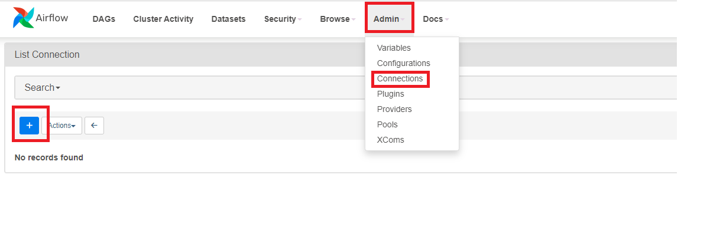
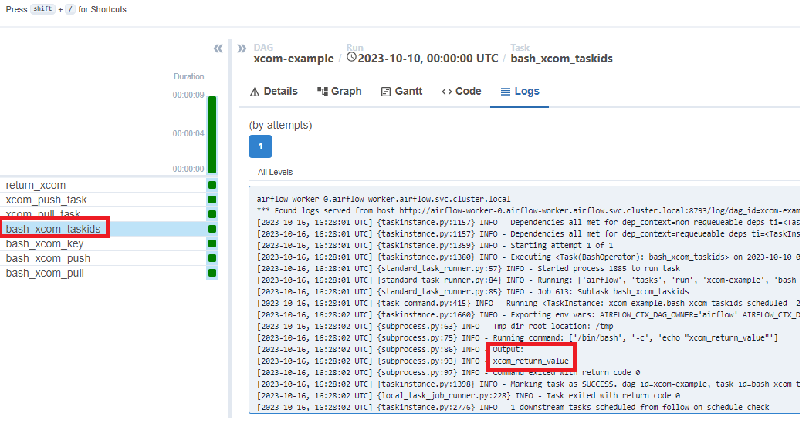

# 1. Airflow 개요


## 1.1 Airflow 란?

배치 중심 워크플로를 개발, 예약 및 모니터링하기 위한 오픈 소스 플랫폼입니다. Airflow의 확장 가능한 Python 프레임워크를 사용하면 거의 모든 기술과 연결되는 워크플로를 구축할 수 있습니다. 웹 인터페이스는 작업 흐름 상태를 관리하는 데 도움이 됩니다. Airflow는 노트북의 단일 프로세스부터 가장 큰 워크플로를 지원하는 분산 설정까지 다양한 방식으로 배포할 수 있습니다.

Airflow 프레임워크에는 다양한 기술과 연결하는 연산자가 포함되어 있으며 신기술과 통합하기 위해 쉽게 확장할 수 있습니다. 워크플로의 시작과 끝이 명확하고 정기적으로 실행되는 경우 Airflow DAG로 프로그래밍할 수 있습니다.

워크플로는 다음을 의미하는 Python 코드로 정의됩니다.

- 이전 버전으로 롤백할 수 있도록 워크플로를 버전 제어에 저장할 수 있습니다.
- 여러 사람이 동시에 워크플로를 개발할 수 있습니다.
- 기능을 검증하기 위해 테스트를 작성할 수 있습니다.
- 구성 요소는 확장 가능하며 다양한 기존 구성 요소 모음을 기반으로 구축할 수 있습니다.

풍부한 스케줄링 및 실행 의미 체계를 통해 정기적으로 실행되는 복잡한 파이프라인을 쉽게 정의할 수 있습니다. 백필을 사용하면 논리를 변경한 후 기록 데이터에 대해 파이프라인을 (재)실행할 수 있습니다. 오류를 해결한 후 부분 파이프라인을 다시 실행하는 기능은 효율성을 극대화하는 데 도움이 됩니다.


### 1.1.1 Airflow 특징

- **Dynamic**
  - Airflow에서 **Pipeline은 Python으로 정의**할 수 있다.
  - Python으로 가능한 것이면 Airflow에서 Pipeline내 Task로 실행할 수 있다.

- **Scalable**
  - Arictecture를 어떻게 구성하느냐, Resource가 얼마나 되는지에 따라 얼마든지 **Task를 병렬로 실행할 수 있다.**
  - Arflow는 Modular Architecture로 구성되며 Message Queue를 사용한다.

- **User Interface**
  - Airflow는 편하고 보기에 좋은 **Web Interface를 제공**한다.
  - Web Appliation을 통해 쉽게 **Pipeline를 모니터링, 관리**할 수 있다.

- **Extensible**
  - 필요한 기능에 대해 **plugin 형태로 쉽게 적용 가능**하다.
  - 커스텀 기능을 추가하기도 좋다.


### 1.1.2 언제 Airflow를 사용해야 할까?

#### 1.1.2.1 Airflow를 선택하는 이유

Airflow가 배치 지향 (Batch-oriented) 데이터 파이프라인을 구현하는데 적합한 이유는

- 파이썬 코드를 이용해 파이프라인을 구현할 수 있기 때문에 **파이썬 언어에서 구현할 수 있는 대부분의 방법을 사용**하여 복잡한 커스텀 파이프 라인을 만들 수 있다
- **파이선 기반의 Airfllow는 쉽게 확장이 가능**하고 다양한 시스템과 통합이 가능하다. 실제로 Airflow 커뮤니티에서 **다양한 유형의 데이터 베이스, 클라우드 서비스 등과 통합할 수 있는 수 많은 애드온이 존재**한다
- 수많은 스케줄링 기법은 **파이프라인을 정기적으로 실행**하고 **점진적(증분 : incremental) 처리를 통해 전체 파이프라인을 재실행할 필요 없는** **효율적인 파이프라인 구축**이 가능한다
- **백**필 기능을 사용하면 과거 데이터를 손쉽게 재처리할 수 있기 때문에 코드를 변경한 후 재생성이 필요한 **일괄 데이터 재처리**가 가능한다
- Airflow의 훌륭한 **웹 인터페이스**는 파이프라인 실행 결과를 모니터링할 수 있고 오류를 디버깅하기 위한 편리한 뷰를 제공한다
- 또 다른 장점은 Airflow는 **오픈 소스**라는 것이다. 때문에 특정 벤더에 종속되지 않고 Airflow를 사용할 수 있다. 또한 몇몇 회사에서는 Airflow를 설치 관리 및 실행에 대한 유연성을 제공하는 관리형 (managed) Airflow 솔루션 또한 제공하고 있다.


#### 1.1.2.2 Airflow가 적합하지 않는 경우

- Airflow는 반복적이거나 배치 태스트에 적합하여, **스트리밍(실시간 데이터 처리) 워크플로 및 해당 파이프라인 처리에 적합하지 않을 수 있다**
- 추가 및 삭제 태스트가 빈번한 동적 파이프라인의 경우에는 적합하지 않을 수 있다 (동적 태스크를 구현할 수 있지만, 웹 인터페이스는 DAG의 가장 최근 실행 버전에 대한 정의만 표현, 따라서 **airflow는 실행되는 동안 구조가 변경되지 않은 파이프라인에 좀 더 적합**)
- 파이썬 언어로만 구현 되어있고, DAG를 구현하는데까지있어 어느정도의 허들이 존재한다.
- 파이썬 코드로 DAG를 작성하는 것은 파이프라인 규모가 커지면 광장히 복잡해 질 수 있다. 때문에 장기적으로 Airflow DAG를 유지 관리 위해서는 초기 사용 시점에서부터 엄격한 관리가 필요하다


## 1.2 **아키텍처**

**Airflow는 워크플로우를 구축하고 실행할 수 있는 플랫폼**입니다 . 

워크플로는 **DAG (방향성 비순환 그래프)** 로 표시되며 **Task(작업)**이라는 개별 작업 조각을 포함하며 종속성과 데이터 흐름을 고려하여 정렬됩니다.


Airflow는 크게 다음과 같은 컴포넌트들로 구성되어 있습니다.

### 1.2.1 **DAG Directory**

- 파이썬으로 작성된 DAG 파일을 저장하는 공간입니다.
  - DAG 파일을 저장하는 공간입니다. dag_folder 혹은 dags_folder 로도 불립니다. 
  - 기본적으로 $AIRFLOW_HOME/dags/ 가 DAG Directory로 설정되어 있습니다.


### **1.2.2 Scheduler**

- **DAG를 분석**하고 현재 시점에서 DAG의 스케줄이 지난 경우 Airflow 워커에 DAG의 **태스크를 예약**합니다.
- Airflow의 가장 중요한 부분으로, **다양한 DAG Run과 Tas kInstance 들을 스케쥴링 및 오케스트레이션** 합니다.
- 또한 하나의 DAG Run이 전체 시스템을 압도하지 않도록 각 DAG Run의 실행 횟수를 제한하기도 합니다.
- DAG 파일 파싱(구문 분석), 즉 DAG 파일 읽기 등으로부터 추출된 데이터를 **메타 스토어에 저장**합니다.
  - Dag Directory에서 파일을 처리하고 결과를 얻는 일
  - DAG Run과 Task Instance의 상태를 변경하고 Executor가 실행시킬 큐에 Task Instance를 넣는 일
  - Executor로 스케줄링 큐에 들어온 Task를 실행시키는 일


### **1.2.3 Executor**

- Scheduler 내부의 구성 요소입니다.
- Scheduler가 작업을 조정하는 동안 Executor는 실제로 작업을 실행합니다.
- Sequential, Local, Celery, Kubernetes 등 Executor에는 여러 종류가 있습니다. (기본 값은 Sequential Executor입니다.)
- 워크로드를 여러 머신에 분산하려는 경우 CeleryExecutor 및 KubernetesExecutor의 두 가지 옵션 존재하고 단일 시스템의 리소스 제한에 도달하거나 여러 시스템에서 태스크를 실행하여 병렬 실행을 원하거나 태스크를 여러 시스템에 분산하여 작업 속도를 더 빠르게 실행하고자 할 때 사용할 수 있습니다.
- Executor는 Scheduler에서 생성하는 서브 프로세스로 Queue에 들어온 Task Instance를 실제로 실행하는 역할을 합니다.
- **Local Executors** : Task Instance를 Scheduler 프로세스 내부에서 실행합니다.
  - Sequential Executor
    - Airflow 익스큐터 중 가장 단순하게 구성할 수 있는 방법이자, Airflow를 별도의 설정이나 환경 구성 없이 바로 실행시킬 수 있는 방법입니다.
    - 태스크를 순차적으로 하도록(한 번에 하나씩) 구성되어 있습니다,
    - 주로 테스트 및 데모 목적으로 사용되는 쪽으로 많이 선호합니다.
    - 작업 처리 속도가 상대적으로 느리며 단일 호스트 환경에서만 작동합니다.
  - Local Executor
    - 한 번에 하나의 태스크로 제한되지 않고 여러 태스크로 병렬로 실행할 수 있습니다.
    - 익스큐터 내부적으로 워커 프로세스가 FIFO(First in, First out) 적용 방식을 통해 대기열에서 실행할 태스크를 등록합니다.
    - 기본적으로 최대 32개의 병렬 프로세스를 실행합니다.
- **Remote Executors** : Task Instance를 Scheduler 프로세스 외부에서 실행합니다.
  - **Celery Executor**
    
    - 내부적으로 Celery를 이용하여 실행할 태스크들에 대해 대기열을 등록합니다.
    - 워커가 대기열에 등록된 태스크를 읽어와 개별적으로 처리합니다.
    - 사용자 관점에서 볼 때 태스크를 대기열로 보내고 워커가 대기열에서 처리할 태스크를 개별적으로 읽어와 처리하는 과정은 LocalExecutor와 유사합니다.
    - LocalExecutor와 가장 큰 차이점은 모든 구성요소가 서로 다른 호스트에서 실행되기 때문에 작업 자체에 대한 부하가 LocalExecutor에 비해 낮습니다.
    - Celery는 대기열 메커니즘(Celery에서 처리할 때는 Broker라고 지칭)을 위해 RabbitMQ, Redis 또는 AWS SQS를 지원합니다.
    - 멀티스레드 싱클톤(singleton) 스케줄러 서비스를 구현합니다. 작업을 호출하는 메시지는 RabbitMQ 또는 Redis 데이터베이스에서 대기열에 추가되고 작업은 여러 Celery 작업자에게 분배됩니다.
    - Celery의 모니터링을 위해 Flower라는 모니터링 도구를 함께 제공합니다.
    - Celery는 파이썬 라이브러리 형태로 제공되므로 Airflow 환경에 적용하기 편리합니다.
  - Kubernetes Executor
    - 쿠버네티스에서 워크로드를 실행합니다.
    - Airflow를 실행하려면 쿠버네티스 클러스터의 설정 및 구성이 필요하며 익스큐터는 Airflow 태스크를 배포하기 위해 쿠버네티스 API와 통합됩니다.
    - 쿠버네티스는 컨테이너화된 워크로드를 실행하기 위한 사실상의 표준 솔루션 입니다.
- Airflow에서는 익스큐터 유형에 따라 다양한 설치 환경을 구성할 수 있습니다. 

| 익스큐터                  | 분산   | 환경 설치 난이도 | 사용에 따른 적합한 황경                    |
| ------------------------- | ------ | ---------------- | ------------------------------------------ |
| SequentialExcutor(기본값) | 불가능 | 매우 쉬움        | 시연 / 테스트                              |
| LocalExcutor              | 불가능 | 쉬움             | 단일 호스트 환경 권장                      |
| CeleryExecutor            | 가능   | 보통             | 멀티 호스트 확장 고려 시                   |
| KubernetesExecutor        | 불가능 | 어려움           | 쿠버네티스 기반 컨테이너 환경 구성 고려 시 |

- 익스큐터 설치
  - SequentalExecutor 설정
    - 스케줄러의 태스크 오퍼레이터 부분은 단일 하위 프로세스에서 실행되고 이 단일 하위 프로세스 내에서 작업은 순차적으로 하나씩 실행되므로 익스큐터 종류 중 가장 느린 실행 방법입니다.
    - 구성 절차가 필요하지 않기 때문에 테스트 시점에 매우 편리하게 사용할 수 있습니다.
  - LocalExecutor 설정
    - 아키텍처는 SequentialExecutor와 유사하지만, 여러 하위 프로세스가 있어 병렬로 태스크를 실행할 수 있으므로 SequentialExecutor에 비해 빠르게 수행할 수 있습니다.
    - 각 하위 프로세스는 하나의 태스크를 실행할 수 있으며, 하위 프로세스는 병렬로 실행할 수 있습니다.
    - 모든 구성 요소를 별도의 컴퓨터에서 실행할 수 있으며, 스케줄러에 의해 생성된 하위 프로세스는 모두 하나의 단일 시스템에서 실행됩니다.
  - CeleryExecutor 설정
    - Celery는 대기열 시스템을 통해 워커에게 메시지를 배포하기 위한 프레임워크를 제공합니다.
    - 태스크가 Celery worker를 실행하는 여러 컴퓨터로 분배하고 워커는 태스크가 대기열에 도착할 때까지 기다립니다.
    - Celery에서는 대기열을 브로커라합니다.
    - Airflow webserver 실행
    - Airflow scheduler 실행
    - Airflow Celery worker 실행
  - KubernetesExecutor 설정
    - 모든 태스크가 쿠버네티스의 파드(pod)에서 실행됩니다.
    - 쿠버네티스에서 웹 서버, 스케줄러 및 데이터베이스를 실행할 필요는 없지만, KubernetesExecutor를 사용할 때 쿠버네티스에서 다른 서비스들이 함께 실행되는 것이 관리하기 좀 더 수월합니다.
    - 파드가 쿠버네티스에서 가장 작은 작업 단위이며 하나 이상의 컨테이너를 실행할 수 있습니다.
    - 다른 익스큐터는 작업 중인 워커의 정확한 위치를 항상 알 수 있으며, 쿠버네티스를 사용하면 모든 프로세스 파드에서 실행되며, 파드는 동일한 시스템에서 실행될 수도 있지만 여러 호스트에 분산되어 실행될 수 있습니다.
    - 사용자의 관점에서 볼 때 프로세스는 파드에서 실행되며 사용자는 실행하는 프로세스가 어떤 호스트에서 실행되는지 명확하게 바로 알 수는 없습니다.
- Airflow 프로세스 간에 DAG파일을 배포하는 방법을 결정
  - PersistentVolume을 사용하여 포드 간에 DAG 공유
  - Git-sync init container를 사용해 리포지토리의 최신 DAG 코드 가져오기
  - Docker 이미지에 DAG 빌드


### **1.2.4 Worker**

- 예약된 태스크를 선택하고 실행합니다.
- Executor에 의해 만들어지며 Task를 실제로 실행하는 프로세스입니다.
- Executor의 종류에 따라 Worker는 쓰레드, 프로세스, 파드가 될 수 있습니다.


### 1.2.5 **Meta Database**

- https://airflow.apache.org/docs/apache-airflow/stable/database-erd-ref.html
- DAG, 해당 실행 및 사용자, 역할 및 연결과 같은 기타 Airflow 구성에 대한 메타데이터를 저장합니다.
  - Meta Database는 Airflow의 DAG, DAG Run, Task Instance, Variables, Connections 등 여러 컴포넌트에서 사용해야하는 데이터를 저장합니다. Webserver, Scheduler, Worker 모두 Meta Database와 통신하기 때문에 Meta Database는 Scheduler와 더불어 매우 중요한 컴포넌트입니다.
  - Airflow를 위한 메타스토어 설정
    - **메타스토어**(metastore) : Airflow에서 일어나는 모든 일은 데이터베이스에 등록됩니다
    - **워크플로 스크립트** : 스케줄러를 통해 작업 내역을 분석 및 관리하는 역할을 수행하며 메타스토어에 그 해석된 내용을 저장하는 등의 여러 컴포넌트로 구성되어 있습니다.
    - Airflow는 Python ORM(Object Relational Mapper) 프레임워크인 **SQLAlchemy를 사용**하여 모든 데이터베이스 태스크를 수행하며 SQL 쿼리를 수동으로 작성하는 대신, 직접 데이터베이스에 직접 편리하게 작성할 수 있습니다.
- Webserver
  - 웹 서버는 파이프라인이 현재 상태에 대한 정보를 시각적으로 표시하고 사용자가 DAG 트리거와 같은 특정 태스크를 수행할 수 있도록 관리하는 역할을 수행합니다.
  - 스케줄러에서 분석한 DAG를 시각화하고 DAG 실행과 결과를 확인할 수 있는 주요 인터페이스를 제공함
  - Airflow의 Web UI 입니다.
  - Meta Database로 부터 DAG 정보를 읽어와 DAG 정보 및 DAG Run의 상태를 확인하고 실행할 수 있습니다.
    - Webserver는 Meta Database와 통신하며 DAG, DAG Runs, Task Instance, Variables, Connections 등의 데이터를 가져와 웹에서 보여주고 유저와 상호작용 할 수 있게 합니다.
- 모든 Airflow 프로세스의 로그 확인
  - 웹 서버 로그 : 웹 활동에 대한 정보, 즉 웹 서버로 전송되는 요청에 대한 정보를 보관합니다.
  - 스케줄러 로그 : DAG 구문분석, 예약 작업 등을 포함한 모든 스케줄러 활동에 대한 정보를 보관합니다.
  - 태스크 로그 : 각 로그 파일에는 단일 태스크 인스턴스의 로그가 보관됩니다.


### 1.2.6 사용자 인터페이스

Airflow에는 DAG와 해당 작업이 수행되는 작업을 확인하고, DAG 실행을 트리거하고, 로그를 보고, DAG 문제에 대한 제한된 디버깅 및 해결을 수행할 수 있는 사용자 인터페이스가 함께 제공됩니다.


이는 일반적으로 Airflow 설치 상태를 전체적으로 확인하고 개별 DAG를 살펴보고 레이아웃, 각 작업 상태 및 각 작업의 로그를 확인하는 가장 좋은 방법입니다.


## 1.3 **How Airflow works**

Airflow가 어떻게 동작하는지 알아보려 한다.

Single Node, Multi Nodes에서 각각 어떻게 동작하는지 알아보자

### 1.3.1 **Single Node Architecture**


**1) Single Node Architecture**에서는 **모든 Airflow Componet가 단일 Machine에서 동작**한다.(WebServer, Metastore, Scheduler, Executor)

2) WebServer는 Metastore에서 Data를 가져와 Web Application에서 보여준다.

3) Scheduler는 Metastore와 통신하고 실행한 Task가 있을 시 Executor에게 요청한다.

4) Executor는 Metstore에서 Data를 확인하고 실행할 Task를 실행한다.

5) Executor내부에 Queue가 존재한다.

**모든 Component는 Metastore을 통해 동작**한다.


### 1.3.2 **Multi Nodes Architecture**


**Multi Nodes Architecture**에서는 **Component들이 다른 Machine에서 배치되어 동작**한다.

WebServer, Scheduler는 Metastore와 분리되었지만 동작은 똑같이 Metastore와 통신하며 동작한다.

내부에 있던 **Executor Queue는 외부로 분리되어진다.**

Executor Queue는 RabbitMQ, Redis와 같은 3rd party Tool로 구성된다.

**수행할 Task가 있으면 Executor가 해당 Task를 Queue에게 Push 한다.**

다수의 Worker는 Queue를 Push 된 Task를 수행한다.


### 1.3.3 **동작 흐름**

DAG는 일련의 Task(작업)를 통해 실행되며 다음과 같은 세 가지 일반적인 작업 유형이 있습니다.

- **연산자** - DAG의 대부분을 구축하기 위해 빠르게 함께 연결할 수 있는 사전 정의된 작업
- **센서** - 외부 이벤트가 발생하기를 전적으로 기다리는 Operator의 특수 하위 클래스인 센서
- **TaskFlow** - `@task`Task로 패키지된 사용자 정의 Python 함수입니다.


DAG 파일 생성부터 Pipeline 진행이 어떻게 진행되는 과정은 아래와 같다.

1. **/dags 폴더에 Python으로 정의한 DAG 파일을 생성**
2. WebServer와 Scheduler가 /dag 폴더에 정의한 DAG 파일 Parse
   - **Web Application에 Data 노출**
   - **Scheduler는 Metastore에 DAGRun Object 생성**
3. **해당 Pipeline Trigger**
4. **Scheduler 해당 DAGRun Object 상태 Running으로 변경**
5. **Metastore에 TaskInstance 생성**
6. **Executor가 TaskInstance 실행/종료 상태 변경**
7. Scheduler는 지속적으로 Pipeline의 모든 Task 종료 여부 체크
   - **모든 Task 종료되면 DAGRun Object 상태 Completed로 변경**
8. **WebServer UI 해당 DAG 상태 변경**


## 1.5 Dag 구성요소

### **1.5.1 DAG**(Directed Acyclic Graph)란?


위 그래프는 DAG이며 DAG는 **방향을 가진 비순환 Graph**이다.


- DAG 명세서
  - Dummy DAGS (Start, End 계열) 일부 제외
    - DummyOperator는 아무 실행도 하지 않는 Operator입니다. 간혹 Task 간 의존성 흐름 내 필요한 경우에 사용됨
  - ExternalTaskSensor 계열은 무조건 후속작업이 있으며, 자신이 감지하고 있는 Task가 끝날 때까지 계속 작동
  - SSHOperator : 일반적인 작업 수행 DAG로 해당 Job이 끝나면 Success를 찍고 끝남
  - TriggerDagOperator : 다른 DAG를 시작시키는 Trigger 역할
  - BranchPythonOperator : 조건에 따라 다른 DAG를 실행해야 할 경우 어느 DAG로 분기해야 할지 DAG 명을 리턴해주는 역할
    - BranchPythonOperator는 특정 조건에 따라 의존성 흐름에 분기를 줄 수 있는 Operator
  - ShortCircuitOperator : BranchPythonOperator와 비슷하나 조건이 False 가 나오면 흐름을 무조건 끊고 다음 작업들을 전부 Skip 시킴
  - PythonOperator : Deploy 서버 내부에서 실행되는 파이썬 코드
  - BashOperator는 bash 커맨드를 실행하는 Operator
  - EmailOperator는 Email을 보내는 Operator
  - Custom Operator : Airflow Operator는 직접 Custom 하게 작성할 수 있음
  - 파이썬 코드 실행 옵션
    - PythonOperator를 사용하는 대신 BashOperator를 사용하여 파이썬 스크립트를 실행함, PythonOperator로 파이썬 코드를 실행하려면 코드를 DAG 정의 파일에 작성하거나 DAG 정의 파일로 가져와야 함, 오케스트레이션과 이 오케스트레이션이 실행하는 프로세스의 로직을 더 많이 분리하고 싶었음, 에어플로우와 내가 실행하려는 코드 간에 호환되지 않는 파이썬 라이브러리 버전의 잠재적인 문제를 피할 수 있음, 프로젝트(및 Git 저장소)를 분리하여 데이터 인프라 전반에 걸쳐 로직을 유지 관리하는 것이 더 쉬움
- 태스크와 오퍼레이터 차이점
  - 오퍼레이터(operator) : 단일 태스크를 나타냅니다.
    - 단일 작업 수행 역할
    - PythonOperator : 파이썬 함수를 실행하는 데 사용됨
    - EmailOperator : 이메일 발송에 사용됨
    - Simple HttpOperator : HTTP 엔드포인트 호출
  - DAG는 오퍼레이터 집합에 대한 실행을 오케스트레이션(orchestration - 조정, 조율)하는 역할을 함, 오퍼레이터의 시작과 정지, 오퍼레이터가 완료되면 연속된 다음 태스크의 시작, 그리고 오퍼레이터 간의 의존성 보장이 포함됨
  - Airflow에서 태스크는 작업의 올바른 실행을 보장하기 위한 오퍼레이터의 래퍼(wrapper) 또는 매니저(manager)로 생각해 볼 수 있음
  - 사용자는 오퍼레이터를 활용해 수행할 작업에 집중할 수 있으며, Airflow는 태스크를 통해 작업을 올바르게 실행할 수 있음
  - DAG와 오퍼레이터는 Airflow 사용자가 이용함, 태스크는 오퍼레이터의 상태를 관리하고 사용자에게 상태 변경(예:시작/완료)을 표시하는 Airflow의 내장 컴포넌트
- 다양한 오퍼레이터를 사용할 때는 다양한 종속성을 위한 많은 모듈이 설치되어야 하기 때문에 잠재적인 충돌이 발생하고 환경 설정 및 유지 관리가 상당히 복잡해짐(많은 패키지를 설치하면 잠재적인 보안 위험은 말할 것도 없이 높아짐), 파이썬은 동일한 환경에 동일한 패키지의 여러 버전을 설치할 수 없기 때문에 문제가 됨

------

### 1.5.2 Operator

Operator는 실제 작업 실행을 담당하는 개체이며 Workflow(DAG) 를 구성하는 하나의 작업을 기술한다. Operator는 보통 다른 작업에 의존적이지 않고 단독으로 수행이 가능하다. 또한 Operator들은 아래와 같은 특징을 가진다.

- DAG 내에 있는 Operator는 순차/병렬적으로 수행될 수 있으며 각 Operator들은 서로 다른 장비에서 수행될 수 있다.
- 만일 두 개의 Operator가 데이터를 공유해서 사용해야 한다면, 하나의 Operator로 합쳐서 사용하기를 권장한다. 그러기 어렵다면 X-Coms라는 컴포넌트를 사용하여 구성할 수 있다.

#### 1.5.2.1 Operator 특징

- single task를 정의 해야한다.
- 멱등성을 유지해야한다. 다른 작업간에 겹침 현상을 제거하여 오류제거를 위함이다.
- 자동 재시도를 작성하여 자동으로 재시도 해줄수 있다.
- 하나의 task는 하나의 Operator 클래스로 구성되어 생성이 되어진다.


#### 1.5.2.2 Operator 종류

Operator는 어떤 작업을 할지 정의 해주는 것이며 Airflow는 다양한 Operator를 제공하며 아래와 같은 대표적인 Operator들이 존재한다.

- **BashOperator**: Bash 명령어를 수행하는 Operator
- **PythonOperator**: Python 함수를 실행하는 Operator
- **EmailOperator**: Email을 전송하는 Operator
- **SimpleHttpOperator**: Http Request를 수행하는 Operator
- MySqlOperator, JdbcOperator, …, MsSqlOperator: **SQL 명령어를 실행하는 Operator**
- **Sensor**: 특정 시간, 파일, DB Row, S3 Key 등을 Polling하는 Operator

[airflow.operators - Airflow Documentation](https://airflow.apache.org/docs/apache-airflow/stable/_api/airflow/operators/index.html)


#### 1.5.2.3 Operator 타입

모든 Operator는 BaseOperator를 상속받아 구성된다. 그리고 밑에 3가지 경우로 상속받아 재구성되어 사용되어진다.

- Action operators - 실제 연산을 수행
- Transfer operators - 데이터를 옮김
- Sensor operators - 태스크를 언제 실행시킬 트리거를 기다림


### 1.5.3 **스케줄링**


https://airflow.apache.org/docs/apache-airflow/stable/core-concepts/dag-run.html


- Cron 기반의 스케줄 간격 설정하기

  - 더 복잡한 스케줄 간격 설정을 지원하기 위해서 Cron(macOS 및 리눅스와 같은 유닉스 기반 OS에서 사용하는 시간 기반 작업 스케줄러)과 동일한 구문을 사용해 스케줄러 간격을 정의함

  - DAG를 실행하고자 할 때, 가령 "매주 토요일 23시 45분" 과 같이 정밀한 시기를 지정하고 싶어질 때가 있습니다.이렇게 좀 더 복잡한 스케줄링을 위해, Cron과 같은 스케줄링을 위한 정규 표현식을 사용할 수 있습니다.

  - Cron은 macOS나 Linux와 같은 유닉스 계열 컴퓨터 운영 체제에서 사용되는 시간 기반 작업 스케줄러입니다.

  - Cron은 다섯 가지 구성 요소로 아래와 같이 정의됩니다.

    ```
    # ┌─────── minute (0 - 59)
    # │ ┌────── hour (0 - 23)
    # │ │ ┌───── day of the month (1 - 31)
    # │ │ │ ┌───── month (1 - 12)
    # │ │ │ │ ┌──── day of the week (0 - 6) (Sunday to Saturday;
    # │ │ │ │ │      7 is also Sunday on some systems)
    # * * * * *
    ```

    cron 작업은 시간/날짜 필드가 현재 시스템 시간/날짜와 일치할 때 실행됩니다.

    특정 시기를 명시하기 원하지 않는 필드를 정의하기 위해 숫자 대신 별표(*)를 사용할 수 있는데,

    해당 필드의 값을 신경 쓰지 않는다는 것을 의미합니다.

    cron 표현식이 처음에는 복잡하다고 느껴질 수 있겠지만, 시간 간격을 유연하게 정의할 수 있습니다.

    예를 들어, 아래와 같은 cron 식을 표현해서 시간 간격, 일 간격 및 주 간격 등을 정의할 수 있습니다.


    `0 0 * * *` : daily (자정 실행)
    `0 0 * 0` : 매주 (일요일 자정에 실행)
    
    `0 0 1 * *` : 매월 1일 자정
    
    `45 23 * * MON, SAT` : 매주 월요일, 토요일 23:45
    
    `0 0 * * MON-FRI` : 주중 평일 자정에 실행

- 빈도 기반의 스케줄 간격 설정하기 : timedelta(표준 라이브러리인 datatime 모듈에 포함된)인스터스를 사용하면 됩니다 

  ```python
  dag = DAG(
      dag_id="04_time_delta",
      schedule_interval=dt.timedelta(days=3),
      start_date=dt.datetime(year=2019, month=1, day=1),
      end_date=dt.datetime(year=2019, month=1, day=5),
  )
  ```

- execution_date : DAG가 실행되는 날짜와 시간을 나타냄

  - DAG를 시작하는 시간의 특정 날짜가 아니라 스케줄 간격으로 실행되는 시작 시간을 나타내는 타임스탬프
  - 스케줄 간격의 종료 시간은 next_execution_date라는 매개변수를 사용
  - 과거의 스케줄 간격의 시작을 정의하는 previous_execution_date 매개변수를 제공

- Airflow는 날짜 시간에 Pendulum 라이브러리를 사용하며 execution_date는 이러한 Pendulum의 datetime 객체


------


### 1.5.4 **워크플로 트리거**

- 센서를 사용한 폴링 조건
  - Airflow 오퍼레이터의 특수 타입(서브 클래스)인 센서(sensor)의 도움을 받을 수 있음
- DAG 간의 공유 종속성에 대한 필요성을 감안할 때 에어플로우 작업은 Sensor라고 하는 특별한 유형의 연산자를 구현할 수 있다, 에어플로우 Sensor는 일부 외부 작업 또는 프로세스의 상태를 확인한 다음 확인 기준이 충족되면 DAG에서 다운스트림 종속성을 계속 실행하도록 설계됨
- 두 개의 서로 다른 에어플로우 DAG를 조정해야 하는 경우 ExternalTaskSensor를 사용하여 다른 DAG의 작업 상태 또는 다른 DAG의 전체 상태를 확인할 수 있음
  - 센서는 특정 조건이 true인지 지속적으로 확인하고 true라면 성공, 만약 false인 경우 센서는 상태가 true가 될 때까지 또는 타임아웃이 될 때까지 계속 확인함
  - FileSensor : 파일위치에 파일이 존재하는지 확인하고 파일이 있으면 true를 반환하고, 그렇지 않으면 false를 반환한 후 해당 센서는 지정된 시간(기본값은 60초) 동안 대기했다가 다시 시도함
  - Poking : 센서를 실행하고 센서 상태를 확인하기 위해 Airflow에서 사용하는 이름
  - 사용자 지정 조건 폴링
    - PythonSensor
      - PythonOperator와 유사하게 파이썬 콜러블(callable 함수, 메서드 등)을 지원
      - PythonSensor 콜러블은 성공적으로 조건이 충족됐을 경우 true를, 실패했을 경우 false로 부울(Boolean) 값을 반환하는 것으로 제한됨
  - 센서 데드록 : 실해중인 태스크 조건이 true가 될 때까지 다른 태스크가 대기하게 되므로 모든 슬롯이 데드록 상태가 됨
  - TriggerDagRunOperator : 워크플로가 분리된 경우 이 오퍼레이터를 통해 다른 DAG를 트리거할 수 있음
    - DAG에서 태스크를 삭제하면 이전에 트리거 된 해당 DAG 실행을 지우는 대신에 새 DAG 실행이 트리거 됨
- 다른 DAG의 상태를 폴링 하기
  - ExternalTaskSensor : 다른 DAG의 태스크를 지정하여 해당 태스크의 상태를 확인하는 것


### 1.5.5 **태스크 간 의존성 정의**

#### 1.5.5.1 Task란?

Task는 airflow의 기본 실행 단위. 작업은 DAG로 정렬된 다음 실행해야 하는 순서를 표현하기 위해 작업간 스트림 및 다운스트림 종속성을 설정


**Task 타입 세가지**

- Operators : DAG의 대부분 구축되어있는 모듈로써 작업 템플릿 대부분을 Operator로 구현
- Sensors : 전적으로 외부 이벤트가 발생하기를 기다리는 연산자의 특수 하위 클래스
- TaskFlow : 장식 @task 된, 태스크로 패키지된 사용자 정의 python함수

기본적으로 BaseOperator를 상속받아 진행 하기 때문에 상요 교환 및 운용이 가능


#### 1.5.5.2 관계(Relationship)

Airflow 는 Task 간 관계를 정함으로 일련의 작업 순서 및 분기를 지정 할 수 있다 

관계를 지정하는 방법에는 비트시프트, 함수 표시 방식으로 구분된다.

```python
# 비트 시프트로 표시
first_task >> second_task >> [third_task, fourth_task]

# 함수로 표시
first_task.set_downstream(second_task)
third_task.set_upstream(second_task)
```


**Bitshift Composition**

- DAG를 구성하는 Task(Operator)들 간의 관계를 정의할 때 기존에는 `set_upstream()`, `set_downstream()`을 사용했으나, Airflow 1.8 버전부터 `>>`와 `<<` 연산자를 사용하여 관계를 정의할 수 있게 되었다.
- A 작업이 실행된 뒤 B 작업이 실행되어야 하는 경우 아래와 같이 표기할 수 있다.
  - `A >> B`
  - `B << A`


- 여러 개의 Bitshift 연산자를 섞어서 아래와 같이 표현할 수도 있다.

  

  - ```plaintext
    A >> B >> C << D
    ```

    - A 작업 완료 후 B 작업 수행
    - B 작업과 D 작업이 완료된 후 C 작업 수행

  

  

  

  - ```plaintext
    A >> [B, C] >> D
    ```

    - A 작업이 완료된 후 B, C 작업 수행
    - B, C 작업이 완료된 후 D 작업 수행


#### 1.5.5.3 Task instance

- DAG실행 될때 마다 Task Instance를 생성하여 Executor로 넘긴다음 해당 작업을 실행한다. 

- 그리고 그 Task instance를 다시 Metadata로 보내서 상태를 업데이트 하며, Task Instance가 작업이 아직 남아 있으면 다시 Executor로 보내진다. 

- 작업이 완료가 되면 Scheduler에게 보내지는데 Task상태를 잘 알아야 scheduler의 다음 동작을 잘 알수 있다.
- Task-Workflow
  - none : 태스크가 아직 실행을 위한 큐가 없는 상태
  - scheduled : 스케쥴러가 작업의 종속성이 충족되고 실행 되어야 한다고 결정
  - queued : 작업이 Executor에 할당되었으며 작업자를 기다리고 있음
  - running : 작업이 작업자에서 실행 중
  - success : 작업이 오류 없이 성공
  - shutdown : 태스트가 실행 중일 때 종료 하도록 외부적으로 요청이 됨
  - restarting : 작업이 실행 중 일 때 다시 시작하도록 외부에서 요청한 작업
  - failed : 작업을 실행하는 동안 오류가 발생하여 실행하지 못했음
  - skipped : 분기, LatestOnly 등으로 인해 작업을 건너뛰었음
  - upstream_failed : 업스트림 작업이 실패했고 트리거 규칙이 필요하다고 말함
  - up_for_retry : 작업이 실패했지만 재시도 횟수가 남았고 일정이 다시 잡힘
  - up_fro_reschedule : reschdule안에 있는 sensor 역할을 함
  - sensing : 과제에 Smart Sensor
  - deferred : 작업이 트리거로 인해 연기 되었음
  - removed : 실행이 시작된 후 작업이 DAG에서 사라졌음


### 1.5.6 시간 초과(Time Out)

Task가 최대 런타임을 가지는 속성을 정의하는 것이다. execution_timeout 속성을 datetime.timedelta 최대 허용 런타임 값으로 설정하면 된다.

SFTPSensor를 예로 들면

- 센서가 SFTP서버에 요청 할 때마다 최대 60초가 걸릴수 있음.
- 센서가 SFTP서버에 요청이 60초 이상 걸리면 AirflowTaskTimeout이 올라감. 그리고 센서는 retries를 하고 최대 재시도 2번까지 함
- 첫 번째 실행 시작부터 결국 성공할 때까지 센서는 에 정의된 대로 최대 3600초 동안 허용됨. 즉, 3600초 이내에 파일이 SFTP 서버에 나타나지 않으면 센서가 AirflowSensorTimeout. 이 오류가 발생하면 다시 시도하지 않음

```python
sensor = SFTPSensor(
	task_id="sensor",
	path="/root/test",
	execution_timeout=timedelta(seconds=60),
	timeout=3600,
	retries=2,
	mode="reschedule",
)
```


# 2. Airflow 실습

## 2.1 사전준비


### 2.1.1 install helm chart Airflow

```bash
$ helm repo add apache-airflow https://airflow.apache.org
$ helm pull apache-airflow/airflow --version 1.11.0
$ tar -zxvf airflow-1.11.0.tgz
```


 

### 2.1.2 git-sync 를 위한 Secret준비

인코딩 사이트 : https://www.base64encode.org/ko/ 

```yaml
#secret.yaml
apiVersion: v1
kind: Secret
metadata:
  name: git-credentials
  namespace: airflow
type: Opaque
data:
  GIT_SYNC_USERNAME: Y2pz #{아이디 base64인코딩}
  GIT_SYNC_PASSWORD: bmV3MTIzNCE= #{비번 base64인코딩}
```


```bash
$ kubectl create ns airflow
$ kubectl apply -f secret.yaml
```


## 2.2 Airflow 설치


### 2.2.1 설치

```powershell
(PowerShell)
$ cd airflow
$ helm upgrade --install airflow apache-airflow/airflow --namespace airflow --create-namespace `
--set dags.gitSync.enabled=true `
--set dags.gitSync.repo=http://gitlab.ssongman.duckdns.org/cjs/git-sync.git `
--set dags.gitSync.branch=main `
--set dags.gitSync.subPath=airflow/dags `
--set dags.gitSync.credentialsSecret=git-credentials `
--set dags.gitSync.wait=60

#삭제시
#$ helm delete airflow -n airflow

#--set ingress.web.enabled=true `
#--set ingress.web.host=airflow.ssongman.duckdns.org `
#--set ingress.web.ingressClassName=traefik
#테스트서버용
$ helm upgrade --install airflow apache-airflow/airflow --namespace airflow --create-namespace --set dags.gitSync.enabled=true --set dags.gitSync.repo=http://gitlab.ssongman.duckdns.org/cjs/git-sync.git --set dags.gitSync.branch=main --set dags.gitSync.subPath=airflow/dags --set dags.gitSync.credentialsSecret=git-credentials --set ingress.web.enabled=true 
--set ingress.web.host=airflow.ssongman.duckdns.org 
--set ingress.web.ingressClassName=traefik
```


### 2.2.2 설치확인 

```
kubectl get pod -n airflow
```

kubectl 명령어를 통해서 방금 생성한 airflow namespace에 pod를 조회해 보자.


 


### 2.2.3 Airflow 접속

```
kubectl get svc -n airflow
```

airflow webserver의 SVC 즉 service 이름을 찾아 냅니다.


```
kubectl port-forward svc/airflow-webserver 8080:8080 -n airflow
```

포트포워딩을 통해서 내부에만 존재하는 Airflow의 포트를 노출시켜 줍니다. 


웹브라우저를 열어서 localhost:8080 으로 접속을 합니다.


### 2.2.4 Airflow Connection 생성

**Admin -> Connections ->  '+' 클릭**



Connection Id : user_api

Connection Type : HTTP 

Host : https://randomuser.me/

입력 후 Save


## 2.3 DAG Tutorial

### 2.3.1 simple_bash.py DAG 파일 생성

`simple_bash`라는 이름의 DAG를 생성할 것이다.

git sync 시 지정한 GitLab 특정경로,

이 디렉토리에 `tutorial_bash.py` 파일을 생성하고, 작성을 시작한다.


### 2.3.2 import 구문

```python
from datetime import datetime, timedelta 
from airflow import DAG 
from airflow.operators.bash_operator import BashOperator 
```

- `from airflow import DAG`: 정의할 DAG에 매핑하는 클래스를 임포트한다.
- `from airflow.operators.bash_operator import BashOperator`: Bash 명령어를 실행할 Task Operator 클래스를 임포트한다.


### 2.3.3 Default Arguments 객체 생성

DAG 및 DAG 내 Task들에 일괄적으로 적용할 속성 객체를 작성한다.

```python
default_args={
	'owner': 'airflow',
    'depends_on_past': False,
    'start_date': datetime(2020, 5, 16, 14, 0),
    'email': ['leeyh0216@gmail.com'],
    'email_on_failure': False,
    'email_on_retry': False,
    'retries': 1,
    'retry_delay': timedelta(minutes=1)
} 
```

- `owner`: 작업 소유자 ID
- `depends_on_past`: 특정 작업의 Upstream이 성공한 경우에만 해당 작업을 Trigger할 것인지에 대한 여부
- `start_date`: DAG 최초 실행 시간(과거 혹은 예약 가능)
- `email`: 작업 실행 관련 이메일 수신 주소 목록
- `email_on_failure`: 작업 실패 시 이메일 수신 여부
- `email_on_retry`: 작업 재시도 시 이메일 수신 여부
- `retries`: 작업 재시도 횟수
- `retry_delay`: 작업 재시도 간격


### 2.3.4 DAG 정의

DAG 객체를 정의한다.

```python
dag = DAG(
	'tutorial_bash',
    default_args=default_args,
    description='My first tutorial bash DAG',
    schedule_interval= '* * * * *' 
) 
```

- `schedule_interval`: DAG 스케쥴링 간격(Cron 표현식 혹은 미리 정의된 속성 사용 가능)


### 2.3.5 Task 정의

“hello world”를 출력하는 작업(say_hello)과 현재 시간을 출력하는 작업(what_time)을 정의할 것이다.

```python
t1 = BashOperator(
	task_id='say_hello',
    bash_command='echo "hello world"',
    dag=dag 
) 

t2 = BashOperator(
	task_id='what_time',
    bash_command='date',
    dag=dag 
) 

t1 >> t2 
```

`BashOperator`에는 다음과 같은 속성이 존재한다.

- `task_id`: 작업의 ID
- `bash_command`: 실행할 Bash Command
- `dag`: 작업이 속할 DAG

또한 `t1 >> t2`는 t1이 실행된 후 t2를 실행한다는 의미이다.(t1이 t2의 Upstream Task)


### 2.3.6 Airflow CLI와 Webserver를 통해 생성된 DAG 확인하기

Airflow CLI로 방금 만든 DAG가 잘 반영되었는지 확인해보자. 원래는 `airflow list_dags` 명령어로 Airflow에 등록된 DAG 목록을 출력할 수 있는데, 여기서는 Docker Compose로 띄워 놓았기 때문에 `airflow list_dags` 명령어 앞에 

```bash

$ kubectl exec -it ${CONTAINER_ID} -n airflow /bin/bash

$ airflow list_dags 
-------------------- DAGS ---------------------------------------
tutorial 
tutorial_bash 
...

```

WebServer에서도 일정 시간이 지나면 아래와 같이 tutorial_bash가 만들어진 것을 확인할 수 있다.


### 2.3.7 DAG를 활성화하여 실행 확인하기

만들어진 DAG는 활성화된 상태가 아니어서(Paused) 실행되지 않는다. 실행을 위해서는 CLI나 Web UI 상에서 ‘Off’ 버튼을 눌러 ‘On’ 상태로 변경해주어야 한다.

CLI Command는 `airflow unpause [DAG ID]`로 아래와 같이 실행하면 된다.

```bash
$ airflow unpause tutorial_bash 
[2020-05-16 06:04:41,772]  INFO - Filling up the DagBag from /usr/local/airflow/dags/tutorial_bash.py Dag: tutorial_bash, paused: False 
```

Web UI에서 확인하면 ‘Off’였던 상태가 ‘On’으로 변경되고, DAG가 실행되고 있는 것을 볼 수 있다.


## 2.4 다양한 Operator 사용하기


### 2.4.1 BashOperator

Bash 명령어를 수행하는 Operator

**example_bash_operator.py**

```python
from builtins import range
from airflow.operators.bash import BashOperator
from airflow.operators.dummy import DummyOperator
from airflow.models import DAG
from datetime import datetime, timedelta

seven_days_ago = datetime.combine(datetime.today() - timedelta(7),
                                  datetime.min.time())
args = {
    'owner': 'airflow',
    'start_date': seven_days_ago,
}

dag = DAG(
    dag_id='example_bash_operator', default_args=args,
    schedule_interval='0 0 * * *')

cmd = 'ls -l'
run_this_last = DummyOperator(task_id='run_this_last', dag=dag)

run_this = BashOperator(
    task_id='run_after_loop', bash_command='echo 1', dag=dag)
run_this.set_downstream(run_this_last)

for i in range(3):
    i = str(i)
    task = BashOperator(
        task_id='runme_'+i,
        bash_command='echo "{{ task_instance_key_str }}" && sleep 1',
        dag=dag)
    task.set_downstream(run_this)

task = BashOperator(
    task_id='also_run_this',
    bash_command='echo "run_id={{ run_id }} | dag_run={{ dag_run }}"',
    dag=dag)
task.set_downstream(run_this_last)
```


### 2.4.2 PythonOperator

Python 함수를 실행하는 Operator

**example_python_operator.py**

```python
from airflow.models import DAG
from airflow.utils.dates import days_ago
from airflow.operators.python_operator import PythonOperator
import time
from pprint import pprint

args = {'owner': 'cjs','start_date': days_ago(n=1)}

dag = DAG(dag_id='example_python_operator',
          default_args=args,
          schedule_interval='@daily')

def print_fruit(fruit_name, **kwargs):
    print('=' * 60)
    print('fruit_name:', fruit_name)
    print('=' * 60)
    pprint(kwargs)
    print('=' * 60)
    return 'print complete!!!'

def sleep_seconds(seconds, **kwargs):
    print('=' * 60)
    print('seconds:' + str(seconds))
    print('=' * 60)
    pprint(kwargs)
    print('=' * 60)
    print('sleeping...')
    time.sleep(seconds)
    return 'sleep well!!!'

t1 = PythonOperator(task_id='task_1',
                    provide_context=True,
                    python_callable=print_fruit,
                    op_kwargs={'fruit_name': 'apple'},
                    dag=dag)

t2 = PythonOperator(task_id='task_2',
                    provide_context=True,
                    python_callable=print_fruit,
                    op_kwargs={'fruit_name': 'banana'},
                    dag=dag)

t3 = PythonOperator(task_id='task_3',
                    provide_context=True,
                    python_callable=sleep_seconds,
                    op_kwargs={'seconds': 10},
                    dag=dag)

t4 = PythonOperator(task_id='task_4',
                    provide_context=True,
                    python_callable=print_fruit,
                    op_kwargs={'fruit_name': 'cherry'},
                    dag=dag)

t1 >> [t2, t3]
[t2, t3] >> t4
```


### 2.4.3 BranchPythonOperator 

Python 함수의 결과에따라 Flow를 지정하는 Operator 

**branch_python_operator.py**

```python
import random
from datetime import datetime

from airflow import DAG
from airflow.operators.bash import BashOperator
from airflow.operators.python import BranchPythonOperator

default_args = {
    'start_date': datetime(2021, 7, 31),
    'schedule_interval': '@daily'
}

def choose_branch(**kwargs):
    branches = ['b1', 'b2', 'b3']
    chosen = random.choice(branches)
    print(f'chosen: {chosen}')
    return chosen

with DAG(dag_id='branch_python_operator', default_args=default_args, schedule_interval=None) as dag:
    start_dag = BashOperator(task_id='start', bash_command='echo start')

    branching = BranchPythonOperator(task_id='choose_branch', python_callable=choose_branch)
    b1 = BashOperator(task_id='b1', bash_command='echo b1')
    b2 = BashOperator(task_id='b2', bash_command='echo b2')
    b3 = BashOperator(task_id='b3', bash_command='echo b3')
    c1 = BashOperator(task_id='c1', bash_command='echo c1')

    start_dag >> branching >> [b1, b2, b3]
    b1 >> c1
```

def choose_branch(**kwargs) 에서 chosen 값으로 b1 이 선택되었다면,

start >> choose_branch >> b1 >> c1 으로 실행된다. (b2, b3 는 SKIP 됨)


 

### 2.4.4 EmailOperator

airflow.cfg [smtp] 설정

```properties
[smtp]

# If you want airflow to send emails on retries, failure, and you want to use
# the airflow.utils.email.send_email_smtp function, you have to configure an
# smtp server here
smtp_host = smtp.gmail.com
smtp_starttls = False
smtp_ssl = True
# Example: smtp_user = airflow
smtp_user = smtp_user_gmail_id
# Example: smtp_password = airflow
smtp_password = your_password
smtp_port = 465
smtp_mail_from = smtp_user_gmail_id
smtp_timeout = 30
smtp_retry_limit = 5
```

Example

```python
    email_operator = EmailOperator(
        task_id='send_email',
        to='receiver@example.com',
        subject='[TEST] 테스트 메일입니다.',
        html_content="""
                        테스트 메일입니다.<br/><br/> 
                        ninja template<br/>
                        {{ data_interval_start }}<br/>
                        {{ ds }}<br/>
                    """,
    )
```


###  2.4.5 SimpleHttpOperator

Http Request를 수행하는 Operator

Example

**example_http_operator.py**

```python
from airflow import DAG
from airflow.providers.http.operators.http import SimpleHttpOperator
from airflow.providers.http.sensors.http import HttpSensor
from datetime import datetime, timedelta
import json

default_args = {
    'owner': 'airflow',
    'depends_on_past': False,
    'start_date': datetime(2023, 10, 10),
    'schedule_interval': '@daily',
    'email': ['airflow@airflow.com'],
    'email_on_failure': False,
    'email_on_retry': False,
    'retries': 1,
    'retry_delay': timedelta(minutes=5),
}

dag = DAG('example_http_operator', default_args=default_args)

dag.doc_md = __doc__

t1 = SimpleHttpOperator(
        task_id='extracting_user1',
        http_conn_id='user_api',
        endpoint='api/',
        method='GET',
        response_filter=lambda response: json.loads(response.text),
        log_response=True,
    	dag=dag,
    )

t2 = SimpleHttpOperator(
        task_id='extracting_user2',
        http_conn_id='user_api',
        endpoint='api/',
        method='GET',
        response_filter=lambda response: json.loads(response.text),
        log_response=True,
	    dag=dag,
    )

t1 >> t2

```


SimpleHttpOperator 의 경우 기본 method 는 'Post' 다.

```python
if self.method == 'GET':
    # GET uses params
    req = requests.Request(self.method, url, params=data, headers=headers, **request_kwargs)
elif self.method == 'HEAD':
    # HEAD doesn't use params
    req = requests.Request(self.method, url, headers=headers, **request_kwargs)
else:
    # Others use data
    req = requests.Request(self.method, url, data=data, headers=headers, **request_kwargs)
```


코드를 보면

method 가 'GET' 일 경우 SimpleHttpOperator의 인자로 넘겨준 data 가 자동으로 parameter 로 들어가게 되지만,

'POST' 의 경우 data 는 request body로 들어가게 되고 **parameter 를 받는 부분이 따로 없다.**


###  2.4.6 KubernetesPodOperator

KubernetesPodOperator는 어떤 언어 상관없이 Dockerfile로 작성된 빌드 된 image를 airflow에서 kubernetes Python client를 호출하여 docker image를 컨테이너로 실행시켜주는 operator

**example_KubernetesPodOperator.py**

```python
from datetime import datetime, timedelta

from kubernetes.client import models as k8s
from airflow.models import DAG, Variable
from airflow.operators.dummy_operator import DummyOperator
from airflow.kubernetes.secret import Secret
#from airflow.kubernetes.pod import Resources
from airflow.providers.cncf.kubernetes.operators.kubernetes_pod import (
    KubernetesPodOperator,
)

dag_id = 'example_KubernetesPodOperator'

task_default_args = {
    'owner': 'cjs',
    'retries': 3,
    'retry_delay': timedelta(minutes=5),
    'start_date': datetime(2023, 10, 10),
#    'depends_on_past': False,
    'email': ['cjs@mgmail.com'],
    'email_on_retry': False,
    'email_on_failure': True,
    'execution_timeout': timedelta(hours=1),
}

dag = DAG(
    dag_id=dag_id,
    description='kubernetes pod operator',
    default_args=task_default_args,
    schedule_interval='5 16 * * *',
    max_active_runs=1
)

env_from = [
    k8s.V1EnvFromSource(
				# configmap fields를  key-value 형태의 dict 타입으로 전달한다. 
        config_map_ref=k8s.V1ConfigMapEnvSource(name="airflow-config"),
				# secret fields를  key-value 형태의 dict 타입으로 전달한다.
        secret_ref=k8s.V1SecretEnvSource(name="git-credentials")),
]

#pod_resources = k8s.V1ResourceRequirements(
#    requests={"memory": "500Mi", "cpu": 0.5, "ephemeral-storage": "1Gi"},
#    limits={"memory": "1Gi", "cpu": 1, "ephemeral-storage": "2Gi"},
#)


start = DummyOperator(task_id="start", dag=dag)

run = KubernetesPodOperator(
    task_id="kubernetespodoperator",
    namespace='airflow',
    image='nginx',
#    secrets=[secret_env],
#    image_pull_secrets=[k8s.V1LocalObjectReference('image_credential')],
    name="job",
    is_delete_operator_pod=True, #Pod operator가 동작하고 난 후 삭제
    get_logs=True, #Pod의 동작하는 로그
#    container_resource=pod_resources,
#    env_from=env_from,
    dag=dag,
)

start >> run

```


## 2.5 Sensor

### 2.5.1 Connection 세팅


Conn Type는 File(path)로 설정하고, extra에 path key를 추가하여 dir까지의 경로를 입력한다.

여기서 입력하는 path는 FileSensor에서 filepath와 조합하여 해당 파일이 있는지 없는지 여부를 계속 확인하게 된다.

Conn Id = file_sensor

Conn Type = File(path)

Extra = {"path":"/opt/airflow/sensor"}


### 2.5.2 HttpSensor

```python
sensor = HttpSensor(
    task_id='http_sensor_check',
#    conn_id='http_default', default 
    endpoint='',
    params={},
    response_check=lambda response: True if "Google" in response.content else False,
    poke_interval=5,
    dag=dag)
```


### 2.5.3 fileSystemSensor

Sensor는 시간, 파일, 외부 이벤트를 기다리며 해당 조건을 충족해야만 이후의 작업을 진행할 수 있게 해주는 Airflow의 기능으로 Operator와 같이 하나의 task가 될 수 있으며 filesystem, hdfs, hive 등 다양한 형식을 제공한다.

이전글에서 작성한 것과 같이 airflow 2.x의 버전에서는 third party로 분류되는 서비스의 경우 airflow와 별개로 설치가 필요하며 필요에 따라 원하는 package를 설치를 진행하면 된다.


 **sensor_test.py**

```python
from airflow import DAG
from datetime import datetime, timedelta
from airflow.sensors.filesystem import FileSensor
from airflow.operators.bash import BashOperator
from airflow.utils.dates import days_ago
from airflow.providers.http.operators.http import SimpleHttpOperator
from airflow.providers.http.sensors.http import HttpSensor
import json

default_args= {
    #'start_date'=datetime(2021, 1, 1),
    'start_date': days_ago(1),
    'retries': 0,
    'catchup': False,
    'retry_delay': timedelta(minutes=5),
}
    
dag = DAG(
        'sensor_test', 
        default_args=default_args, 
        #schedule_interval="@once",
        schedule_interval=timedelta(days=1),
)

file_sensor_a = FileSensor(
    task_id='file_sensor_a',
    fs_conn_id='file_sensor',
    filepath='a.txt',
    dag=dag,
)

read_file_a = BashOperator(
    task_id='read_file_a',
    bash_command='cat /opt/airflow/sensor/a.txt',
    dag=dag,
)

is_api_available = HttpSensor(
    task_id='is_api_available',
    http_conn_id="user_api",
    endpoint="api/",
    dag=dag,
)

extracting_user = SimpleHttpOperator(
    task_id="extracting_user",
    http_conn_id='user_api',
    endpoint='api/',
    method='GET',
    response_filter=lambda response: json.loads(response.content),
    log_response=True,
    dag=dag,
)

file_sensor_a >> read_file_a >> is_api_available >> extracting_user

```


```bash
$ kubectl get pod -n airflow
NAME                                 READY   STATUS    RESTARTS        AGE
airflow-postgresql-0                 1/1     Running   1 (8m27s ago)   22h
airflow-redis-0                      1/1     Running   1 (8m27s ago)   22h
airflow-scheduler-55cc4f945d-p4tnx   3/3     Running   3 (8m27s ago)   21h
airflow-statsd-67dbbcd9b-rpgfl       1/1     Running   1 (8m27s ago)   22h
airflow-triggerer-0                  3/3     Running   4 (8m27s ago)   21h
airflow-webserver-59bc88fd88-fnf64   1/1     Running   2 (8m27s ago)   21h
airflow-worker-0                     3/3     Running   3 (8m27s ago)   21h

$ kubectl exec -it airflow-worker-0 -n airflow bash
kubectl exec [POD] [COMMAND] is DEPRECATED and will be removed in a future version. Use kubectl exec [POD] -- [COMMAND] instead.
Defaulted container "worker" out of: worker, git-sync, worker-log-groomer, wait-for-airflow-migrations (init), git-sync-init (init)

airflow@airflow-worker-0:/opt/airflow$mkdir sensor
airflow@airflow-worker-0:/opt/airflow$cd sensor
airflow@airflow-worker-0:/opt/airflow/sensor$ cat > a.txt
aaaaaaaaaaaa
^C

airflow@airflow-worker-0:/opt/airflow/sensor$ cat a.txt
aaaaaaaaaaaa
```


## 2.6 X-COM

Xcom은 DAG 내의 task 사이에서 데이터를 전달하기 위해서 사용되는데, CeleryExecutor를 예로 들면, 각 task들이 각기 다른 Worker에서 실행될 수 있으며, 이러한 경우에 Xcom은  task간 데이터 전달을 가능하게 한다. 

Variables와 마찬가지로 key-value의 형식으로 사용되지만, Variables과는 달리 **Xcom은 DAG내에서만 공유할 수 있는 변수**라는 점이다. Xcom을 이용해 데이터를 전달하는 경우 DataFrame이나 많은 양의 데이터를 전달하는 것은 지원하지 않으며, **소량의 데이터만 전달하는 것을 권장**한다. 

Xcom을 사용하기 위해서는 **각 task에서 push, pull 하는 방식으로 기본적으로 사용**되지만, **PythtonOperator의 경우 return이 자동적으로 Xcom 변수로 지정**되게 된다.

**xcom-example.py**

```python
from airflow import DAG
from airflow.operators.python import PythonOperator
from airflow.operators.bash import BashOperator
from datetime import datetime

dag = DAG(
    dag_id = 'xcom-example',
    start_date = datetime(2023,10,10),
    catchup=False,
    schedule_interval='@once'
)

def return_xcom():
    return "xcom!"

def xcom_push_test(**context):
    xcom_value = "xcom_push_value"
    context['task_instance'].xcom_push(key='xcom_push_value', value=xcom_value)

    return "xcom_return_value"

def xcom_pull_test(**context):
    xcom_return = context["task_instance"].xcom_pull(task_ids='return_xcom')
    xcom_push_value = context['ti'].xcom_pull(key='xcom_push_value')
    xcom_push_return_value = context['ti'].xcom_pull(task_ids='xcom_push_task')

    print("xcom_return : {}".format(xcom_return))
    print("xcom_push_value : {}".format(xcom_push_value))
    print("xcom_push_return_value : {}".format(xcom_push_return_value))


return_xcom = PythonOperator(
    task_id = 'return_xcom',
    python_callable = return_xcom,
    dag = dag
)

xcom_push_task = PythonOperator(
    task_id = 'xcom_push_task',
    python_callable = xcom_push_test,
    dag = dag
)

xcom_pull_task = PythonOperator(
    task_id = 'xcom_pull_task',
    python_callable = xcom_pull_test,
    dag = dag
)

bash_xcom_taskids = BashOperator(
    task_id='bash_xcom_taskids',
    bash_command='echo "{{ task_instance.xcom_pull(task_ids="xcom_push_task") }}"',
    dag=dag
)

bash_xcom_key = BashOperator(
    task_id='bash_xcom_key',
    bash_command='echo "{{ ti.xcom_pull(key="xcom_push_value") }}"',
    dag=dag
)

bash_xcom_push = BashOperator(
    task_id='bash_xcom_push',
    bash_command='echo "{{ ti.xcom_push(key="bash_xcom_push", value="bash_xcom_push_value") }}"',
    dag=dag
)

bash_xcom_pull = BashOperator(
    task_id='bash_xcom_pull',
    bash_command='echo "{{ ti.xcom_pull(key="bash_xcom_push") }}"',
    dag=dag
)

return_xcom >> xcom_push_task >>xcom_pull_task >> bash_xcom_taskids >> bash_xcom_key >> bash_xcom_push >> bash_xcom_pull
```


### xcom_pull_task


### bash_xcom_taskids





### bash_xcom_key


### bash_xcom_pull


### Airflow Web UI

Admin-XComs 메뉴에서 확인이 가능하며 Dag id, task id, key, value 등의 정보를 확인할 수 있다.


# 별첨

## *Jib 빌드사용법

### plugin 추가

프로젝트 pom.xml 파일의 plugins 에 Jib 빌드를 위한 plugin을 추가한다.

```xml
<plugin>
    <groupId>com.google.cloud.tools</groupId>
    <artifactId>jib-maven-plugin</artifactId>
    <version>3.2.1</version>
    <configuration>
        <from>
            <image>eclipse-temurin:17-jre-alpine</image>
        </from>
        <to>
            <image>nexus.dspace.kt.co.kr/icis/icis-samp-ppon</image>
            <tags>
                temp
            </tags>
            <auth>
                <username>
                    icistr-sa
                </username>
                <password>
                    icistr-sa  
                </password>
            </auth>                      
        </to>
        <allowInsecureRegistries>true</allowInsecureRegistries>
    </configuration>
</plugin>
```

- image : nexus에 저장할 이미지명
- tags : 이미지 태그
- auth : nexus 계정 username/password


### 빌드하기

STS의 Project Explorer에서 대상 프로젝트 선택 후 컨텍스트 메뉴의 Run As > Maven Build ... 을 클릭한 후 Name에 적당한 이름을 넣고 Goals에 아래 명령어를 입력한다.

clean compile jib:build

- 위 설정을 한번 한 후 이후에는 Run As > Maven Build 를 클릭하면 최초 생성 시 지정한 이름을 선택하고 OK 하면 동일하게 동작한다.


### Repository 확인

Run 버튼을 누르면 프로젝트 빌드 후 Nexus Repository에 Push가 된다.


 

## *KubernetesPodOperator 리소스 설정

```python
from kubernetes.client import models as k8s
from datetime import datetime, timedelta
from airflow.providers.cncf.kubernetes.operators.kubernetes_pod import KubernetesPodOperator

def getCompleteTask():
    return BashOperator(task_id='complete', bash_command='echo Flow 완료')

def getConfigMap(configmap_name):
    return k8s.V1EnvFromSource(config_map_ref=k8s.V1ConfigMapEnvSource(name=configmap_name))

def getSecret(secret_name):
    return k8s.V1EnvFromSource(secret_ref= k8s.V1SecretEnvSource(name=secret_name))
        
def getVolume(volume_name,pvc_name):
    return k8s.V1Volume(name=volume_name, persistent_volume_claim=k8s.V1PersistentVolumeClaimVolumeSource(claim_name=pvc_name))

def getVolumeMount(volume_name,m_path):
    return k8s.V1VolumeMount(name=volume_name, mount_path=m_path, sub_path=None, read_only=False)


def getHostAliases():
    return k8s.V1HostAlias(ip='10.222.111.222',hostnames=['test.co.kr','test2.co.kr'])

envs = [
    getConfigMap('testConfigMap'),
    getConfigMap('testConfigMap2'),
    getSecret('testSecret')
]

with DAG({
    'dag_id':'workflow-070501-0.2.dev.0.0',
    'schedule_interval':'0 * * * *',
    'start_date': datetime(2023, 7, 4, 0, 1, 00, tzinfo=local_tz),
    'end_date': datetime(2023, 7, 6, 0, 4, 00, tzinfo=local_tz),
    'paused': True
})as dag:
    
	task = KubernetesPodOperator(
            volumes=[getVolume('pv','pvc')],
            volume_mounts=[getVolumeMount('pv','/test')],
            env_from=envs,
            task_id='k8sPodOperTest',
            image='${IMAGE_NAME}',
            arguments='${ARGUMENTS}',
            namespace='airflow',
            get_logs=True,
            image_pull_secrets = [k8s.V1LocalObjectReference('docker-secret')],
            name=prm['task_id'],
            is_delete_operator_pod = True,
            host_aliases=[getHostAliases()],
            trigger_rule= prm.get('trigger_rule', TriggerRule.ALL_SUCCESS)
        )
    
   emptyOper = EmptyOperator(task_id='empty')     

   emptyOper >> task     

```


## *execution_date란 ?

먼저 execution_date에 대한 정의를 내려보자.

airflow에서의 **execution_date는 dag가 실행되어야 하는 기대값**이라고 생각할 수 있을 것 같다.

한 가지 예를 들어 살펴보자. 매일 자정 전날에 발생했던 log들을 HDFS로 이관하는 작업이 있다고 가정해보자. 자정이 지나 오늘의 날짜는 2021-09-26일인데 이관되어야 하는 log들의 날짜는 2021-09-25일이 된다. 이런 경우 사용자는 하루 전 날짜의 데이터를 가지고 오기 위해 어떻게 해야할까? 단순하게 오늘 날짜-1을 하여 데이터를 가지고 오면 되는데 airflow는 이를 execution_date라는 것으로 대신 사용할 수 있게 해준다. 실행되는 날짜는 2021-09-26이지만 execution_date는 2021-09-25가 된다.

실제 예를 살펴보도록 하자. 아래의 예는 daily job으로 start date와 execution date를 잘 살펴보면 오늘의 날짜는 분명 26일인데 execution_date는 25일까지밖에 없는 것을 확인할 수 있다. execution_date가 26일인 작업은 27일 자정에 실행되게 된다.


다른 예시도 함께 살펴보도록 하자. hourly job과 5분마다 실행되는 dag들의 실행 이력은 아래와 같다.

hourly job의 경우 현재 시간은 14시인데 execution_date는 13시까지 밖에 존재하지 않고 이 역시 위의 예와 동일한 예를 들어 설명하면 13시 log 데이터를 모두 이관하기 위해서는 14시에 작업이 실행되어야하는데 그 때의 execution_date는 13시가 되는 것이다.


마지막으로 주기가 5분인 작업은 어떻게 동작하게 될까? 이 작업의 경우 실무에서는 거의 사용할 일이 없겠지만 예제를 통해 살펴본다고 이해하면 될 것 같다. 위의 2개의 동작방식과 마찬가지로 start date와 execution_date사이에 동일한 방식으로 차이가 발생하는 것을 확인할 수 있다.


 

## *Kubernetes Pod Operator 설치시 필요버전

**package apache-airflow-providers-cncf-kubernetes 릴리스: 7.6.0**


## 설치

```
Requirements`지원되는 최소 Airflow 버전에 대해 기존 Airflow 2 설치(아래 참조) 위에 이 패키지를 설치할 수 있습니다.
pip install apache-airflow-providers-cncf-kubernetes
```

## 요구사항

이 공급자 패키지에서 지원하는 최소 Apache Airflow 버전은 입니다 `2.4.0`.

| PIP 패키지           | 필요한 버전     |
| -------------------- | --------------- |
| `apache-airflow`     | `>=2.4.0`       |
| `asgiref`            | `>=3.5.2`       |
| `cryptography`       | `>=2.0.0`       |
| `kubernetes`         | `>=21.7.0,<24`  |
| `kubernetes_asyncio` | `>=18.20.1,<25` |
| `google-re2`         | `>=1.0`         |


참고

```
https://gngsn.tistory.com/263
https://atonlee.tistory.com/196
https://berrrrr.github.io/programming/2020/07/04/airflow-github-sync/
https://magpienote.tistory.com/193
https://leeyh0216.github.io/posts/airflow_concept_dag_operator/
https://airflow.apache.org/docs/apache-airflow/stable/tutorial/index.html
https://airflow.apache.org/docs/apache-airflow/stable/core-concepts/executor/celery.html
https://airflow.apache.org/docs/apache-airflow/stable/core-concepts/executor/kubernetes.html
https://airflow.apache.org/docs/apache-airflow/stable/core-concepts/executor/kubernetes.html
https://airflow.apache.org/docs/apache-airflow/stable/howto/operator/index.html
https://wefree.tistory.com/38
https://amazelimi.tistory.com/entry/Operator-SimpleHttpOperator-LIM
https://dydwnsekd.tistory.com/76
https://dydwnsekd.tistory.com/107
https://yhjin.tistory.com/32
https://developnote-blog.tistory.com/176
https://developnote-blog.tistory.com/124
https://todaycodeplus.tistory.com/52
https://airflow.apache.org/docs/apache-airflow-providers-cncf-kubernetes/stable/index.html
https://github.com/K9Ns/data-pipelines-with-apache-airflow.git
https://atonlee.tistory.com/196
```

