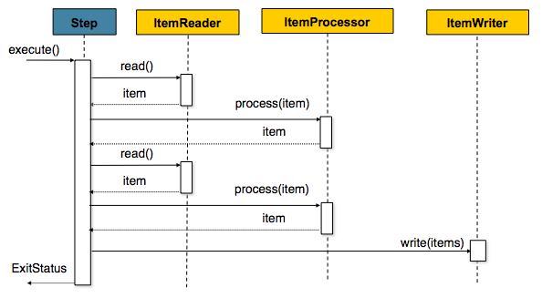
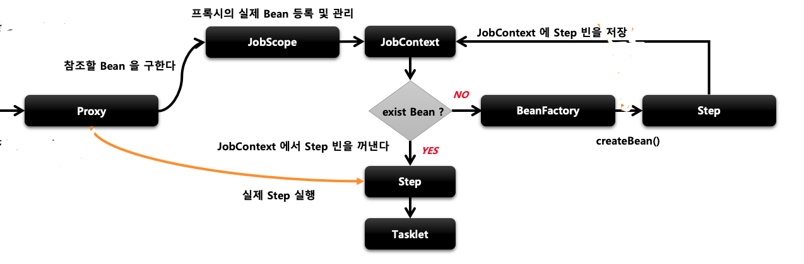
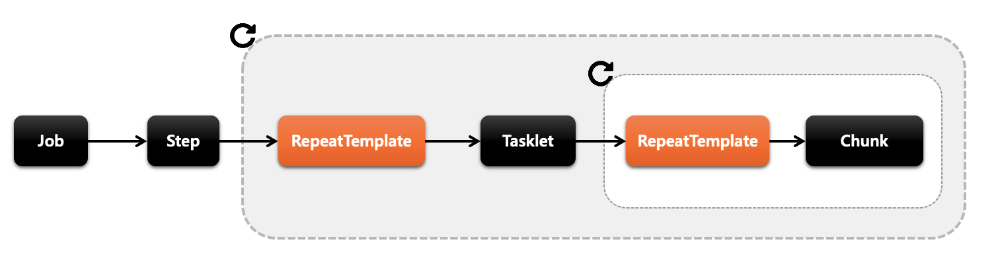

# 1. Spring Batch 개요


매월마다 이전달의 매출액을 집계해야하는 상황이있습니다. 그럼 과연 이 집계 과정을 어디서 수행하면 될까요?

자바 언어와 웹 어플리케이션 밖에 모른다면 통상적으로 Tomcat + Spring MVC 가 생각이 날것같습니다
하지만 이렇게 큰 데이터를 읽고, 가공하고, 저장한다면 해당 서버는 순식간에 CPU, I/O 등의 자원을 다 써버려서 다른 Request 처리를 못하게 됩니다.

그리고 이 집계 기능은 **한달에 1번 수행**됩니다.
이를 위해 API를 구성하는 것은 너무 낭비가 아닐까요? 여기서 추가로 데이터가 너무 많아서 처리중에 실패가 나면 어떻게 될까요?
**5만번째에서 실패했다면, 5만 1번째부터 다시 실행**할 수 있다면 얼마나 좋을까요?

또 이런 경우도 있을수 있습니다.
오늘 아침 누군가가 집계 실행 파일을 실행시켰는데, 다른 누군가가 또 실행시켜 집계 데이터가 2배로 증가 될 수도 있습니다.
**같은 파라미터로 같은 실행 파일을 실행할 경우** 이미 실행한 적이 있어 실패하는 기능을 지원한다면 얼마나 좋을까요?

바로 이런 단발성으로 대용량의 데이터를 처리하는 어플리케이션을 **배치 어플리케이션**이라고 합니다.
위의 고민들을 다시 생각해보면 배치 어플리케이션을 구성하기 위해선 **비지니스 로직 외에 부가적으로 신경써야할 부분들이 많다**는 것을 알 수 있습니다.

웹 어플리케이션을 개발할때는 Spring MVC를 사용하기 때문에  비지니스 로직에 최대한 집중할 수 있습니다.
그럼 Spring에서 이런 배치성 어플리케이션을 지원하는 모듈은 무었이 있을까요? 

Spring 진영에선 **Spring Batch**가 있습니다.

Spring Batch를 소개하기전에 배치 어플리케이션이란 어떤 것인지, 만족해야 할 조건은 아래와 같습니다.

- **대용량 데이터** - 배치 어플리케이션은 **대량의 데이터를 가져오거나, 계산하거나, 전달하는  등의 처리를 할 수 있어야 합니다**.
- **자동화** - 배치 어플리케이션은 심각한 문제 해결을 제외하고는 **사용자 개입 없이 실행**되어야 합니다.
- **견고성** - 배치 어플리케이션은 **잘못된 데이터를 충돌/중단 없이 처리할 수 있어야 합니다**.
- **신뢰성** - 배치 어플리케이션은 **무엇이 잘못되었는지를 추적**할 수 있어야 합니다. (로깅, 알림)
- **성능** - 배치 어플리케이션은 **지정한 시간 안에 처리를 완료**하거나 동시에 실행되는 **다른 어플리케이션을 방해하지 않도록 수행**되어야합니다.


---


## 1.1 Spring Batch란?

엔터프라이즈급 도메인 내의 많은 애플리케이션은 서비스 운영을 수행하기 위해 대량 처리가 필요합니다. 이러한 비즈니스 운영에는 다음이 포함됩니다.

- **사용자 개입 없이 가장 효율적으로 처리되는 대용량 정보의 자동화된 복잡한 처리**입니다. 이러한 작업에는 일반적으로 시간 기반 이벤트(예: 월말 계산, 공지 또는 서신)가 포함됩니다.
- **매우 큰 데이터**(예: 보험 혜택 결정 또는 요율 조정)에 걸쳐 반복적으로 처리되는 복잡한 비즈니스 규칙을 주기적으로 적용합니다.
- 일반적으로 트랜잭션 방식으로 형식화, 검증 및 처리가 필요한 내부 및 외부 시스템에서 수신된 정보를 기록 시스템에 통합합니다. 일괄 처리는 기업에서 매일 수십억 건의 거래를 처리하는 데 사용됩니다.

Spring Batch는 기업 시스템의 일상적인 운영에 필수적인 강력한 배치 애플리케이션 개발을 가능하게 하도록 설계된 가볍고 포괄적인 배치 프레임워크입니다. Spring Batch는 사람들이 기대하는 Spring Framework의 특성(DI, AOP, 생산성, POJO 기반 개발 접근 방식, 일반적인 사용 용이성)을 기반으로 구축되는 동시에 개발자가 필요할 때 더 발전된 서비스에 쉽게 액세스하고 사용할 수 있도록 합니다. 

**Spring Batch는 스케줄링 프레임워크가 아닙니다**. 상용 및 오픈 소스 공간 모두에서 사용할 수 있는 훌륭한 스케줄러(예: Quartz, Tivoli, Control-M 등)가 많이 있습니다. Spring Batch는 스케줄러를 대체하기보다는 스케줄러와 함께 작동하도록 고안되었습니다.

Spring Batch는 로깅 및 추적, 트랜잭션 관리, 작업 처리 통계, 작업 재시작, 건너뛰기, 리소스 관리 등 대용량 레코드 처리에 필수적인 재사용 가능한 기능을 제공합니다. 또한 최적화 및 파티셔닝 기술을 통해 대용량, 고성능 배치 작업을 가능하게 하는 고급 기술 서비스 및 기능을 제공합니다. 


### 1.1.1 배경

오픈 소스 소프트웨어 프로젝트 및 관련 커뮤니티는 웹 및 마이크로서비스 기반 아키텍처 프레임워크에 더 많은 관심을 집중하고 있는 반면, Java 기반 배치 처리 요구 사항을 수용하기 위한 재사용 가능한 아키텍처 프레임워크에 대한 초점은 눈에 띄게 부족했습니다. 과거엔 엔터프라이즈 IT 환경 내에서 처리. 재사용 가능한 표준 배치 아키텍처가 부족하여 클라이언트 엔터프라이즈 IT 기능 내에서 개발된 일회성 사내 솔루션이 많이 확산되었습니다.

SpringSource(현재 VMware)와 Accenture가 협력하여 이를 변경했습니다. 배치 아키텍처 구현에 대한 Accenture의 실제 산업 및 기술 경험, SpringSource의 깊이 있는 기술 경험, Spring의 입증된 프로그래밍 방식이 자연스럽고 강력한 파트너십을 형성하여 엔터프라이즈 Java의 중요한 격차를 메우는 것을 목표로 하는  소프트웨어를 만들었습니다.  두 회사 모두 Spring 기반 배치 아키텍처 솔루션을 개발하여 비슷한 문제를 해결하고 있는 여러 고객과 협력했습니다.

Accenture와 SpringSource 간의 공동 노력은 소프트웨어 처리 접근 방식, 프레임워크 및 기업 사용자가 배치 애플리케이션을 만들 때 일관되게 사용할 수 있는 도구의 표준화를 촉진하는 것을 목표로 했습니다.  이로써 Spring Batch가 탄생하게 되었고 우리는 이 인프라를 활용함으로 배치프로그램의 여러 용이성을 누릴 수 있게 되었습니다.


### 1.1.2 사용 시나리오

일반적인 배치 프로그램은 일반적으로 다음과 같습니다.

- 데이터베이스, 파일 또는 큐에서 많은 수의 레코드를 읽습니다. (Read)
- 어떤 방식으로든 데이터를 처리합니다. (Process)
- 수정된 형식으로 데이터를 다시 씁니다. (Write)

Spring Batch는 이러한 반복 기능을 자동화하여 사용자 상호 작용 없이 트랜잭션을 처리하는 기능을 제공합니다. 배치 작업은 대부분의 IT 프로젝트의 일부이며 Spring Batch는 강력한 엔터프라이즈 규모 솔루션을 제공하는 오픈 소스 프레임워크입니다.


#### 1.1.2.1 비즈니스 시나리오

Spring Batch는 다음 비즈니스 시나리오를 지원합니다.

- 주기적으로 일괄 처리를 커밋합니다.

- 동시 일괄 처리: 작업을 병렬로 처리합니다.

- 단계적 기업 메시지 기반 처리.

- 대규모 병렬 배치 처리.

- 실패 후 다시 시작.

- 종속 단계의 순차적 처리(워크플로우 기반 배치 확장 포함)

- 부분 처리: 레코드를 건너뜁니다(예: 롤백 시).

- 배치 크기가 작거나 기존 저장 프로시저 또는 스크립트가 있는 경우 전체 배치 트랜잭션입니다.

  

#### 1.1.2.2 기술 목표

Spring Batch에는 다음과 같은 기술적 목표가 있습니다.

- 배치 개발자가 Spring 프로그래밍 모델을 사용하도록 합니다. 비즈니스 로직에 집중하고 프레임워크가 인프라를 관리하도록 합니다.
- 인프라, 배치 실행 환경, 배치 애플리케이션 간의 우려사항을 명확하게 분리합니다.
- 모든 프로젝트가 구현할 수 있는 인터페이스로 공통 핵심 실행 서비스를 제공합니다.
- "즉시" 사용할 수 있는 핵심 실행 인터페이스의 간단한 기본 구현을 제공합니다.
- 모든 계층에서 Spring 프레임워크를 사용하여 서비스를 쉽게 구성, 사용자 정의 및 확장할 수 있습니다.
- 모든 기존 핵심 서비스는 인프라 계층에 영향을 주지 않고 쉽게 교체하거나 확장할 수 있어야 합니다.
- Maven을 사용하여 구축된 애플리케이션과 완전히 분리된 아키텍처 JAR을 사용하여 간단한 배포 모델을 제공합니다.


---


### **1.1.3 Spring Batch 장점**

- 대용량 데이터 처리에 최적화되어 고성능을 발휘
- 효과적인 로깅, 통계 처리, 트랜잭션 관리 등 재사용 가능한 필수 기능을 지원
- 수동으로 처리하지 않도록 자동화되어 있습니다.
- 예외사항과 비정상 동작에 대한 방어 기능 존재.


---


### **1.1.4 Spring Batch 단점**

- 스케줄 기능을 제공하지 않으므로 스케줄링을 위해 Jenkins, Quarz 및 Airflow를 같이 사용


---


## 1.2 **Batch Application 사용 사례**

배치 애플리케이션은 일정 주기로 실행되어야 할 때나 실시간 처리가 어려운 대량의 데이터를 처리할 때 주로 사용된다.

- ETL(Extract 추출, Transform 변환, Load 적재)
- 데이터 마이그레이션(Spring Batch는 커밋 횟수 측정, 롤백 기능 제공)
- 대규모 데이터 병렬 처리

 

### **일/월/년 등 특정기간 별 매출 집계하기**

엔터프라이즈 단위의 데이터 집계는 하루에 1000만건이상 나올 수 있다. 이를 count 쿼리로 실행하기에는 서버 부하가 심해질 것이다. 그래서 매일 새벽 매출 집계 데이터를 만들어 외부 요청이 올 경우 미리 만들어 준 집계 데이터를 바로 전달하면 성능과 부하를 모두 잡을 수 있다.

 

### ERP 연동

재무팀의 요구사항으로 매일 매출 현황을 ERP로 전달해야하는 상황에서 Spring Batch가 많이 사용된다. 매일 아침 8시에 ERP에 전달해야할 매출 데이터를 전송해야한다면 Spring Batch 의 각종 API를 활용하여 쉽게 구현할 수 있다.

 

### **구독 서비스** 

전송할 데이터 내역과 구독자 정보를 받아 정해진 시간에 구독을 신청한 회원에게 규칙적으로 메일을 일괄 전송할 때 SpringBatch를 사용하면 쉽게 구현할 수 있다. 배치를 별도로 구현하였을때 구독 서비스 자체 서버 또는 클라이언트나 다른 정보를 열람하는 등 다른 서비스에 영향을 주지 않는다.

 

이 외에도 큰 데이터를 활용하여 보험급여를 결정한다거나 트랜잭션 방식으로 포맷, 유효성 확인 및 처리가 필요한 내부 및 외부 시스템에서 수신한 정보를 기록 시스템으로 통합하는 등 여러 방식으로 사용할 수 있다.

 


## 1.3 Spring Batch 아키텍처

Spring Batch 계층화 아키텍처


- **Application** 

  - 개발자가 만든 모든 배치 Job과 사용자 정의 코드가 포함되어 있습니다.

  - 개발자는 비즈니스 로직 구현에만 집중하고 공통적인 기반 기술은 프레임워크가 담당합니다.

  - Spring Batch를 사용하여 개발자가 작성한 모든 배치 작업과 사용자 정의 코드를 나타냅니다
  
- **Batch Core** : 배치 작업을 시작하고 제어하는 데 필요한 핵심 런타임 클래스를 포함(JobLauncher, Job, Step 등..)
- **Batch Infrastructure** : 
  - Application, Batch Core 모두 Infrastructure Layer에서 빌드됩니다.

  - Job의 흐름과 처리를 위한 틀을 제공하며 Reader, Processor, Writer 등이 속합니다.

  - 개발자와 애플리케이션에서 사용하는 일반적인 Reader와 Writer 그리고 RetryTemplate과 같은 서비스를 포함


스프링 배치는 계층 구조가 위와 같이 설계되어 있기 때문에 개발자는 **Application** 계층의 비즈니스 로직에 집중할 수 있고, 배치의 동작과 관련된 것은 **Batch Core**에 있는 클래스들을 이용하여 제어할 수 있다.

 

스프링배치는 전반적으로 배치 설계를 해봤다면 익숙하고 편하게 느껴질 만한 컨셉을 사용한다. Job과 Step 그리고 개발자가 직접 제공해야하는 처리유닛(`ItemReader` `ItemWriter`)으로 구성되어 있는데, 스프링 패턴, operation, 템플릿, 콜백 으로 인한 다음과 같은 차별점이 있다.

- 명확한 관심사 분리
- 인터페이스로 제공하는 명확한 아키텍처 레이어와 서비스
- 빠르게 적용하고 쉽게 응용할 수 있는 간단한 디폴트 구현체
- 크게 향상된 확장성


배치 프로세싱 도메인 언어를 구성하는 컴포넌트를 개략적으로 설명한다. 이 아키텍처는 지난 몇 세대의 플랫폼(COBOL/Mainframe, C/Unix, and now Java/anywhere)에서 수십 년에 걸쳐 입증한 청사진이다.

스프링 배치는 견고하고 유지보수 가능한 시스템에서 일반적으로 사용하는 레이어, 컴포넌트, 기술 서비스의 물리적 구현체를 제공하는데, 이를 복잡한 요구사항을 해결하기 위한 인프라와 함께 확장하면, 단순한 배치부터 매우 복잡한 배치 응용 프로그램까지 개발할 수 있다.


위 다이어그램은 스프링 배치의 도메인 언어를 구성하는 핵심 개념을 간결하면서도 뚜렷하게 나타내고있다. 

Job 하나는 1~N개의 Step을 가지고 있으며 각 Step은 `ItemReader`, `ItemProcessor`, `ItemWrite`를 딱 한 개씩 가지고 있다. 

각 Job은 `JobLauncher`가 실행하며, 현재 실행 중인 프로세스의 메타정보는 `JobRepository`에 저장된다.


**JobRepository**

다양한 배치 수행과 관련된 수치 데이터와 잡의 상태를 유지 및 관리한다. 

일반적으로 관계형 데이터베이스를 사용하며 스프링 배치 내의 **대부분의 주요 컴포넌트가 공유**한다.

실행된 Step, 현재 상태, 읽은 아이템 및 처리된 아이템 수 등이 모두 JobRepository에 저장된다.


**JobLauncher**

**Job을 실행하는 역할을 담당한다. Job.execute을 호출하는 역할**이다.

Job의 재실행 가능 여부 검증, 잡의 실행 방법, 파라미터 유효성 검증 등을 수행한다.

스프링 부트의 환경에서는 부트가 Job을 시작하는 기능을 제공하므로, 일반적으로 직접 다룰 필요가 없는 컴포넌트다.

Job을 실행하면 해당 잡은 각 Step을 실행한다. 각 스텝이 실행되면 JobRepository는 현재 상태로 갱신된다.


**Job**

**Job은 배치 처리 과정을 하나의 단위로 만들어 표현한 객체**이고 여러 Step 인스턴스를 포함하는 컨테이너이다.

Job이 실행될 때 스프링 배치의 많은 컴포넌트는 탄력성(resiliency)을 제공하기 위해 서로 상호작용을 한다.


**Step**

스프링 배치에서 개발자가 가장 많이 접하며 가장 일반적으로 상태를 보여주는 단위이다. 

각 Step은 잡을 구성하는 독립된 작업의 단위이다.

Step에는 Tasklet, Chunk 기반으로 2가지가 있다.


**Tasklet**

Step이 중지될 때까지 execute 메서드가 계속 반복해서 수행하고 수행할 때마다 독립적인 트랜잭션이 얻어진다. 초기화, 저장 프로시저 실행, 알림 전송과 같은 잡에서 일반적으로 사용된다.


**Chunk**

한 번에 하나씩 데이터(row)를 읽어 Chunk라는 덩어리를 만든 뒤, Chunk 단위로 트랜잭션을 다루는 것

Chunk 단위로 트랜잭션을 수행하기 때문에 실패할 경우엔 해당 Chunk 만큼만 롤백이 되고, 이전에 커밋된 트랜잭션 범위까지는 반영이 된다.

Chunk 기반 Step은 ItemReader, ItemProcessor, ItemWriter라는 3개의 주요 부분으로 구성될 수 있다.





ItemReader와 ItemProcessor에서 데이터는 1건씩 다뤄지고, Writer에선 Chunk 단위로 처리된다.

> 일반적으로 스프링 배치는 대용량 데이터를 다루는 경우가 많기 때문에 Tasklet보다 상대적으로 트랜잭션의 단위를 짧게 하여 처리할 수 있는 
>
> ItemReader, ItemProcessor, ItemWriter를 이용한 Chunk 지향 프로세싱을 이용한다.


**Item**

작업에 사용하는 데이터이다. Item의 전체적인 Flow는 다음과 같이 읽고 처리하기 쓰기로 단순하다. 그리고 이에 대해 ItemReader, ItemProcessor, ItemWriter가 각 역할을 맞아 수행한다.

 


 

**ItemReader**

ItemReader는 말 그대로 데이터를 읽어들인다. DB 데이터뿐만 아니라 File, XML, JSON, CSV 등 다른 데이터 소스를 배치 처리의 입력으로 사용할 수 있다. 또한 JMS와 같은 다른 유형의 데이터 소스도 지원한다. 정리하면 다음과 같다.

- 입력 데이터에서 읽어오기
- 파일에서 읽어오기
- Database에서 읽어오기
- Java Message Service등 다른 소스에서 읽어오기
- 본인만의 커스텀한 Reader로 읽어오기

 

**ItemWriter**

ItemWriter는 Spring Batch에서 사용하는 출력 기능이다. Spring Batch가 처음 나왔을 때, ItemWriter는 ItemReader와 마찬가지로 item을 하나씩 다루었다. 그러나 Spring Batch2와 청크 (Chunk) 기반 처리의 도입으로 인해 **ItemWriter는 item 하나를 작성하지 않고 Chunk 단위로 묶인 item List를 다룬다.**

 

**ItemProcessor**

ItemProcessor는 데이터를 가공 (혹은 처리)한다. 해당 기능은 필수가 아니다.

- ItemProcessor는 데이터를 가공하거나 필터링하는 역할을 한다. 이는 Writer 부분에서도 충분히 구현 가능하다.
- 그럼에도 ItemProcessor를 쓰는 것은 Reader, Writer와는 별도의 단계로 기능이 분리되기 때문이다.

 

---


## 1.4 **Spring Batch 구성요소**

### **1.4.1 Job**


**JobRepository**

스프링 배치에서 Job의 실행 정보를 저장하고 관리하는 데이터베이스로 JobLauncher에 의해 사용된다.

 

**JobExecution**

Job의 실행 정보를 저장하며 JobInstance와 연관된다.

 

**JobInstance**

Job의 논리적 실행 단위를 의미한다.

 

**StepExecution**

Job의 실행 과정에서 Step의 실행 정보를 저장하며, JobExecution과 연관된다. 한 개의 JobExecution은 여러 개의 StepExecution을 가질 수 있다.

 

**ExecutionContext**

Job 또는 Step 실행 중에 사용자가 저장하고자 하는 임시 데이터를 저장한다.

 

**JobLauncher**

Job을 실행하는 인터페이스이다. JobRepository에서 Job의 실행 정보를 읽어 Job을 실행하고 결과를 JobRepository에 저장한다.

 

**JobOperator**

Job의 실행, 중지, 재시작 등의 작업을 수행하는 인터페이스이다. 스프링 배치에서는 JobOperator 인터페이스를 구현하는 SimpleJobOperator를 제공하고 있다.


job은 전체 배치 프로세스를 캡슐화한 엔티티다. 다른 스프링 프로젝트와 마찬가지로, `Job`은 XML 기반이나 자바 기반 설정을 둘 다 지원한다. 이 설정은 “job 설정”이라고도 할 수 있지만, Job은 아래 다이어그램에서 보듯 가장 상위 개념 일 뿐이다.

#### 1.4.1.1 JobInstance

JobInstance는 **Job이 실행될 때 생성되는 Job의 논리적 실행 단위 객체로서 고유하게 식별 가능한 작업 실행을 나타냅니다.**

Job의 설정과 구성은 동일하지만 Job이 실행되는 시점에 처리하는 내용은 다릅니다. 즉, 같은 잡을 실행하지만 오늘 실행되는 내용과 내일 실행되는 내용이 다르다는것을 나타냅니다. 

 

JobInstance는 새로 시작되는 배치일 경우 Job + JobParameter로 새로운 JobInstance를 생성합니다. 그런데 이전과 동일한 Job + Jobparameter로 실행될 경우 이미 존재하는 JobInstance를 반환하게 됩니다. 

 

Job과 JobInstance는 1:M의 관계를 가지면서 BATCH_JOB_INSTANCE 테이블과 매핑되는데 JOB_NAME(Job)과 JOB_KEY(JobParameter)가 동일한 데이터는 중복해서 저장이 불가능합니다.

 

1) JobInstance 생성 Flow


2) BATCH_JOB_INSTACE Table

| JOB_INSTANCE_ID | JOB_NAME  | JOB_KEY                          |
| --------------- | --------- | -------------------------------- |
| 1               | SimpleJob | d52d8cd98d00e214e9412998ecf2457e |
| 2               | SimpleJob | e41z8cb98q00b204e9800998ecf8427e |

JOB_INSTANCE_ID에는 각 다른 인스턴스 값이 저장이 되고

JOB_NAME에는 등록된 잡의 이름이 저장이 되고

JOB_KEY에는 Job Parameter를 해싱한 값이 저장이 됩니다. 

**JobName + JobParamter는 중복된 데이터는 가질수 없습니다**.

 

#### 1.4.1.2 JobParameter

\- Job을 실행할 때 함께 포함되어 사용되는 파라미터를 가진 도메인 객체

\- JobParameter와 JobInstance는 1대1 관계

 `JobInstance`가 Job과 어떻게 다른지 이야기하다 보면 보통 이런 질문이 나온다: “`JobInstance`는 다른 JobInstance와 어떻게 구분하지?” 정답은 `JobParameters`다. `JobParameters`는 배치 job을 시작할 때 사용하는 파라미터 셋을 가지고 있는 객체다. 아래 그림에서 보이듯, 실행 중 job을 식별하거나 참조 데이터로도 사용할 수 있다.


앞에 나온 예시에서는  `Job`은 하나지만 `JobParameter`가 두 개 있다. JobInstance` = `Job` + 식별용 `JobParameters`. 덕분에 개발자는 효율적으로 `JobInstance`를 정의할 수 있으며, 거기 사용될 파라미터도 제어할 수 있다.

> 모든 job 파라미터를 `JobInstance`를 식별하는 데 사용하진 않는다. 기본적으로는 그렇지만, 프레임워크는 `JobInstance`ID 에 관여하지 않는 파라미터를 사용할 수도 있다.

  

#### 1.4.1.3 JobExecution

JobLauncher : Job을 실행시키는 주체

JobInstance에 대한 한번의 시도를 의미하는 객체로서 Job 실행 중에 발생한 정보들을 저장하는 객체

**해당 JobExecution은 JobInstance가 실행 될 때 마다 생성된다.**

**JobExecution은 FAILED 또는 COMPLETED 등의 Job의 실행 결과 상태를 가지고 있다.**

FAILED : JobInstance 실행이 완료되지 않은 것으로 간주해서 **재실행이 가능,** JobParameter의 동일한 값으로 계속 실행 가능

COMPLETED : JobInstance 실행이 완료된 것으로 간주해서 **재실행이 불가능**

 

1) BATCH_JOB_EXECUTION Table

\- JobInstance와 JobExecution은 1:M의 관계로서 JobInstance에 대한 성공/실패 내역을 가지고 있다.


`JobExecution` 개념은 Job을 한번 실행하려 했다는 것이다. 하나의 실행은 성공하거나 실패하게 되는데, 실행에 상응하는 `JobInstance`는 실행이 성공적으로 종료되기 전까지는 완료되지 않은 것으로 간주한다. 앞에 나온 EndOfDay `Job`을 실행하고 처음엔 실패한  `JobInstance`를 생각해보자. 첫 번째 실행과 똑같은 job 파라미터로 재실행한다면, 새 `JobExecution`이 생성된다. 반면 `JobInstance`는 여전히 한 개다.

`Job`은 job이 무엇인지와 어떻게 실행되어야 하는지를 설명하고, `JobInstance`는 주로 올바른 재시작을 위해 실행을 그룹화하는 **순수한 구조적 오브젝트**다. 반면 `JobExecution`은 실제 실행 중에 필요한 기본 스토리지 메커니즘을 제공하며, 아래 테이블에서 보이듯 더 많은 프로퍼티를 관리하고 유지해야 한다.

**Table 1. JobExecution Properties**

|     Property      |                          Definition                          |
| :---------------: | :----------------------------------------------------------: |
|      Status       | 실행 상태를 나타내는 `BatchStatus` 오브젝트. 실행 중일 때는 `BatchStatus#STARTED`. 실패하면 `BatchStatus#FAILED`. 성공적으로 종료되면 `BatchStatus#COMPLETED` |
|     startTime     | job을 실행할 때의 시스템 시간을 나타내는 `java.util.Date`. 아직 job이 시작되지 않았다면 이 필드는 비어있다. |
|      endTime      | 성공 여부와 상관없이 실행이 종료될 때의 시스템 시간을 나타내는 `java.util.Date`. 아직 job이 종료되지 않았다면 이 필드는 비어있다. |
|    exitStatus     | 실행 결과를 나타내는 `ExitStatus`. 호출자에게 리턴하는 종료 코드를 포함하기 때문에 가장 중요하다. 자세한 내용은 5장 참고. 아직 job이 종료되지 않았다면 이 필드는 비어있다. |
|    createTime     | `JobExecution`이 처음 저장될 때의 시스템 시간을 나타내는 `java.util.Date`. job은 시작되지 않았을 수도 있는데(따라서 시작 시간이 없을 수도 있음), createTime은 프레임워크가 job 레벨의 `ExecutionContext`을 관리할 때 사용하기 때문에 항상 존재한다. |
|    lastUpdated    | `JobExecution`이 저장된 마지막 시간을 나타내는 `java.util.Date`. 아직 job이 시작되지 않았다면 이 필드는 비어있다. |
| executionContext  | 실행하는 동안 유지해야 하는 모든 사용자 데이터를 담고 있는 “property bag”. |
| failureExceptions | `Job` 실행 중 발생한 예외 리스트. `Job`이 실패할 때 둘 이상의 예외가 발생한 경우에 유용하다. |

이 프로퍼티를 저장해 두면 실행 상태를 결정할 수 있으므로 매우 중요하다. 예를 들어, 예시의 EndOfDay job을 9:00 PM에 실행해서 9:30에 실패했다면, 배치 메타 데이터 테이블에 아래 엔트리들이 저장된다:

**Table 2. BATCH_JOB_INSTANCE**

| JOB_INST_ID |  JOB_NAME   |
| :---------: | :---------: |
|      1      | EndOfDayJob |

**Table 3. BATCH_JOB_EXECUTION_PARAMS**

| JOB_EXECUTION_ID | TYPE_CD |   KEY_NAME    |  DATE_VAL  | IDENTIFYING |
| :--------------: | :-----: | :-----------: | :--------: | :---------: |
|        1         |  DATE   | schedule.Date | 2017-01-01 |    TRUE     |

**Table 4. BATCH_JOB_EXECUTION**

| JOB_EXEC_ID | JOB_INST_ID |    START_TIME    |     END_TIME     | STATUS |
| :---------: | :---------: | :--------------: | :--------------: | :----: |
|      1      |      1      | 2017-01-01 21:00 | 2017-01-01 21:30 | FAILED |

> 단순화와 포맷팅을 위해 일부 컬럼명은 축약하거나 제외했다.

job이 실패했고, 밤새도록 문제를 찾느라 ‘배치 윈도우’가 이제야 닫혔다고 가정해보자. 또한 윈도우는 9:00 PM에 시작하고, 다음 날 중단했던 위치에서부터 job을 다시 시작해서 9:30에 01-01 데이터를 모두 처리했다고 가정해보자. 하루가 지났으므로 01-02 job도 실행해야 하는데, 9시 31분에 바로 시작해서 1시간이 걸려 10시 30분에 정상적으로 종료된 상황이다. 두 job이 동일한 데이터에 접근해서 데이터베이스 레벨에서 잠금 문제를 일으킬 일이 없다면, `JobInstance` 한 개씩 순차적으로 진행할 필요는 없다. `Job`을 실행할지 말지 결정하는 일은 전적으로 스케줄러에 달려있다. 여기서 두 `JobInstance`는 독립적이므로, 스프링 배치는 동시에 실행한다고 해서 job을 중단시키지 않는다. (`JobInstance`가 이미 실행 중인데 같은 `JobInstance`를 실행하려고 하면 `JobExecutionAlreadyRunningException`이 발생한다). 아래 표를 보면 이제 `JobInstance` 및 `JobParameters` 테이블에 엔트리 하나씩이 추가됐고, `JobExecution` 테이블에 두 개의 엔트리가 추가됐다.

**Table 5. BATCH_JOB_INSTANCE**

| JOB_INST_ID |  JOB_NAME   |
| :---------: | :---------: |
|      1      | EndOfDayJob |
|      2      | EndOfDayJob |

**Table 6. BATCH_JOB_EXECUTION_PARAMS**

| JOB_EXECUTION_ID | TYPE_CD |   KEY_NAME    |  DATE_VAL  | IDENTIFYING |
| :--------------: | :-----: | :-----------: | :--------: | :---------: |
|        1         |  DATE   | schedule.Date | 2017-01-01 |    TRUE     |
|        2         |  DATE   | schedule.Date | 2017-01-01 |    TRUE     |
|        3         |  DATE   | schedule.Date | 2017-01-02 |    TRUE     |

**Table 7. BATCH_JOB_EXECUTION**

| JOB_EXEC_ID | JOB_INST_ID |    START_TIME    |     END_TIME     |  STATUS   |
| :---------: | :---------: | :--------------: | :--------------: | :-------: |
|      1      |      1      | 2017-01-01 21:00 | 2017-01-01 21:30 |  FAILED   |
|      2      |      1      | 2017-01-02 21:00 | 2017-01-02 21:30 | COMPLETED |
|      3      |      2      | 2017-01-02 21:31 | 2017-01-02 22:29 | COMPLETED |

> 단순화와 포맷팅을 위해 일부 컬럼명은 축약하거나 제외했다.

------


---


### **1.4.2 Step**

Job의 실행 단계를 나타내는 것으로, Tasklet 또는 Chunk 지향 처리 방식으로 구성되어 있다.

- Batch Job을 구성하는 독립적인 하나의 단계로서 실제 배치 처리를 정의하고 컨트롤하는데 필요한 모든 정보를 가지고 있는 도메인 객체
- 모든 Job은 하나 이상의 step으로 구성됨

 

#### 1.4.2.1 기본 구현체

- Tasklet : 가장 기본이 되는 클래스로서 Tasklet 타입의 구현체들을 제어
- PartitionStep : 멀티 스레드 방식으로 Step을 여러 개로 분리해서 실행
- JobStep : Step 내에서 Job을 실행
- FlowStep : Step 내에서 Flow를 실행

 

#### 1.4.2.2 StepExecution

- Step에 대한 한번의 시도를 의미하는 객체로서 Step 실행 중에 발생한 정보들을 저장하는 객체
- Step이 매번 시도 될 때마다 각 Step별로 생성
-  Job이 재시작 하더라도 이미 성공적으로 완료된 Step은 재시작하지 않고 실패된 Step만 실행
- 이전 단계에서 Step이 실패해서 현재 Step을 실행하지 않았다면 StepExecution을 생성하지 않음. 즉, Step이 실제로 시작되었을 때만 StepExecution을 생성


`StepExecution`은 한 번의 `Step` 실행 시도를 의미한다. `StepExecution`은 `JobExecution`과 유사하게 `Step`을 실행할 때마다 생성한다. 하지만 이전 단계 step이 실패해서 step을 실행하지 않았다면 execution을 저장하지 않는다. `Step`이 실제로 시작됐을 때만 `StepExecution`을 생성한다.

`Step` execution은 `StepExecution` 클래스 객체다. 각 execution은 실행/종료 시각이나 커밋/롤백 횟수를 포함한 해당 step, `JobExecution`, 트랜잭션 관련 데이터를 가지고 있다. 추가로, 각 step execution은 `ExecutionContext`를 가지고 있는데 여기에는 통계나 재시작 시 필요한 상태 정보 등 배치 작업에서 유지해야 하는 모든 데이터가 있다. `StepExecution`의 프로퍼티는 아래 테이블에 있다.

**Table 8. StepExecution Properties**

|     Property     |                          Definition                          |
| :--------------: | :----------------------------------------------------------: |
|      Status      | 실행 상태를 나타내는 `BatchStatus` 객체. 실행 중일 때는 `BatchStatus.STARTED`. 실패하면 `BatchStatus.FAILED`. 성공하면 `BatchStatus.COMPLETED.` |
|    startTime     | step을 실행할 때의 시스템 시간을 나타내는 `java.util.Date`. 아직 step이 시작되지 않았다면 이 필드는 비어있다. |
|     endTime      | 성공 여부와 상관없이 실행이 종료될 때의 시스템 시간을 나타내는 `java.util.Date`. 아직 step이 종료되지 않았다면 이 필드는 비어있다. |
|    exitStatus    | 실행 결과를 나타내는 `ExitStatus`. 호출자에게 리턴하는 종료 코드를 포함하기 때문에 가장 중요하다. 자세한 내용은 5장 참고. 아직 job이 종료되지 않았다면 이 필드는 비어있다. |
| executionContext | 실행하는 동안 유지해야 하는 모든 사용자 데이터를 담고 있는 “property bag”. |
|    readCount     |                 성공적으로 read한 아이템 수.                 |
|    writeCount    |                성공적으로 write한 아이템 수.                 |
|   commitCount    |                실행 중에 커밋된 트랜잭션 수.                 |
|  rollbackCount   |          `Step`에서 처리된 트랜잭션 중 롤백된 횟수.          |
|  readSkipCount   |                 read에 실패해서 스킵된 횟수.                 |
| processSkipCount |               process에 실패해서 스킵된 횟수.                |
|   filterCount    |          `ItemProcessor`에 의해 필터링된 아이템 수.          |
|  writeSkipCount  |                write에 실패해서 스킵된 횟수.                 |

------


#### 1.4.2.3 ExecutionContext

`ExecutionContext`는 프레임워크에서 유지/관리하는 키/값 쌍의 컬렉션으로, `StepExecution` 객체 또는 `JobExecution` 객체에 속하는 상태(state)를 저장한다. Quartz에 익숙하다면, JobDataMap과 유사 

```
executionContext.putLong(getKey(LINES_READ_COUNT), reader.getPosition());
```

`Job`의 개념 설명할 때 예시로 사용한 EndOfDay를 그대로 가져와서, 데이터베이스에서 파일을 읽는 ‘loadData’ step 하나가 있다고 가정해보자. 첫 실행에 실패한 이후의 메타 데이터 테이블은 아래와 같을 것이다:

**Table 9. BATCH_JOB_INSTANCE**

| JOB_INST_ID |  JOB_NAME   |
| :---------: | :---------: |
|      1      | EndOfDayJob |

**Table 10. BATCH_JOB_EXECUTION_PARAMS**

| JOB_INST_ID | TYPE_CD |   KEY_NAME    |  DATE_VAL  |
| :---------: | :-----: | :-----------: | :--------: |
|      1      |  DATE   | schedule.Date | 2017-01-01 |

**Table 11. BATCH_JOB_EXECUTION**

| JOB_EXEC_ID | JOB_INST_ID |    START_TIME    |     END_TIME     | STATUS |
| :---------: | :---------: | :--------------: | :--------------: | :----: |
|      1      |      1      | 2017-01-01 21:00 | 2017-01-01 21:30 | FAILED |

**Table 12. BATCH_STEP_EXECUTION**

| STEP_EXEC_ID | JOB_EXEC_ID | STEP_NAME |    START_TIME    |     END_TIME     | STATUS |
| :----------: | :---------: | :-------: | :--------------: | :--------------: | :----- |
|      1       |      1      | loadData  | 2017-01-01 21:00 | 2017-01-01 21:30 | FAILED |

**Table 13. BATCH_STEP_EXECUTION_CONTEXT**

| STEP_EXEC_ID |    SHORT_CONTEXT    |
| :----------: | :-----------------: |
|      1       | {piece.count=40321} |

위 예시에서 `Step`은 30분 동안 실행됐고, 40,321개의 ‘peices’(여기서는 이파일의 라인 수를 의미)를 처리했다. 이 값은 프레임워크가 각 커밋 전 업데이트하며, `ExecutionContext` 내 엔티티에 해당하는 여러 row를 포함할 수 있다. 커밋 전에 통지 받으려면 여러 `StepListener` 구현체 중 하나가 필요합니다. 이전 예시와 동일하게 다음 날 `Job`을 재실행했다고 가정한다. 재시작할 때 데이터베이스로부터 마지막 실행을 가리키는 `ExecutionContext` 값을 조회한다. 아래 예제처럼, `ItemReader`가 열릴 때 컨텍스트에 저장된 상태가 있는지 확인하고, 있다면 해당 컨텍스트를 참조해서 초기화한다.

```java
if (executionContext.containsKey(getKey(LINES_READ_COUNT))) {
    log.debug("Initializing for restart. Restart data is: " + executionContext);

    long lineCount = executionContext.getLong(getKey(LINES_READ_COUNT));

    LineReader reader = getReader();

    Object record = "";
    while (reader.getPosition() < lineCount && record != null) {
        record = readLine();
    }
}
```

위 코드를 실행하면 현재 라인은 40322이므로, 중단됐던 위치부터 `Step`을 다시 실행할 수 있다. 실행 자체에 관한 통계 데이터도 `ExecutionContext`를 활용하면 된다. 예를 들어, 여러 줄을 한 번에 처리해야 하고 그 처리에도 순서가 있다면 몇 번째 순서까지 진행했는지도 기록해야 한다 (단순히 읽어온 라인 수를 기록하는 것과는 다르다). 따라서 `Step`이 끝날 때 몇 번째 순서까지 진행했는지를 메일로 보낸다고 해보자. 프레임워크는 어떤 `JobInstance`를 사용하냐에 따라 그에 맞는 상태를 저장해주는데, 이미 있는 `ExecutionContext`를 사용할지 말지 판단하는 일은 쉽지만은 않다.

 

또한 `JobExecution` 당 `ExecutionContext`가 하나인 것처럼, 모든 `StepExecution` 마다 `ExecutionContext`를 한 개씩 가지고 있다는 점도 잊지 말자. 예시로 아래 코드를 보자:

```java
ExecutionContext ecStep = stepExecution.getExecutionContext();
ExecutionContext ecJob = jobExecution.getExecutionContext();
//ecStep does not equal ecJob
```

주석에서 말하듯이 `ecStep`과 `ecJob`은 같지 않다. `ExecutionContext`는 두 종류가 있다. 하나는 `Step` 레벨로 `Step` 내에서 커밋할 때마다 저장하고, `Job` 레벨의 컨텍스트는 모든 `Step` 실행 사이마다 저장한다.


------


#### 1.4.2.4 StepContribution

- 청크 프로세스의 변경사항을 StepExecution에 업데이트 해주는 도메인 객체
- 청크 커밋 직전에 StepExecution의 apply 메소드를 호출하여 상태를 업데이트
- ExitStatus의 기본 종료 코드 외 사용자 정의 종료코드를 생성해서 적용 가능


`Step`은 배치 job의 독립적이고 순차적인 단계를 캡슐화한 도메인 객체다. 즉, 모든 Job은 하나 이상의 step으로 구성된다. `Step`은 실제 배치 처리를 정의하고 컨트롤하는 데 필요한 모든 정보를 가지고 있다. 설명이 모호하게 느껴질 수도 있는데, `Step`의 모든 내용은 `Job`을 만드는 개발자 재량이기 때문에 그렇다. `Step`은 어떻게 개발하느냐에 따라 간단할 수도 있고 복잡할 수도 있다. 즉, 단순히 데이터베이스에서 파일을 읽는, 코드가 거의 필요 없거나 전혀 필요하지 않은(사용한 구현체에 따라 다름) 간단한 작업이 될 수도 있고, 프로세싱 일부를 처리하는 복잡한 비지니스 로직도 될 수 있다. 


---


#### 1.4.2.5 Flow


#### **1.4.2.6 Tasklet**

Step에서 실행되는 최소 실행 단위이다. 스프링에서 제공하는 Tasklet 인터페이스를 구현하여 실행시킬 수 있다. Tasklet이 실행되면 Job의 다음 Step으로 넘어가게 된다.

 

#### **1.4.2.7 Chunk 지향 처리(Chunk-oriented Processing)**

대용량 데이터를 처리할 때 사용되는 방식으로, 지정된 chunk size 만큼 데이터를 처리하고 다음 chunk를 처리하는 방식이다. 이 방식은 데이터 처리의 속도를 높이고, 메모리를 효율적으로 사용할 수 있다.


---


# 2. Spring Batch 실습

## 2.1 사전준비

### 2.1.1 DataBase 준비

#### 2.1.1.1 Docker 실행


#### 2.1.1.2 docker-compose 로  docker file 실행

```bash
$ cd Docker
$ docker-compose up -d
```


## 2.2 맛보기 코드 실행


### 2.2.1 jobname 설정

spring.batch.job.name: ${job.name:NONE}

Spring Batch가 실행될때, **Program arguments로 `job.name` 값이 넘어오면 해당 값과 일치하는 Job만 실행**하겠다는 것입니다.
여기서 `${job.name:NONE}`을 보면 `:`를 사이에 두고 좌측에 `job.name`이, 우측에 `NONE`이 있는데요.
이 코드의 의미는 `job.name`**이 있으면** `job.name`**값을 할당하고, 없으면** `NONE`**을 할당**하겠다는 의미입니다.
중요한 것은! `spring.batch.job.names`에 `NONE`이 할당되면 **어떤 배치도 실행하지 않겠다는 의미**입니다.
즉, 혹시라도 **값이 없을때 모든 배치가 실행되지 않도록 방지하며 Job 을 선택하여 실행 할 수 있게하는 역할**입니다.


### 2.2.2 실행하기

**Open Config** 


**Arguments 설정**


**실행하기**


## 2.3 MetaTable

**/org/springframework/batch/core/schema-\*.sql**

Spring Batch 메타데이터 테이블은 Java에서 이를 나타내는 Domain 객체와 매우 밀접하게 일치합니다. 예를 들어, `JobInstance`,`JobExcution` , `JobParameters` 는 각각 BATCH_JOB_INSTANCE, BATCH_JOB_EXECUTION, BATCH_JOB_EXECUTION_PARAMS 및 BATCH_STEP_EXECUTION에 매핑됩니다 `JobExecution`. BATCH_JOB_EXECUTION_CONTEXT 및 BATCH_STEP_EXECUTION_CONTEXT에 모두 매핑됩니다. 그만큼 `JobParameters` `StepExecution` `ExecutionContext` `JobRepository`각 Java 객체를 올바른 테이블에 저장하고 저장하는 일을 담당합니다.


https://docs.spring.io/spring-batch/docs/3.0.x/reference/html/metaDataSchema.html


### 2.3.1 Job 관련 테이블

#### BATCH_JOB_INSTANCE

\- Job이 실행될 때 **JobInstance 정보가 저장**되며 **job_name, job_key를 키로 하여 하나의 데이터가 저장되기 때문에 중복되는 Job을 저장할 수 없습니다**.

| Column Name     | Column Explanation                                           |
| --------------- | ------------------------------------------------------------ |
| JOB_INSTANCE_ID | Job 인스턴스를 식별하는 고유 ID. getId 메서드를 호출하여 얻을 수 있다. |
| VERSION         | 업데이트 될 때마다 1씩 증가                                  |
| JOB_NAME        | Job을 구성할 때 부여하는 Job의 이름                          |
| JOB_KEY         | job_name과 job_parameter를 합쳐 해싱한 값을 저장             |

 

#### BATCH_JOB_EXECUTION

\- 배치 Job의 실행 정보가 담기며 **Job의 생성, 시작, 종료 시간, 실행 상태 등의 정보를 저장**합니다.

| Column Name      | Column Explanation                                           |
| ---------------- | ------------------------------------------------------------ |
| JOB_EXECUTION_ID | JobExecution을 고유하게 식별할수 있는 기본키, JOB_INSTANCE와 일대 다 관계. getId 메서드를 호출하여 얻을 수 있다. |
| VERSION          | 업데이트 될 때마다 1씩 증가                                  |
| JOB_INSTANCE_ID  | BATCH_JOB_INSTANCE 테이블의 외래 키                          |
| CREATE_TIME      | 실행(Execution)이 생성된 시점을 TimeStamp 형식으로 기록      |
| START_TIME       | 실행(Execution)이 시작된 시점을 TimeStamp 형식으로 기록      |
| END_TIME         | 성공 또는 실패에 관계 없이 실행(Execution)이 완료된 시점을 TimeStamp 형식으로 기록  단, Job 실행 도중 오류가 발생해서 Job이 중단된 경우 값이 저장되지 않을 수 있음 |
| STATUS           | 실행 상태(BatchStatus)를 저장(COMPLETED, STARTED...). BatchStatus의 Enumeration |
| EXIT_CODE        | 실행 종료(ExitStatus) 코드를 저장(COMPLETED, STARTED...)     |
| EXIT_MESSAGE     | Job이 종료된 방법에 대한 설명을 나타냄. Status가 실패일 경우 실패 원인 등의 내용을 저장 |
| LAST_UPDATED     | 마지막 실행(Execution) 시점을 TimeStamp 형식으로 기록        |

 

#### BATCH_JOB_EXECUTION_PARAMS

\- Job과 함께 실행되는 **JobParameter 정보를 저장**합니다.

| Column Name      | Column Explanation                                           |
| ---------------- | ------------------------------------------------------------ |
| JOB_EXECUTION_ID | JobExecution 식별 키. JOB_EXECUTION과는 일대다 관계. 그렇기 때문에 하나의 JOB_EXECUTION_ID에는 여러개의 파라미터 값을 가질수 있음 |
| TYPE_CD          | 저장된 값의 타입 정보를 저장(STRING, LONG, DATE...). 유형을 알아야 하기 때문에 null 일 수 없음 |
| KEY_NAME         | 파라미터 키                                                  |
| STRING_VAL       | 타입이 String일 경우 저장되는 값                             |
| DATE_VAL         | 타입이 Date일 경우 저장되는 값                               |
| LONG_VAL         | 타입이 Long일 경우 저장되는 값                               |
| DOUBLE_VAL       | 타입이 Double일 경우 저장되는 값                             |
| IDENTIFTING      | 배치 잡 파라미터의 값을 식별 여부를 저장 (TRUE, FALSE)       |

 

#### BATCH_JOB_EXECUTION_CONTEXT

\- Job의 실행 동안 여러 가지 상태 정보, 공유 데이터를 직렬화(Json 형식) 해서 저장합니다.

\- ExecutionContext 객체가 가지고 있는 데이터를 통해 Step 간 서로 데이터 공유가 가능합니다.

| Column Name        | Column Explanation                                          |
| ------------------ | ----------------------------------------------------------- |
| STEP_EXECUTION_ID  | JobExecution 식별 키. JOB_EXECUTION 마다 각 생성            |
| SHORT_CONTEXT      | Job의 실행 상태 정보, 공유 데이터 등의 정보를 문자열로 저장 |
| SERIALIZED_CONTEXT | 직렬화된 전체 컨텍스트                                      |


### 2.3.2 Step 관련 테이블

#### BATCH_STEP_EXECUTION

\- Step의 실행 정보가 저장되며 **생성, 시작, 종료 시간 등을 관리**합니다.

| Column Name        | Column Explanation                                           |
| ------------------ | ------------------------------------------------------------ |
| STEP_EXECUTION_ID  | Step의 실행벙보를 고유하게 식별할 수 있는 기본 키            |
| VERSION            | 업데이트 될 때마다 1씩 증가                                  |
| STEP_NAME          | Step을 구성할 때 부여하는 Step 이름                          |
| JOB_EXECUTION_ID   | BATCH_JOB_EXECUTION 테이블의 외래키. JobExecution과는 일대다 관계 |
| START_TIME         | 실행이 시작된 시간을 나타내는 타임스탬프                     |
| END_TIME           | 성공, 실패에 상관없이 완료된 시간을 나타내는 타임스탬프      |
| STATUS             | 실행 상태(BatchStatus)를 저장(COMPLETED, STARTED...). BatchStatus의 Enumeration |
| COMMIT_COUNT       | 트랜잭션 당 커밋되는 수를 기록                               |
| READ_COUNT         | 실행 시점에 Read한 item 수를 기록                            |
| FILTER_COUNT       | 실행 도중 필터링 된 item 수를 기록                           |
| WRITE_COUNT        | 실팽 도중 저장되고 커밋된 item 수를 기록                     |
| READ_SKIP_COUNT    | 실행 도중 Read가 Skip된 item 수를 기록                       |
| WRITE_SKIP_COUNT   | 실행 도중 Write가 Skip된 item 수를 기록                      |
| PROCESS_SKIP_COUNT | 실행 도중 Prcess가 Skip된 itme 수를 기록                     |
| ROLLBACK_COUNT     | 실행 도중 Rollback이 일어난 수를 기록                        |
| EXIT_CODE          | 실행 종료(ExitStatus) 코드를 저장(COMPLETED, STARTED...)     |
| EXIT_MESSAGE       | Step이 종료된 방법에 대한 설명을 나타냄. Status가 실패일 경우 실패 원인 등의 내용을 저장 |
| LAST_UPDATED       | 마지막 실행(Execution) 시점을 타임스탬프 형식으로 기록       |

 

#### BATCH_STEP_EXECUTION_CONTEXT

\- Step의 실행 동안 여러 가지 **상태 정보, 공유 데이터를 직렬화(Json 형식) 해서 저장**합니다.

\- Step 별로 저장되며 **Step 간 서로 데이터 공유가 불가능**합니다.

| Column Name        | Column Explanation                                           |
| ------------------ | ------------------------------------------------------------ |
| STEP_EXECUTION_ID  | StepExecution 식별 키, STEP_EXECUTION 마다 각 생성           |
| SHORT_CONTEXT      | STEP의 실행 상태 정보, 공유 데이터 등의 정보를 문자열로 저장 |
| SERIALIZED_CONTEXT | 직렬화된 전체 컨텍스트                                       |


---


## 2.4 Job

 **JobLauncherApplicationRunner**

- Spring Batch 작업을 시작하는 ApplicationRunner로서 BatchAutoConfiguration에서 생성됩니다.
- 스프링 부트에서 제공하는 ApplicationRunner의 구현체로 애플리케이션이 정상적으로 구동되자 마자 실행됩니다.
- 기본적으로 빈으로 등록된 모든 Job을 실행시킵니다.


**BatchProperties**

application.properties 에서 Spring Batch의 환경 설정을 할 수 있습니다.

```properties
spring.batch.job.enabled=true
spring.batch.job.name=${job.name:NONE} 
spring.batch.jdbc.initialize-schema = ALWAYS
#spring.batch.jdbc.table-prefix: SYSTEM_
```


- enable
  - 기본값은 true
  - false는 스프링이 자동으로 Job을 실행하는 것을 막습니다.
- name
  - enable이 true일 때, 자동으로 전체 Job이 실행되는데 특정 Job만 실행하도록 하는 옵션입니다.
    - ex) --job.name=job1
    - job1만 실행하고 존재하지 않으면 실행하지 않습니다.
    - 만약 아무런 argument가 주입되지 않는다면 아무런 배치도 실행되지 않습니다.
- initialize-schema
  - EMBEDDED : **내장 DB일 때만** 실행되며 스키마가 자동으로 생성(Default)
  - ALWAYS : 스크립트 항상 실행
  - NEVER
    - 스크립트 항상 실행 안하기 때문에 내장 DB일 경우 스크립트가 생성이 안되기 때문에 오류 발생
    - **운영에서는 수동으로 스크립트 생성 후 설정하는 것을 권장**
- table-prefix
  - 기본값은 BATCH_
  - 테이블의 앞의 문자를 변경하는 옵션입니다.


### 2.4.1 JobBuilder 

------

스프링 배치는 Job을 쉽게 생성 및 설정할 수 있도록 Util 성격의 빌더 클래스들을 제공합니다.

- JobBuilderFactory(v5.0 이후 deprecated)
  - JobBuilder를 생성하는 팩토리 클래스로 get 메서드를 제공합니다.
  - JobBuilderFactory.get(“jobName”)
    - 내부적으로 JobBuilder가 jobName을 잡의 이름으로 하여 잡을 생성하도록 로직이 구성되어 있습니다.
- JobBuilder
  - Job을 구성하는 설정 조건에 따라 두 개의 하위 빌더 클래스를 생성하여 직접 Job을 생성하지 않고 Job 생성을 위임합니다.
  - SimpleJobBuilder
    - SimpleJob을 생성하는 Builder 클래스
    - Job 실행과 관련된 여러 설정 API 제공
  - FlowJobBuilder
    - FlowJob을 생성하는 Builder 클래스
    - 내부적으로 FlowBuilder를 반환함으로써 Flow 실행과 관련된 여러 설정 API를 제공


### 2.4.2 아키텍처


- JobBuilder에서 start(step)를 사용하면 JobBuilder 내부적으로 SimpleJobBuilder를 생성하여 SimpleJob을 생성합니다.
- JobBuilder에서 start(flow) 또는 flow(step)를 사용하면 JobBuilder 내부적으로 FlowJobBuilder를 생성하여 FlowJob을 생성합니다. 
- FlowJobBuilder는 내부적으로 JobFlowBuilder 클래스를 생성하여 Flow를 생성합니다.
- SimpleJobBuilder와 JobFlowBuilder는 위 그림과 같이 다양한 API를 제공합니다.


### 2.4.3 상속 구조


- JobBuilder 클래스는 JobBuilderHelper를 상속받고 있습니다.
- JobBuilderHelper 클래스는 내부 static 클래스로 CommonJobProperties를 갖고 있으며 이를 필드값으로 갖고 있는데 Job을 생성하는 공통적인 내용을 갖고 있습니다
- JobBuilder가 생성하는 SimpleJobBuilder와 FlowJobBuilder는 JobBuilderHelper를 상속받고 있습니다.
- SimpleJobBuilder와 FlowJobBuilder는 각각의 Job을 생성하게 되고 JobRepository는 빌더 클래스를 통해 Job 객체에 전달되어 메타데이터를 기록하는데 사용됩니다.


### 2.4.4 SimpleJob

- SimpleJob은 **Step을 실행시키는 Job 구현체로서 SimpleJobBuilder에 의해 생성** 됩니다.

- 여러 단계의 Step으로 구성할 수 있으며 Step을 순차적으로 실행시킵니다.
- 모든 step의 실행이 성공적으로 완료되어야 Job이 성공적으로 완료됩니다.


**기본API**

```java
public Job batchJob(){
	return JobBuilder("batchJob", jobRepository) // Job생성을 위한 Builder, Job 이름과 jobRepository 를 매개변수로 받음
			.start(Step)						 // 처음 실행 할 Step 설정, SimpleJobBuilder 반환
			.next(Step)							 // 다음에 실행 할 Step 설정, 횟수제한없음 모든 next 가 종료되어야 Job 종료
			.incrementer(JobParameterIncrementer)// JobParameter의 값을 자동증가하는 설정
			.preventRestart(true)				 // Job의 재시작 가능 여부 설정 (Default:true)
			.validator(JobParameterValidator)    // Job 실행 전 JobParameter가 올바르게 구성되어있는지 Check
			.listener(JobExcitionListener)		 // Job 실행 전 후 로 동작하는Lisenter
			.build();							 // 위 설정에따른 Job 생성
}
```

**SimpleJob 흐름도**


- JobLauncher는 SimpleJob과 Jobparameters를 갖고 Job을 실행시킵니다.
- 그 사이에 Job이 실행될 때 필요한 메타 데이터들을 생성합니다.(JobInstance, JobExecution, ExecutionContext)
- Job이 실행되기 전에 JobListener에서 beforeJob이 호출됩니다.
- 각각 Step이 실행되면서 StepExecution과 ExecutionContext가 생성됩니다.
- Step이 모두 종료되면 JobListener에서 afterJob이 호출됩니다.
- 마지막 Step 단계의 BatchStatus와 ExitStatus를 Job에 업데이트시키고 끝납니다.


### 2.4.5 validator() 


- Job 실행에 꼭 필요한 파라미터를 검증하는 용도로 사용됩니다.
- DefaultJobParametersValidator 구현체를 지원하며, 좀 더 복잡한 제약조건이 있다면 인터페이스를 직접 구현할 수도 있습니다.


**동작 과정** 


기본적으로 제공하는 DefaultJobParametersValidator는 생성자의 인자로 반드시 있어야 하는 key값을 담고 있는 requiredKeys 배열과 있으나 없으나 상관 없는 optionalKeys 배열을 받습니다.
만약 optionalKeys와 requiredKeys 둘 안에 없는 파라미터가 들어오면 예외를 뱉어냅니다.

### 2.4.6 Sample_01

```java
// 커스텀해서 만든 Validator
public class CustomJobParametersValidator implements JobParametersValidator {
    @Override
    public void validate(JobParameters parameters) throws JobParametersInvalidException {
        if(parameters.getString("name") == null){
            throw new JobParametersInvalidException("name parameters is not found");
        }
    }
}
------------------------------------------------------------------------------------------------------------

@Bean
public Job sampleJob(JobRepository jobRepository, Step sampleStep, Step taskletStep) {
    return new JobBuilder("sampleJob", jobRepository)
            .incrementer(new RunIdIncrementer())
            .validator(new CustomJobParametersValidator())
            .listener(jobCompletionNotificationListener)
            .preventRestart()
            .start(taskletStep)
            .next(sampleStep)
            .build();
}
```

**validator()** 

validator를 한 개이상 등록하게 되면 마지막에 등록한 것으로 처리된다.


**preventRestart()** 

- 기본적으로 Job은 실패할 경우 재시작이 가능한데(기본값 true) 해당 옵션을 false로 주면 Job의 재시작을 지원하지 않습니다.
- false인 상태에서 재시작하려고 시도하면 JobRestartException이 발생합니다.

위 코드처럼 preventRestart()를 호출하면 옵션이 false인 상태로 들어갑니다.
preventRestart()를 호출하지 않으면 기본값 true로 설정됩니다.


**incrementer()**

JobParameters로 잡이 성공했다면 기본적으로 동일한 JobParameters로 동일한 Job을 실행시킬 수 없습니다.
하지만 같은 JobParemeters로 계속 Job을 실행해야 할 때에는 JobIncrementer를 통해 실행가능합니다.
 **JobIncrementer는 기존의 JobParameter 변경없이 Job을 여러 번 시작하고자 할 때 사용** 합니다.
RunIdIncrementer 구현체를 지원하며 JobParametersIncrementer 인퍼테이스를 직접 구현할 수도 있습니다.
**주의할 점은 Incrementer는 특별한 일을 하는 것이 아니라 실행되기 위해 주입된 파라미터에 추가로 파라미터를 더해주는 역할일 뿐이므로 validator을 사용할 경우 추가해주는 값을 명시해줘야 합니다.**

```java
public class CustomJobParametersIncrementor implements JobParametersIncrementer {

    private static final SimpleDateFormat format = new SimpleDateFormat("yyyyMMdd-hhmmss");

    @Override
    public JobParameters getNext(JobParameters parameters) {
        String id = format.format(new Date());
        return new JobParametersBuilder().addString("custom",id).toJobParameters();
    }
}
----------------------------------------------------------------------------------
    @Bean
    public Job sampleJob(JobRepository jobRepository, Step sampleStep, Step taskletStep) {
        return new JobBuilder("sampleJob", jobRepository)
                //.incrementer(new RunIdIncrementer())
                .incrementer(new CustomJobParametersIncrementor())
                //.validator(new CustomJobParametersValidator())
                .listener(jobCompletionNotificationListener)
                .preventRestart()
                .start(taskletStep)
                .next(sampleStep)
                .build();
    }
```

구현체로 지원하는 RunIdIncrementer()의 경우 run.id 라는 키로 실행될 때마다 1부터 증가하여 파라미터에 값을 채워넣습니다.


---


## 2.5 Step

### 2.5.1 StepBuilder

- StepBuilder
  - Step을 구성하는 설정 조건에 따라 다섯 개의 하위 빌더 클래스를 생성하고 Step 생성을 위임합니다.
  - **TaskletStepBuilder**
    - Tasklet을 생성하는 기본 빌더 클래스
  - **SimpleStepBuilder**
    - Tasklet을 생성하며 내부적으로 청크기반 작업을 처리하는 ChunkOrientedTasklet 클래스를 생성합니다.
  - **PartitionStepBuilder**
    - PartitionStep을 생성하며 멀티 스레드 방식으로 Job을 실행합니다.
  - **JobStepBuilder**
    - JobStep을 생성하여 Step 안에서 Job을 실행합니다.
  - **FlowStepBuilder**
    - FlowStep을 생성하여 Step 안에서 Flow를 실행합니다.

### 2.5.2 아키텍처 


- JobBuilderFactory의 구조와 유사합니다.
- StepBuilderFactory에서 get을 호출하면 내부적으로 StepBuilder를 호출합니다.
- StepBuilder는 API의 파라미터 타입과 구분에 따라 적절한 하위 빌더를 생성합니다.


### 2.5.3 상속 구조


- StepBuilder는 StepBuilderHelper를 상속받고 있고 StepBuilderHelper는 공통적으로 Step 생성하는데 필요한 내용들을 담고 있습니다.
- 각각의 하위 빌더들은 StepBuilderHelper를 상속받고 있고 각각에 맞는 Step들을 생성합니다.
- StepBuilder는 API 설정에 따라서 하위 빌더들을 생성하는 역할을 하고 있습니다.


### 2.5.4 TaskletStep

------

#### 2.5.4.1 기본 개념 

- **스프링 배치에서 제공하는 Step의 구현체로서 Tasklet을 실행시키는 도메인 객체**
- TaskletStep은 Tasklet을 실행시키는데 있어 중간에 RepeatTemplate을 사용하여 Tasklet의 구문을 트랜잭션 경계 내에서 반복해서 실행시킵니다.
- Task 기반과 Chunk 기반으로 나눠서 Tasklet을 실행합니다.


#### 2.5.4.2 Task와 Chunk 기반 비교


스프링 배치에서 Step의 실행 단위는 크게 Task과 Chunk로 나눠집니다.

- Task 기반
  - 단일 작업 기반으로 처리되는 경우에 적합합니다.
  - 주로 Tasklet 구현체를 만들어서 사용합니다.
- Chunk 기반
  - 하나의 큰 덩어리를 n개씩 나눠서 실행한다는 의미로 대량 처리를 하는 경우에 적합합니다.
  - ItemReader, ItemProcessor, ItemWriter를 사용하며 청크 기반 전용 Tasklet인 ChunkOrientedTasklet 구현체가 제공됩니다.


#### 2.4.5.3기본 API 소개

```java
public Step batchStep(){
	return StepBuilder("batchStep", jobRepository) //Step 생성을 위한 Build ,이름과 jobRepository 를 매개변수로 받음
			.tasklet(Tasklet,TransactionManager)   //TaskletStepBuilder 반환 Tasklet,transactionManager 를 매개변수로 받음
			.startLimit(10)						   // Step 실행횟수 설정, 설정만큼 실행되고 초과시 오류 발생
			.allowStartIfComplete(true)			   // Step의 성공 실패와 관계없이 항상 Step 실행하기위한 설정
			.listener(StepExecutionListener)       // Step 실행 전후에 동작 정의
			.build();							   // TaskletStep 생성
}
```


#### 2.5.4.4 Tasklet


- 인터페이스로 execute 단일 메서드를 제공합니다.
- **Step 내에서 구성되고 실행되는 도메인 객체** 로 주로 단일 테스크를 수행하기 위한 것입니다.
- TaskletStep에 의해 반복적으로 수행되며 반환값에 따라 계속 수행 혹은 종료 여부가 결정됩니다.
  - RepeatStatus : Tasklet의 반복 여부 상태값
    - FINISHED : 반복 종료(null로 반환시도 이 값으로 적용)
    - CONTINUABLE : 무한 반복
- 익명 클래스 혹은 구현 클래스로 만들어서 사용합니다.
- Step에 **오직 하나의 Tasklet 설정이 가능** 하며 두 개 이상 설정할 경우 마지막 설정한 Tasklet이 적용됩니다.


#### 2.5.4.5 startLimit()

- Step의 실행 횟수를 조정할 때 사용됩니다.
- Step 마다 설정할 수 있습니다.
- 설정 값을 초과한다면 StartLimitExceededException이 발생합니다.
- 기본값은 Integer.Max_VALUE 입니다.


#### 2.5.4.6 Sample02

```java
package com.example.batch_01.sample02;

import org.springframework.batch.core.StepContribution;
import org.springframework.batch.core.scope.context.ChunkContext;
import org.springframework.batch.core.step.tasklet.Tasklet;
import org.springframework.batch.repeat.RepeatStatus;

public class CustomTasklet implements Tasklet {
    @Override
    public RepeatStatus execute(StepContribution contribution, ChunkContext chunkContext) throws Exception {
        System.out.println("CustomTasklet complete");
        return RepeatStatus.FINISHED;
    }
}

---
    
package com.example.batch_01.sample02;

import lombok.RequiredArgsConstructor;
import lombok.extern.slf4j.Slf4j;
import org.springframework.batch.core.Job;
import org.springframework.batch.core.Step;
import org.springframework.batch.core.job.builder.JobBuilder;
import org.springframework.batch.core.launch.support.RunIdIncrementer;
import org.springframework.batch.core.repository.JobRepository;
import org.springframework.batch.core.step.builder.StepBuilder;
import org.springframework.context.annotation.Bean;
import org.springframework.context.annotation.Configuration;
import org.springframework.transaction.PlatformTransactionManager;

@Slf4j
@Configuration
@RequiredArgsConstructor
public class Sample02JobConfiguration {

    private final PlatformTransactionManager transactionManager;
    private final JobRepository jobRepository;

    @Bean
    public Job sample02() {
        return new JobBuilder("sample02", jobRepository)
                .start(sample02_step01())
                .incrementer(new RunIdIncrementer())
                .build();
    }

    @Bean
    public Step sample02_step01() {
        return new StepBuilder("sample02_step01",jobRepository)
                .tasklet(new CustomTasklet(),transactionManager)
                .startLimit(3) // sample02_step01 3번만 실행이 가능하다.
                .build();
    }
}
```


#### 2.5.4.7 allowStartIfComplete()

- 실패로 인한 재시작이 가능한 Job이 다시 실행될 때, 이전 실행에서 Step의 성공 여부와 관계 없이 항상 Step을 실행하기 위한 설정입니다.
- 즉, 잡이 실행될때마다 무조건 해당 Step이 실행되게 하는 옵션입니다.
- 실행마다 유효성을 검증하는 Step이나 꼭 필요한 사전 작업인 Step의 경우 사용합니다.
- 기본값은 false 입니다.


**예시**

```java
    @Bean
    public Step sample02_step01() {
        return new StepBuilder("sample02_step01",jobRepository)
                .tasklet(new CustomTasklet(),transactionManager)
                .startLimit(3) // sample02_step01 3번만 실행이 가능하다.
                .allowStartIfComplete(true) // 잡이 실행될때마다 무조건 실행됩니다.
                .build();
    }
```


#### 2.5.4.8 TaskletStep 흐름도


1. Job이 TaskletStep을 호출하는 사이에서 StepExecution과 ExecutionContext가 생성되어 TaskletStep에 전달합니다.
2. Tasklet이 실행되기 전에 StepListener의 beforeStep이 호출됩니다. Tasklet 작업이 끝나면 StepListener의 afterStep이 호출됩니다.
3. StepExecution에 Step의 완료 상태를 업데이트합니다.
4. StepExecutionListener 호출 후 추가적으로 exitStatus 상태를 업데이트할 수 있습니다.


---


### 2.5.5 Chunk

#### 2.5.5.1 **기본 개념**

- **여러 개의 아이템을 묶은 하나의 덩어리** 를 의미합니다.
- 한 번에 하나씩 아이템을 입력받아 Chunk 단위의 덩어리로 만든 후 Chunk 단위로 트랜잭션을 처리합니다.
  - Chunk 단위로 Commit과 Rollback
- 일반적으로 대용량 데이터를 한 번에 처리하는 것이 아닌 청크 단위로 쪼개어 반복해서 수행합니다.

**Chunk<I> , Chunk<O>** 

- Chunk<I>
  - ItemReader로 읽은 하나의 아이템을 Chunk 크기만큼 반복해서 저장하는 타입
- Chunk<O>
  - ItemReader로부터 전달받은 Chunk<I>를 참조해서 ItemProcessor에서 적절하게 가공한 뒤 ItemWriter로 전달되는 타입
  - 여기서 O는 Processor가 없다면 ItemReader로부터 전달받는 타입, Processor가 있다면 Processor로부터 전달받는 타입입니다.


#### 2.5.5.2 아키텍처 


1. ItemReader가 Source를 한 건씩 읽고 한 건씩 Chunk크기 만큼 Chunk<I>에 저장합니다.
2. Chunk 크기만큼 쌓였다면 Chunk<I>를 ItemProcessor에 전달합니다.
3. ItemProcessor는 전달받은 Chunk를 적절하게 가공해서 Chunk<O>에 저장합니다.
4. Chunk<O>를 ItemWriter에 전달합니다.
5. itemWriter는 데이터를 쓰기작업합니다.

**ItemReader와 ItemProcessor는 각각의 하나씩 아이템을 처리하지면 ItemWriter는 Chunk 크기만큼을 한 번에 일괄 처리합니다.**


#### 2.5.5.3 내부 구조


청크사이즈만큼 가질 수 있는 List와 예외에 대한 필드들이 있습니다.
내부 클래스로 ChunkIterator를 갖고 있는데 이는 Chunk가 갖고있는 items들을 한 건씩 가져올 때 사용합니다.


#### 2.5.5.4 ChunkOrientedTasklet

------

#### 2.5.5.5 기본 개념

- 스프링 배치에서 제공하는 **Tasklet 구현체로 Chunk 지향 프로세싱을 담당하는 도메인 객체** 입니다.
- ItemReader, ItemWriter, ItemProcessor를 사용해 Chunk 기반 데이터 입출력을 담당합니다.
- TaskletStep에 의해서 반복적으로 실행되며, ChunkOrientedTasklet이 실행될 때마다 **매번 새로운 트랜잭션이 생성** 되어 처리됩니다.
- exception이 발생할 경우, 해당 Chunk는 롤백되며 이전에 커밋한 Chunk는 완료 상태가 유지됩니다.
- 내부적으로 ItemReader를 핸들링하는 ChunkProvider와 ItemProcessor, ItemWriter를 핸들링하는 ChunkProcessor 타입의 구현체를 갖습니다.


#### 2.5.5.6 실행 순서


1. TaskletStep이 execute 메서드로 ChunkOrientedTasklet를 호출합니다.
2. ChunkOrientedTasklet는 provide 메서드로 ChunkProvider를 호출합니다.
3. ChunkProvider는 ItemReader에게 Item을 **한 건씩** read하도록 지시합니다.
4. 이 과정이 Chunk size만큼 반복됩니다.
5. ChunkOrientedTasklet는 ChunkProcessor에게 읽은 데이터를 가공하라고 명령합니다.
6. ChunkProcessor는 ItemProcessor에게 명령하고 ItemProcessor는 전달된 아이템 개수만큼 반복하여 가공합니다.
7. ChunkProcessor는 가공된 아이템을 ItemWriter에 전달합니다.
8. ItemWriter는 저장하는 등 쓰기 처리를 합니다.
9. 이것이 하나의 Chunk Size 사이클로 이후 다시 ChunkOrientedTasklet에 가서 읽을 Item이 없을 때까지 반복합니다.


#### 2.5.5.7 ChunkProvider

- **ItemReader를 사용해서 소스로부터 아이템을 Chunk size만큼 읽어서 Chunk단위로 만들어 제공하는 도메인 객체**
- Chunk<I>를 만들고 내부적으로 반복문을 사용해서 ItemReader.read()를 계속 호출하면서 item을 Chunk<I>에 쌓습니다.
  - Chunk size만큼 item을 읽으면 반복문이 종료되고 ChunkProcessor로 넘깁니다.
  - ItemReader가 읽은 item이 null일 경우 read 반복문이 종료되고 해당 Step의 반복문도 종료됩니다.
- 외부로부터 ChunkProvider가 호출될 때마다 **새로운 Chunk** 를 생성합니다.
- 기본 구현체로 SimpleChunkProvider, FaultTolerantChunkProvider가 있습니다.


#### 2.5.5.8 ChunkProcessor

- **ItemProcessor를 사용해서 Item을 변형, 가공, 필터링하고 ItemWriter를 사용해서 Chunk 데이터를 저장, 출력합니다.**

- Chunk<O>를 만들고 앞에서 넘어온 Chunk<I>의 item을 한 건씩 itemProcessor를 통해 처리한 후 Chunk<O>에 저장합니다.

  - 만약 ItemProcessor가 존재하지 않는다면 바로 Chunk<O>에 저장합니다.

- ItemProcessor 처리가 완료되면 Chunk<O>에 있는 List<item>을 ItemWriter에게 전달합니다.

- **ItemWriter 처리가 완료되면 Chunk 트랜잭션이 종료되고 Step 반복문에서는 다시 ChunkOrientedTasklet이 새롭게 실행됩니다.**

- ItemWriter는 Chunk size만큼 데이터를 커밋하기 때문에 Chunk size는 곧 Commit Interval(커밋 간격)이 됩니다.

- 기본 구현체로 SimpleChunkProcessor와 FaultTolerantChunkProcessor가 있습니다.


#### 2.5.5.9 기본 API


위에 Chunk가 두 개 표기되어 있는데 실제로는 한 개만 사용 가능합니다.두가지 방법이 있다 정도로 알아두면 될 것 같습니다.

readerIsTransationalQueue() Deprecated in V5.0


#### 2.5.5.10 ItemReader


- 다양한 입력으로부터 데이터를 읽어서 제공하는 인터페이스입니다.

  - 플랫 파일 - csv, txt
  - XML, Json
  - Database
  - Message Queuing 서비스
  - Custom reader
  
- 다수의 구현체들이 ItemReader와 ItemStream 인터페이스를 동시에 구현하고 있습니다.

  - ItemStream은 파일 스트림 연결 종료, DB 커넥션 연결 종료 등의 장치 초기화 등의 작업에 사용됩니다.
  - ExecutionContext에 read와 관련된 여러 가지 상태 정보를 저장해두고 재시작 시 참조됩니다.

- ChunkOrientedTasklet 실행 시 필수적 요소로 설정해야 합니다.

- T read()

  - 입력 데이터를 읽고 다음 데이터로 이동합니다.
  - 아이템 하나를 리턴하며 더 이상 아이템이 없는 경우 null 리턴합니다.
  - 아이템 하나는 파일의 한 줄, DB의 한 row, XML 파일에서 하나의 엘리먼트를 의미합니다.
  - 더 이상 처리해야 할 item이 없어도 예외가 발생하지 않고 itemProcessor와 같은 다음 단계로 넘어갑니다.


#### 2.5.5.11 ItemWriter 


- Chunk 단위로 데이터를 받아 일괄 출력 작업을 위한 인터페이스입니다.

  - 플랫 파일 - csv, txt
  - XML, Jsono
  - Database
  - Message Queuing 서비스
  - Mail Service
  - Custom reader
  
- 다수의 구현체들이 itemReader와 같은 맥락으로 itemWriter와 ItemStream을 동시에 구현하고 있습니다.

- 하나의 아이템이 아닌 아이템 리스트를 전달받아 수행합니다.

- ChunkOrientedTasklet 실행 시 필수적 요소로 설정해야 합니다.

- void write()

  - 출력 데이터를 아이템 리스트로 받아서 처리합니다.
  - 출력이 완료되고 트랜잭션이 종료되면 새로운 Chunk 단위 프로세스로 이동합니다.

#### 2.5.5.12 ItemProcessor


- **데이터를 출력하기 전에 데이터를 가공 및 필터링 역할을 하는 인터페이스** 입니다.
- ItemReader 및 ItemWriter와 분리되어 비즈니스 로직을 구현할 수 있습니다.
- ItemReader로부터 받은 아이템을 특정 타입으로 변환해서 ItemWriter에 넘겨 줄 수 있습니다.
- Itemreader로부터 받은 아이템들 중 필터과정을 거쳐서 원하는 아이템들만 ItemWriter로 넘겨줄 수 있습니다.
- ChunkOrientedTasklet 실행 시 선택적 요소기 때문에 필수 요소는 아닙니다.
- O process()
  - I 제네릭은 ItemReader에서 받을 데이터 타입
  - O 제네릭은 ItemWriter에게 보낼 데이터 타입
  - **아이템을 하나씩 가공 처리하며 null을 리턴할 경우 해당 아이템은 Chunk<O>에 저장되지 않습니다.**
- ItemStream을 구현하지 않고 거의 대부분 Customizing해서 사용하기 때문에 기본적으로 제공되는 구현체가 적습니다.

#### 2.5.5.13 ItemStream


- ItemReader와 ItemWriter 처리 과정 중 상태를 저장하고 오류가 발생하여 재시작 시 해당 상태를 참조하여 실패한 곳부터 재시작하도록 지원합니다.
- 리소스를 열고(open) 닫아야(close) 하며 입출력 장치 초기화 등의 작업을 해야하는 경우 사용합니다.
  - 대부분의 구현체는 다 만들어져 있기 때문에 구현체를 사용한다면 직접 구현할 일은 없습니다.
- open과 update 메서드에서 ExecutionContext를 인수로 받는데 이는 상태 정보를 ExecutionContext에 업데이트 해두고 재시작 시 open에서 해당 정보를 가져와서 사용하기 때문입니다.
  - 예를 들어, 총 10개의 데이터를 Chunk 5단위로 진행한다면 총 2번의 update가 발생합니다. 만약 9번째 데이터를 읽는 과정에서 문제가 발생하면 첫번째 청크 커밋은 완료가 된 상태로 재시작 시에는 open에서 ExecutionContext에서 정보를 가져와 6번째 데이터부터 다시 시작할 수 있습니다.
- Stream이 구현된 ItemReader와 ItemWriter를 직접 만들려면 ItemStreamReader, ItemStreamWrtier 인터페이스를 구현하면 됩니다.


#### 2.5.5.14 최종 아키텍처

------


1. Job을 실행하면 TaskletStep이 실행됩니다.
2. Tasklet은 내부에 RepeatTemplate라는 반복기를 가지고 있어 ChunkOrientedTasklet을 반복합니다.
3. ChunkOrientedTasklet이 실행될 때 스프링 배치는 Transaction 경계를 생성합니다.
4. Chunk 단위로 작업을 시작합니다.
5. SimpleChunkProvider도 내부적으로 RepeatTmplate 반복기를 갖고 있어 ItemReader을 Chunk size만큼 반복시켜서 데이터를 읽습니다.
6. Chunk Size만큼 읽고 읽은 아이템이 담긴 Chunk<I>를 SimpleChunkProcessor에 넘깁니다.
7. SimpleChunkProcessor는 전달받은 Chunk 데이터를 한 건씩 읽어서 ItemProcessor로 데이터를 가공하여 Chunk<O>에 저장합니다.
8. ItemWriter에게 Chunk가 갖고 있는 List값을 전달하고 ItemWriter는 출력 처리를 합니다.(트랜잭션 커밋)
9. 이 과정이 청크 단위로 반복되고 ItemReader에서 null 값을 읽을 때 반복 작업이 끝나게 됩니다.

만약 중간에 예외가 발생한다면 트랜잭션 롤백이 발생하고 작업이 중단됩니다.
만약 ItemReader에서 null값을 읽어오게 된다면 RepeatStatus.FINISHED를 통해 현재 작업을 마지막으로 다음부터는 반복 작업이 일어나지 않게 됩니다.
**Chunk 단위마다 새로운 트랜잭션** 이 생성되고 커밋되는 과정이 존재하는 것을 알아둡시다.


#### 2.5.5.15 . Page Size vs Chunk Size

기존에 Spring Batch를 사용해보신 분들은 아마 PagingItemReader를 많이들 사용해보셨을 것입니다.
PagingItemReader를 사용하신 분들 중 간혹 Page Size와 Chunk Size를 같은 의미로 오해하시는 분들이 계시는데요.
**Page Size와 Chunk Size는 서로 의미하는 바가 다릅니다**.

**Chunk Size는 한번에 처리될 트랜잭션 단위**를 얘기하며, **Page Size는 한번에 조회할 Item의 양**을 얘기합니다.

자 그럼 이제 2개가 어떻게 다른지 실제 Spring Batch의 ItemReader 코드를 직접 들여다보겠습니다.

PagingItemReader의 부모 클래스인 `AbstractItemCountingItemStreamItemReader`의 `read()` 메소드를 먼저 보겠습니다.


보시는것처럼 읽어올 데이터가 있다면 `doRead()`를 호출합니다.

`doRead()`의 코드는 아래와 같습니다.


`doRead()`에서는 현재 읽어올 데이터가 없거나, Page Size를 초과한 경우 `doReadPage()`를 호출합니다.
읽어올 데이터가 없는 경우는 read가 처음 시작할 때를 얘기합니다.
Page Size를 초과하는 경우는 예를 들면 Page Size가 10인데, 이번에 읽어야할 데이터가 11번째 데이터인 경우입니다.
이럴 경우 Page Size를 초과했기 때문에 `doReadPage()` 를 호출한다고 보시면 됩니다.

즉, **Page 단위로 끊어서 조회**하는 것입니다.

> 게시판 만들기에서 페이징 조회를 떠올려보시면 쉽게 이해가 되실것 같습니다.

`doReadPage()`부터는 하위 구현 클래스에서 각자만의 방식으로 페이징 쿼리를 생성합니다.
여기서는 보편적으로 많이 사용하시는 **JpaPagingItemReader** 코드를 살펴보겠습니다.

JpaPagingItemReader의 `doReadPage()`의 코드는 아래와 같습니다.


Reader에서 지정한 Page Size만큼 `offset`, `limit` 값을 지정하여 페이징 쿼리를 생성 (`createQuery()`)하고, 사용 (`query.getResultList()`) 합니다.
쿼리 실행 결과는 `results`에 저장합니다.
이렇게 저장된 `results`에서 `read()` 가 **호출될때마다 하나씩 꺼내서 전달**합니다.

즉, Page Size는 **페이징 쿼리에서 Page의 Size를 지정하기 위한 값**입니다.

만약 2개 값이 다르면 어떻게 될까요?
PageSize가 10이고, ChunkSize가 50이라면 **ItemReader에서 Page 조회가 5번 일어나면 1번 의 트랜잭션이 발생하여 Chunk가 처리**됩니다.

한번의 트랜잭션 처리를 위해 5번의 쿼리 조회가 발생하기 때문에 성능상 이슈가 발생할 수 있습니다. 그래서 Spring Batch의 PagingItemReader에는 클래스 상단에 다음과 같은 주석을 남겨두었습니다.

> Setting a fairly large page size and using a commit interval that matches the page size should provide better performance.
> (상당히 큰 페이지 크기를 설정하고 페이지 크기와 일치하는 커밋 간격을 사용하면 성능이 향상됩니다.)

2개 값이 의미하는 바가 다르지만 위에서 언급한 여러 이슈로 **2개 값을 일치시키는 것이 보편적으로 좋은 방법**이니 꼭 2개 값을 일치시키시길 추천드립니다.


### 2.5.6 JobStep 

------

#### 2.5.6.1 기본 개념 

- 외부의 Job을 포함하고 있는 하나의 Step
- 외부의 Job이 실패하면 해당 Step이 실패하므로 해당 Step을 품고있는 기본 Job도 실패합니다.
- 모든 메타데이터는 기본 Job과 외부 Job 별로 각각 저장됩니다.
- 커다란 시스템을 작은 모듈로 쪼개고 job의 흐름을 관리하고자 할 때 사용합니다.
- Step의 동작이었던 Tasklet 대신 Job을 넣었다고 생각하면 이해가 쉽습니다.


#### 2.5.6.2 API 소개


#### 2.5.6.3 Sample_03

```java
@Configuration
@RequiredArgsConstructor
public class HelloJobConfiguration {

    @Bean
    public Job sample03(JobRepository jobRepository, Step jobStep, Step scopeStep02) {
        return new JobBuilder("sample03", jobRepository)
                .start(jobStep) // null로 넣으면 DI로 알아서 주입
                .incrementer(new RunIdIncrementer())
                .build();
    }

    @Bean
    public Step jobStep(JobLauncher jobLauncher,JobRepository jobRepository, PlatformTransactionManager transactionManager) {
        return new StepBuilder("jobStep", jobRepository)
                .job(childJob(jobRepository,step1(jobRepository,transactionManager)))
                .launcher(jobLauncher)
                .parametersExtractor(jobParametersExtractor())
                // 리스너를 통해서 Step이 시작하기 전에 Step의 ExecutionContext에 name과 backtony 키밸류값 등록
                .listener(new StepExecutionListener() {
                    @Override
                    public void beforeStep(StepExecution stepExecution) {
                        stepExecution.getExecutionContext().putString("name", "backtony");
                    }

                    @Override
                    public ExitStatus afterStep(StepExecution stepExecution) {
                        return null;
                    }
                })
                .build();
    }

    // Step의 ExecutionContext에 name의 key를 갖는 키밸류 값을 꺼내서 
    // JobStep의 JobParameters로 만들어서 넘긴다.
    private JobParametersExtractor jobParametersExtractor() {
        DefaultJobParametersExtractor extractor = new DefaultJobParametersExtractor();
        extractor.setKeys(new String[]{"name"});
        return extractor;
    }

    @Bean
    public Job childJob(JobRepository jobRepository, Step step1) {
        return new JobBuilder("childJob", jobRepository)
                .start(step1)
                .build();
    }

    @Bean
    public Step step1(JobRepository jobRepository, PlatformTransactionManager transactionManager) {
        return new StepBuilder("step1",jobRepository)
                .tasklet((stepContribution, chunkContext) -> {
                    JobParameters jobParameters = stepContribution.getStepExecution().getJobExecution().getJobParameters();
                    System.out.println(jobParameters.getString("name"));
                    return RepeatStatus.FINISHED;
                },transactionManager)
                .build();
    }
}
```


JobStep의 경우 Step 안에서 Job이 실행되기 때문에 Job이 실행되기 위해 JobLauncher와 JobParameters가 필요합니다.
인자로 null을 넘겨주면 jobLauncher의 경우 DI를 통해 자동 주입되서 바로 사용하면 됩니다.
**parametersExtractor는 StepExecution의 ExecutionContext에 있는 키-벨류값을 추출해서 jobParameters로 만들어 job으로 넘겨줍니다.**
위 코드에서는 리스너를 통해서 StepExecution의 ExecutionContext에 name키값으로 값을 저장해주었고 jobParametersExtractor를 통해 추출해서 jobParameters로 만들었습니다.


## 2.6 Flow

### 2.6.1 FlowJob 

------

#### 2.6.1.1 기본 개념

- Step을 특정한 상태에 따라 흐름을 전환하도록 구성할 수 있으며 FlowJobBuilder에 의해 생성됩니다.
  - Step이 실패하더라도 Job은 실패로 끝나지 않도록 해야 하는 경우
  - Step이 성공했을 때 다음에 실행해야 할 Step을 구분해야할 경우
  - 특정 Step은 전혀 실행되지 않게 구성해야하는 경우
- Flow와 Job의 흐름을 구성하는데만 관여하고 실제 로직은 Step에서 이뤄집니다.
- 내부적으로 SimpleFlow 객체를 포함하고 있으며 job 실행 시 호출됩니다.


FlowJob은 조건에 따라 분기되어 실행되는데 그에 대한 조건으로 아래 3가지 상태를 이용합니다.

#### 2.6.1.2 Batch Status

Batch Status는 JobExecution과 StepExecution의 속성으로 Job과 Step의 실행 상태를 나타냅니다.
COMPLETED, STARTING, STARTED, STOPPING, STOPPED, FAILED, ABANDONED, UNKNOWN 총 8 종류의 **ENUM값** 이 있습니다.
ABANDONED와 FAILED와의 차이점은 FAILED는 실패 후 재실행 시 재시작이 되지만, ABANDONED는 재실행 시 건너뜁니다.

- SimpleJob
  - 마지막 Step의 **BatchStatus** 값을 Job의 최종 BatchStatus에 반영합니다.
  - Step이 실패한 경우 해당 Step이 마지막 Step이 되어 Job의 BatchStatus값으로 반영합니다.
- FlowJob
  - Flow내 Step의 **ExitStatus** 값을 FlowExecutionStatus에 반영합니다.
  - 마지막 Flow의 FlowExecutionStatus 값을 Job의 최종 BatchStatus 값으로 반영합니다.


#### 2.6.1.3 ExitStatus

JobExecution과 StepExecution의 속성으로 Job과 Step의 실행 후 종료되는 상태를 나타냅니다.
**기본적으로 ExitStatus는 BatchStatus와 동일한 값으로 설정됩니다.**
임의의 값으로 다르게 설정할 수도 있습니다.

- SimpleJob
  - 마지막 Step의 **ExitStatus** 값을 Job의 최종 ExitStatus값으로 반영합니다.
- FlowJob
  - Flow내 Step의 **ExitStatus** 값을 FlowExecutionStatus 값으로 저장합니다.
  - 마지막 Flow의 FlowExecutionStatus 값을 Job의 최종 ExitStatus값으로 반영합니다.


#### 2.6.1.4 FlowExecutionStatus

- FlowExecution의 속성으로 Flow의 실행 후 최종 결과 상태를 나타냅니다.
- Flow 내 Step이 실행되고 ExitStatus값을 FlowExecutionStatus값으로 저장하게 됩니다.
- FlowJob의 BatchStatus에 관여합니다.
- COMPLETED, STOPPED, FAILED, UNKNOWN 의 상태가 있습니다.


#### 2.6.1.5 API 소개 


#### 2.6.1.6 start(), next()


start에는 Flow와 Step이 모두 올 수 있습니다.
Flow가 오게 되면 jobFlowBuilder가 반환되고, Step이 오면 SimpleJobBuilder가 반환됩니다.
하지만 simpleJobBuilder도 on을 지원하기 때문에 start에 step을 인자로 넣고 뒤에서 on을 사용하면 jobFlowBuilder가 반환됩니다.
next는 Step, Flow, JobExecutionDecider 타입을 받을 수 있습니다.


#### 2.6.1.7 Transition

- Flow 내 Step의 조건부 전환을 정의합니다.
- Job의 API설정에서 on(String Pattern) 메서드를 호출하면 TransitionBuilder가 반환되어 Transition Flow를 구성할 수 있습니다.
- **Step의 종료상태(ExitStatus)** 가 어떤 pattern과도 매칭되지 않으면 예외가 발생됩니다.
- API
  - on(String pattern)
    - Step의 실행 결과로 받는 **종료상태(ExitStatus)** 와 매칭하는 패턴스키마
    - pattern과 ExitStatus와 매칭되면 다음 실행할 Step을 지정할 수 있습니다.
    - 특수문자는 2가지만 허용합니다.
      - \* : 0개 이상의 문자와 매칭
      - ex) c*t은 cat, count와 매칭
      - ? : 정확히 1개의 문자와 매칭
      - ex) c?t는 cat과 매칭, count는 매칭 불가
  - to()
    - 다음 실행할 단계 지정
  - from()
    - 이전 단계에서 정의한 Transition을 새롭게 추가해서 정의
    - 앞선 분기 이외의 새로운 분기를 만든다고 생각하면 됩니다.
- 중단 API
  - Flow가 실행되면 FlowExecutionStatus에 상태값이 저장되고 최종적으로 Job의 BatchStatus와 ExitStatus에 반영되지만, **Step의 BatchStatus와 ExitStatus에는 아무런 영향을 주지 않습니다.**
  - stop()
    - FlowExecutionStatus가 STOPPED 상태로 종료
    - Job의 BatchStatus와 ExitStatus가 모두 STOPPED로 종료됩니다.
  - fail()
    - FlowExecution가 FAILED 상태로 종료
    - Job의 BatchStatus와 ExitStatus가 모두 FAILED로 종료됩니다.
  - end()
    - FlowExecution가 COMPLETED 상태로 종료
    - Job의 BatchStatus와 ExitStatus가 모두 COMPLETED로 종료됩니다.
    - Step의 ExitStatus가 FAILED이더라도 Job의 BatchStatus가 COMPLETED로 종료되도록 하여 Job의 재시작이 불가능
    - 하나의 SimpleFlow 객체를 생성할 때도 사용됩니다.(flow를 다 정의하고 마지막에 붙인다고 생각) -> SimpleFlow는 뒤에서 설명합니다.
  - stopAndReStart(Step or Flow or JobExecutionDecider)
    - stop()과 기본 흐름은 동일
    - 특정 step에서 작업을 중단하도록 설정하면 중단 이전의 Step만 COMPLETED로 저장되고 이후의 Step은 실행되지 않고 STOPPED 상태로 종료
    - job이 다시 실행됐을 때 실행해야 할 Step을 인자로 넘기면 이전에 COMPLETED로 저장된 Step은 건너뛰고 중단 이후 Step부터 시작

#### 2.6.1.8 Sample_04

```java
package com.example.batch_01.sample04;

import lombok.RequiredArgsConstructor;
import org.springframework.batch.core.ExitStatus;
import org.springframework.batch.core.Job;
import org.springframework.batch.core.Step;
import org.springframework.batch.core.job.builder.JobBuilder;
import org.springframework.batch.core.launch.support.RunIdIncrementer;
import org.springframework.batch.core.repository.JobRepository;
import org.springframework.batch.core.step.builder.StepBuilder;
import org.springframework.batch.repeat.RepeatStatus;
import org.springframework.context.annotation.Bean;
import org.springframework.context.annotation.Configuration;
import org.springframework.transaction.PlatformTransactionManager;

@Configuration
@RequiredArgsConstructor
public class Sample_04_JobConfiguration {
    
    @Bean
    public Job sample04_01(JobRepository jobRepository, Step jobStep, Step scopeStep02,PlatformTransactionManager transactionManager) {
        return new JobBuilder("sample04_01", jobRepository)
                .start(sample04_step1(jobRepository,transactionManager))
                .on("FAILED")
                .to(sample04_step2(jobRepository,transactionManager))
                .on("PASS")
                .stop()
                .end() // SimpleFlow 객체 생성
                .incrementer(new RunIdIncrementer())
                .build();
    }

    @Bean
    public Job sample04_02(JobRepository jobRepository, Step jobStep, Step scopeStep02,PlatformTransactionManager transactionManager) {
        return new JobBuilder("sample04_02", jobRepository)
                .start(sample04_step1(jobRepository,transactionManager))
                    .on("COMPLETED")
                    .to(sample04_step2(jobRepository,transactionManager))
                    .on("FAILED")
                    .to(sample04_step3(jobRepository,transactionManager))
                .from(sample04_step1(jobRepository,transactionManager))
                    .on("FAILED")
                    .end()
                .from(sample04_step2(jobRepository,transactionManager))
                    .on("COMPLETED")
                    .to(sample04_step4(jobRepository,transactionManager))
                    .next(sample04_step5(jobRepository,transactionManager))
                .end() // SimpleFlow 객체 생성
                .incrementer(new RunIdIncrementer())
                .build();
    }
    @Bean
    public Step sample04_step1(JobRepository jobRepository, PlatformTransactionManager transactionManager) {
        return new StepBuilder("sample04_step1",jobRepository)
                .tasklet((stepContribution, chunkContext) -> {
                    System.out.println("step1 completed");
                    stepContribution.setExitStatus(ExitStatus.COMPLETED);
                    return RepeatStatus.FINISHED;
                },transactionManager)
                .build();
    }

    @Bean
    public Step sample04_step2(JobRepository jobRepository, PlatformTransactionManager transactionManager) {
        return new StepBuilder("sample04_step2",jobRepository)
                .tasklet((stepContribution, chunkContext) -> {
                    System.out.println("sample04_step2 completed");
                    stepContribution.setExitStatus(ExitStatus.FAILED);
                    return RepeatStatus.FINISHED;
                },transactionManager)
                .listener(new PassCheckListener()) // 리스너 추가
                .build();
    }

    @Bean
    public Step sample04_step3(JobRepository jobRepository, PlatformTransactionManager transactionManager) {
        return new StepBuilder("sample04_step3",jobRepository)
                .tasklet((stepContribution, chunkContext) -> {
                    System.out.println("sample04_step3 completed");
                    return RepeatStatus.FINISHED;
                },transactionManager)
                .listener(new PassCheckListener()) // 리스너 추가
                .build();
    }

    @Bean
    public Step sample04_step4(JobRepository jobRepository, PlatformTransactionManager transactionManager) {
        return new StepBuilder("sample04_step4",jobRepository)
                .tasklet((stepContribution, chunkContext) -> {
                    System.out.println("sample04_step4 completed");
                    return RepeatStatus.FINISHED;
                },transactionManager)
                .listener(new PassCheckListener()) // 리스너 추가
                .build();
    }

    @Bean
    public Step sample04_step5(JobRepository jobRepository, PlatformTransactionManager transactionManager) {
        return new StepBuilder("sample04_step5",jobRepository)
                .tasklet((stepContribution, chunkContext) -> {
                    System.out.println("sample04_step5 completed");
                    return RepeatStatus.FINISHED;
                },transactionManager)
                .listener(new PassCheckListener()) // 리스너 추가
                .build();
    }
}
```


경우에 따라 하나씩 보겠습니다.

- step1 성공 -> step2 실패 -> step3 진행 -> step3의 ExitStatus에 따른 Job의 BatchStatus, ExitStatus 업데이트
- step1 성공 -> step2 성공 -> step4 진행 -> step5 진행 -> step5에 ExitStatus에 따른 Job의 BatchStatus, ExitStatus 업데이트
- step1 실패 -> step1의 StepExecution의 BatchStatusExitStatus, ExitStatus는 FAILED이지만 end로 인해 Job의 BatchStatus, ExitStatus는 COMPLETED
- 맨 마지막의 end()는 정의한 flow를 하나의 SimpleFlow 객체로 생성하는 메서드


```java
@Configuration
@RequiredArgsConstructor
public class HelloJobConfiguration {

    private final JobBuilderFactory jobBuilderFactory;
    private final StepBuilderFactory stepBuilderFactory;

    @Bean
    public Job helloJob() {
        return jobBuilderFactory.get("job")
                .start(step1())
                    .on("COMPLETED")
                    .stop()
                .from(step1())
                    .on("*")
                    .to(step2())
                    .on("FAILED")
                    .stopAndRestart(step3())
                .end() // SimpleFlow 객체 생성
                .build();
    }
    ...
}    
```


- step1 성공 -> step1의 StepExecution의 BatchStatusExitStatus, ExitStatus는 COMPLETED이지만 stop으로 인해 Job의 BatchStatus, ExitStatus는 STOPPED
- step1 실패 -> step2 성공 -> step2의 상태에 맞춰 Job의 BatchStatus, ExitStatus는 COMPLETED
- step1 실패 -> step2 실패 -> StepExecution의 BatchStatusExitStatus, ExitStatus는 FAILED이지만 stopAndRestart로 인해 Job의 BatchStatus, ExitStatus는 STOPPED -> 재실행시 step3부터 시작


**명확한 로직이 정해지지 않은 경우**

앞선 예시들을 보면 분명 조건을 명시해주지 않았던 작업에 대해서도 동작하는 것을 확인할 수 있습니다.
이는 스프링 배치에서 Flow 조건에 따른 전환이 명확하게 명시되어 있지 않을 경우 후속 처리를 하기 때문입니다.
예를 들면, 스텝이 성공했을 경우에만 조건으로 처리했을 경우, 스프링 배치에서 나머지 상태의 경우에 대한 조건을 기본적으로 추가해버립니다.

```java
private void addDanglingEndStates() {
   Set<String> froms = new HashSet<>();
   for (StateTransition transition : transitions) {
      froms.add(transition.getState().getName());
   }
   if (tos.isEmpty() && currentState != null) {
      tos.put(currentState.getName(), currentState);
   }
   Map<String, State> copy = new HashMap<>(tos);
   // Find all the states that are really end states but not explicitly declared as such
   for (String to : copy.keySet()) {
      if (!froms.contains(to)) {
         currentState = copy.get(to);
         if (!currentState.isEndState()) {
            addTransition("COMPLETED", completedState);
            addTransition("*", failedState);
         }
      }
   }
   copy = new HashMap<>(tos);
   // Then find the states that do not have a default transition
   for (String from : copy.keySet()) {
      currentState = copy.get(from);
      if (!currentState.isEndState()) {
         if (!hasFail(from)) {
            addTransition("*", failedState);
         }
         if (!hasCompleted(from)) {
            addTransition("*", completedState);
         }
      }
   }
}
```


위 코드는 FlowBuilder 소스 중 일부입니다.
**만약 현재 스텝의 조건 전환이 끝나지 않았는데 아무런 상태 flow가 정의되어 있지 않은 경우에는 COMPLETED 를 추가하고 나머지 작업에 대해서는 FAILED 처리 flow가 추가됩니다.**
만약 현재 스텝의 조건 전환이 끝나지 않았는데 완료조건만 있다면 실패조건이 추가되고, 실패조건만 있다면 완료조건이 추가됩니다.
여기서 주의할 점은 만약 Custom한 Exitstatus만으로 on절을 명시하고 default transition인 FAILED, COMPLETED 정의가 모두 되어있지 않을 경우 FAILED 정의가 *으로 우선적으로 추가되기 때문에 step이 COMPLETED로 끝나고 잡은 FAILED 처리됩니다.


```java
@Configuration
@RequiredArgsConstructor
public class HelloJobConfiguration {

    private final JobBuilderFactory jobBuilderFactory;
    private final StepBuilderFactory stepBuilderFactory;

    @Bean
    public Job helloJob() {
        return jobBuilderFactory.get("job")
                .start(step1())
                    .on("FAILED")
                    .to(step2())
                    .on("PASS")
                    .stop()
                .end() // SimpleFlow 객체 생성
                .build();
    }
    ...
}     
```


step2에는 성공, 실패에 대한 모든 정의가 되어있지 않기 때문에 실패에 대한 flow가 우선적으로 추가되어 step2가 성공해도 실패로 처리됩니다.
만약에 step1이 COMPLETED 되었다면 이때는 예외가 발생합니다.
스프링 배치가 기본적으로 조건을 추가해주는 작업은 to의 인수로 있는 작업에 한에서만 입니다.
따라서 step1은 to문에 들어있지 않기 때문에 기본적인 조건 추가가 안들어가게 되어 예외가 발생하는 것입니다.


#### 2.6.1.9 ExitStatus 커스텀하기

간단하게 Step이 종료된 이후에 StepExecution의 ExitStatus를 PASS로 조작하는 리스너를 하나 만들어서 step2에 붙였습니다.

```java
public class PassCheckListener implements StepExecutionListener {
    @Override
    public void beforeStep(StepExecution stepExecution) { }

    @Override
    public ExitStatus afterStep(StepExecution stepExecution) {
        String exitCode = stepExecution.getExitStatus().getExitCode();
        if(!exitCode.equals(ExitStatus.FAILED.getExitCode())){
            return new ExitStatus("PASS"); // 스텝이 끝난 이후 ExitStatus 코드를 PASS로 조작하는 리스너
        }
        return null;
    }
}
--------------------------------------------------------------------------
@Configuration
@RequiredArgsConstructor
public class HelloJobConfiguration {

    private final JobBuilderFactory jobBuilderFactory;
    private final StepBuilderFactory stepBuilderFactory;

    @Bean
    public Job helloJob() {
        return jobBuilderFactory.get("job")
                .start(step1())
                    .on("FAILED")
                    .to(step2())
                    .on("PASS")
                    .stop()
                .end() // SimpleFlow 객체 생성
                .incrementer(new RunIdIncrementer())
                .build();
    }

    @Bean
    public Step step1() {
        return stepBuilderFactory.get("step1")
                .tasklet((stepContribution, chunkContext) -> {
                    System.out.println("step1 completed");
                    contribution.setExitStatus(ExitStatus.FAILED);
                    return RepeatStatus.FINISHED;
                })
                .build();
    }

    @Bean
    public Step step2() {
        return stepBuilderFactory.get("step2")
                .tasklet((stepContribution, chunkContext) -> {
                    System.out.println("step2 completed");
                    return RepeatStatus.FINISHED;
                })
                .listener(new PassCheckListener()) // 리스너 추가
                .build();
    }
}
```


#### 2.6.1.10 JobExecutionDecider 

앞서 ExitStatus의 상태값을 조작하기 위해서 step 안에 Listener를 추가했습니다.
Step은 비즈니스 로직에 집중해야하는데 Step안에 flow를 위한 exitStatus 조작 코드가 들어가게 되니 그다지 좋은 방법은 아니라는 느낌이 듭니다.
JobExecutionDecider는 **Transition 처리를 위한 전용 클래스** 로 ExitStatus를 조작하거나 StepExecutionListener를 등록할 필요 없이 내부적인 로직으로 흐름을 제어할 수 있습니다.
**JobExecutionDecider는 ExitStatus가 아닌 FlowExecutionStatus 상태값을 새롭게 생성하여 반환합니다.**


**예시**
간단하게 짝홀 decider를 만들어보고 그에 따른 흐름에 맞게 동작하는 Job을 만들겠습니다.

#### 2.6.1.11 Sample_05

```java
package com.example.batch_01.sample05;

import lombok.RequiredArgsConstructor;
import org.springframework.batch.core.Job;
import org.springframework.batch.core.Step;
import org.springframework.batch.core.job.builder.JobBuilder;
import org.springframework.batch.core.job.flow.JobExecutionDecider;
import org.springframework.batch.core.launch.support.RunIdIncrementer;
import org.springframework.batch.core.repository.JobRepository;
import org.springframework.batch.core.step.builder.StepBuilder;
import org.springframework.batch.repeat.RepeatStatus;
import org.springframework.context.annotation.Bean;
import org.springframework.context.annotation.Configuration;
import org.springframework.transaction.PlatformTransactionManager;

@Configuration
@RequiredArgsConstructor
public class Sample_05_JobConfigureation {

    private final PlatformTransactionManager transactionManager;
    private final JobRepository jobRepository;

    @Bean
    public Job sample05() {
            return new JobBuilder("sample05", jobRepository)
                    .incrementer(new RunIdIncrementer())
                .start(step())
                .next(decider()) // step이 완료되면 decider를 실행
                    // decider의 반환값에 따른 분기
                    .from(decider()).on("ODD").to(oddSTep())
                    .from(decider()).on("EVEN").to(evenStep())
                .end() // SimpleFlow 객체 생성
                .build();
    }


    @Bean
    public JobExecutionDecider decider() {
        return new CustomDecider();
    }

    @Bean
    public Step step() {
        return new StepBuilder("step",jobRepository)
                .tasklet((stepContribution, chunkContext) -> {
                    System.out.println("step completed");
                    return RepeatStatus.FINISHED;
                },transactionManager)
                .build();
    }

    @Bean
    public Step evenStep() {
            return new StepBuilder("evenStep",jobRepository)
                .tasklet((stepContribution, chunkContext) -> {
                    System.out.println("even completed");
                    return RepeatStatus.FINISHED;
                },transactionManager)
                .build();
    }


    @Bean
    public Step oddSTep() {
            return new StepBuilder("oddSTep",jobRepository)
                .tasklet((stepContribution, chunkContext) -> {
                    System.out.println("odd completed");
                    return RepeatStatus.FINISHED;
                },transactionManager)
                .build();
    }
}

--------------------------------------------------------------------
public class CustomDecider implements JobExecutionDecider {
    private int count = 0;

    @Override
    public FlowExecutionStatus decide(JobExecution jobExecution, StepExecution stepExecution) {
        count++;

        if (count % 2 == 0) {
            return new FlowExecutionStatus("EVEN");
        } else {
            return new FlowExecutionStatus("ODD");
        }
    }
}
```


#### 2.6.1.12 FlowJob 아키텍처

------


1. JobLauncher는 FlowJob과 Jobparameters를 갖고 Job을 실행시킵니다.
2. 그 사이에 Job이 실행될 때 필요한 메타 데이터들을 생성합니다.(JobInstance, JobExecution, ExecutionContext) 
3. Job이 실행되기 전에 JobListener에서 beforeJob이 호출됩니다.
4. FlowExecutor가 SimpleFlow를 실행시킵니다.
5. 그 사이에서 FlowExecution 객체가 생성되는데 이는 JobExecution, StepExecution 처럼 Flow를 실행시키면서 발생하는 정보를 담는 객체입니다.
6. 실행 결과 Flow가 가진 상태값 FlowExecutionStatus를 반환하게 되고 이를 FlowExecution에 업데이트합니다.
7. 이후 JobListener에서 afterJob이 호출되고, 마지막으로 FlowExecutionStatus 값을 Job의 BatchStatus와 ExitStatus에 업데이트 시키고 끝납니다.


### 2.6.2 SimpleFlow

------

#### 2.6.2.1 기본 개념

- 스프링 배치에서 제공하는 **Flow 인터페이스의 구현체** 로 각 요소(Step, Flow, JobExecutionDecider)들을 담고 있는 State를 실행시키는 도메인 객체
- FlowBuilder를 사용해서 생성하며 Transition과 조합하여 여러 개의 Flow 및 중첩 Flow를 만들어 Job을 구성할 수 있습니다.

#### 2.6.2.2 구조 및 구성


SimpleFlow는 Flow 인터페이스를 구현한 구현체입니다.
여기서 갑자기 State라는 개념이 등장합니다.
FlowJob을 실행시키면 Job을 구성한 여러 요소들을 포함하고 있는 SimpleFlow로 동작이 수행됩니다.
SimpleFlow는 State 인터페이스를 startState 변수로 갖고 있습니다.
State의 구현체로는 FlowState, StepState 등 여러 개의 구현체가 있습니다.
예를 들어, StepState는 내부적으로 Step을 갖고 있습니다.
즉, 각 State 구현체들은 내부적으로 타입에 맞는 인스턴스(Step, Flow 등)을 갖고 있습니다.
결과적으로 SimpleFlow는 갖고 있는 State의 handle 메서드를 통해 실제 인스턴스(Step, Flow)의 동작을 수행시키게 되고 handle 메서드는 FlowExecutionStatus를 반환합니다.
**정리하자면, State는 각 실행 요소들을 한번 감싸서 가지고 있고 해당 요소를 실행하는 역할을 하는 객체라고 보면 됩니다.**
각각의 State는 Job이 구성되는 시점에 FlowBuilder에 의해서 생성됩니다.


각각의 api의 인자로 들어가있는 flow1과 flow2도 SimpleFlow입니다.
end()는 전체를 감싸는 SimpleFlow를 생성합니다.
즉, 하나의 큰 SimpleFlow 안에 여러 개의 SimpleFlow가 담겨있는 것입니다.
여기서 flow1은 Flow이므로 FlowState가 생성되며 이는 flow1을 필드로 갖게 되고, flow2 마찬가지로 FlowState가 생성되어 flow2를 담게 됩니다.

#### 2.6.2.3 아키텍처


앞서 각각의 State는 Job이 구성되는 시점에 인수타입에 맞게 FlowBuilder에 의해 생성된다고 했습니다.
그림의 왼쪽 부분이 해당 내용입니다. 각 타입에 맞는 State가 생성되고 그 안에 해당 인수들이 담깁니다.
이런 State들이 on에서 어떤 패턴을 만나면 어떤 다음 State로 이동하는 지에 대한 정보가 StateTransition 객체에 담기게 됩니다.
SimpleFlow는 각각의 StateTransition를 List로 갖고 이를 통해서 나머지 필드값들을 초기화 합니다.


1. FlowJob은 FlowExecutor를 통해서 SimpleFlow를 실행합니다.
2. SimpleFlow는 각각의 State들의 Flow를 담은 StateTransition를 리스트 형태로 갖고 있고 이를 통해서 StateMap을 초기화합니다.
3. 처음 실행될 StartState를 지정하고 실행합니다.
4. StartState가 완료되면 다음 State를 실행하기 위해 resume() 메서드를 호출합니다.
5. resume()메서드에서는 다음 State를 선택하기 위해서 nextState()를 호출하고 nextState에서는 StateMap을 통해 다음 State를 선택합니다.
6. 결과적으로 resume() 메서드로 돌아와 다음 State를 실행하게 됩니다.
7. 만약 다음 State가 FlowState일 경우, 그 안에 Flow가 존재하므로 다시 반복하게 됩니다.
   

#### 2.6.2.4 Sample_06

```java
package com.example.batch_01.sample06;

import lombok.RequiredArgsConstructor;
import lombok.extern.slf4j.Slf4j;
import org.springframework.batch.core.Job;
import org.springframework.batch.core.Step;
import org.springframework.batch.core.job.builder.FlowBuilder;
import org.springframework.batch.core.job.builder.JobBuilder;
import org.springframework.batch.core.job.flow.Flow;
import org.springframework.batch.core.repository.JobRepository;
import org.springframework.batch.core.step.builder.StepBuilder;
import org.springframework.batch.repeat.RepeatStatus;
import org.springframework.context.annotation.Bean;
import org.springframework.context.annotation.Configuration;
import org.springframework.transaction.PlatformTransactionManager;

@Slf4j
@Configuration
@RequiredArgsConstructor
public class Sample_06JobConfiguration {

    private final PlatformTransactionManager transactionManager;
    private final JobRepository jobRepository;
    
    @Bean
    public Job sample06() {
        return new JobBuilder("sample06", jobRepository)
                .start(flow1()) // SimpleFlow
                    .on("COMPLETED")
                    .to(flow2()) // SimpleFlow
                .end() // 전부를 포괄하는 SimpleFlow 생성
                .build();
    }

    @Bean
    public Flow flow1() {
        FlowBuilder<Flow> builder = new FlowBuilder<>("flow1");
        builder.start(sample06_step1())
                .end();
        return builder.build();
    }

    @Bean
    public Flow flow2() {
        FlowBuilder<Flow> builder = new FlowBuilder<>("flow2");
        builder.start(sample06_step2())
                .end();
        return builder.build();
    }


    @Bean
    public Step sample06_step1() {
        return new StepBuilder("sample06_step1",jobRepository)
                .tasklet((stepContribution, chunkContext) -> {
                    System.out.println("sample06_step1 completed");
                    return RepeatStatus.FINISHED;
                },transactionManager)
                .build();
    }

    @Bean
    public Step sample06_step2() {
        return new StepBuilder("sample06_step2",jobRepository)
                .tasklet((stepContribution, chunkContext) -> {
                    System.out.println("sample06_step2 completed");
                    return RepeatStatus.FINISHED;
                },transactionManager)
                .build();
    }
}
```


#### 2.6.2.5 Sample_07

```java
@Configuration
@RequiredArgsConstructor
public class Sample_07JobConfiguration {

    private final JobBuilderFactory jobBuilderFactory;
    private final StepBuilderFactory stepBuilderFactory;


    @Bean
    public Job helloJob() {
        return jobBuilderFactory.get("job")
                .start(flow1())
                    .on("FAILED")
                    .to(flow2())
                .end()
                .build();
    }

    @Bean
    public Flow flow1() {
        FlowBuilder<Flow> builder = new FlowBuilder<>("flow1");
        builder.start(step1())
                .end();
        return builder.build();
    }

    @Bean
    public Flow flow2() {
        FlowBuilder<Flow> builder = new FlowBuilder<>("flow2");
        builder.start(step2())
                .end();
        return builder.build();
    }


    @Bean
    public Step step1() {
        return stepBuilderFactory.get("step1")
                .tasklet((stepContribution, chunkContext) -> {
                    System.out.println("step1 completed");
                    contribution.setExitStatus(ExitStatus.FAILED);
                    return RepeatStatus.FINISHED;
                })
                .build();
    }

    @Bean
    public Step step2() {
        return stepBuilderFactory.get("step2")
                .tasklet((stepContribution, chunkContext) -> {
                    System.out.println("step2 completed");
                    return RepeatStatus.FINISHED;
                })
                .build();
    }

}
```


flow1에서 수행되는 step1의 ExitStatus를 FAILED처리 시켰고 이후 flow2가 수행됩니다.
이때 JOB의 ExitStatus와 BatchStatus에 주목해야 합니다.
Job의 BatchStatus는 COMPLETED이지만, ExitStatus는 FAILED입니다.
이는 맨 앞쪽에서 step들끼리 on, to로 연결한 것과 다른 방식으로 업데이트 됩니다.
즉, flow로 Job이 구성된 경우에는 다르게 업데이트 된다는 의미입니다.

Job의 BatchStatus는 최종 흐름의 성공 여부에 따라 값이 반영됩니다.
위의 경우 흐름에 따라 flow1이 실패하고 flow2를 성공적으로 끝내서 결과적으로 성공했습니다.
따라서 BatchStatus는 COMPLETED로 처리됩니다.
하지만 흐름중에서 어떠한 STEP에서 FAILED가 발생한다면 나머지 모두가 성공하더라도 Job의 ExitStatus는 FAILED 처리됩니다.
위에서는 flow1에서 step1이 FAILED 처리되었기에 최종적으로 Job이 성공했더라도 ExitStatus는 FAILED처리되는 것입니다.
따라서 일반적으로 **배치가 최종 성공했는지 실패했는지를 판단하는 기준은 BatchStatus**라고 보면 됩니다.


### 2.6.3 FlowStep

------

#### 2.6.3.1 기본 개념

- Step 내에 Flow를 할당하여 실행시키는 도메인 객체
- JobStep이 Step 안에서 Job을 할당하는 것 처럼 Step 내에서 Flow를 할당하는 객체입니다.
- flowStep도 Step이기 때문에 BatchStatus와 ExitStatus가 존재하는데, 품고 있는 Flow의 FlowExecutionStatus값을 통해 업데이트 됩니다.

#### 2.6.3.2 Sample08

```java
package com.example.batch_01.sample08;

import lombok.RequiredArgsConstructor;
import org.springframework.batch.core.Job;
import org.springframework.batch.core.Step;
import org.springframework.batch.core.job.builder.FlowBuilder;
import org.springframework.batch.core.job.builder.JobBuilder;
import org.springframework.batch.core.job.flow.Flow;
import org.springframework.batch.core.launch.support.RunIdIncrementer;
import org.springframework.batch.core.repository.JobRepository;
import org.springframework.batch.core.step.builder.StepBuilder;
import org.springframework.batch.repeat.RepeatStatus;
import org.springframework.context.annotation.Bean;
import org.springframework.context.annotation.Configuration;
import org.springframework.transaction.PlatformTransactionManager;

@Configuration
@RequiredArgsConstructor
public class Sample08JobConfiguration {

    private final PlatformTransactionManager transactionManager;
    private final JobRepository jobRepository;

    @Bean
    public Job sample08() {
        return new JobBuilder("sample08", jobRepository)
                .start(sample_08_flowStep01())
                .next(sample_08_step02())
                .incrementer(new RunIdIncrementer())
                .build();
    }

    // 스텝이지만 flow를 요소로 갖고 있는 flowStep
    @Bean
    public Step sample_08_flowStep01() {
        return new StepBuilder("sample_08_flowStep01",jobRepository)
                .flow(flow())
                .build();
    }

    @Bean
    public Flow flow() {
        FlowBuilder<Flow> builder = new FlowBuilder<>("sample_08_flow01");
        builder.start(sample_08_step01())
                .end();
        return builder.build();
    }


    @Bean
    public Step sample_08_step01() {
        return new StepBuilder("sample_08_step01",jobRepository)
                .tasklet((stepContribution, chunkContext) -> {
                    System.out.println("sample_08_step1 completed");
                    return RepeatStatus.FINISHED;
                },transactionManager)
                .build();
    }

    @Bean
    public Step sample_08_step02() {
        return new StepBuilder("sample_08_step02",jobRepository)
                .tasklet((stepContribution, chunkContext) -> {
                    System.out.println("sample_08_step02 completed");
                    return RepeatStatus.FINISHED;
                },transactionManager)
                .build();
    }
}
```


간단하게 job에 flowStep 한개와 Step 한개를 넣었습니다.
처음에 flowStep을 실행하게 되면서 flowStep내부에 있는 flow를 실행하게 되고 flow가 step1을 실행하게 됩니다.
이후 next에 의해 step2가 실행됩니다.
만약 step1이 실패하게 되면 해당 flowStep도 실패처리됩니다.


#### 2.6.3.3. Scope 

------

Scope는 스프링 컨테이너에서 빈이 관리되는 범위를 의미합니다.

- Job과 Step의 빈 생성과 실행에 관여하는 스코프입니다.
- **프록시 모드** 를 기본값으로 합니다.
- 프록시 모드이기 때문에 애플리케이션 구동 시점에는 빈의 프록시 빈이 생성되고 실행 시점에 빈 생성이 이뤄집니다.
  - 이를 통해 빈의 실행 시점에 값을 참조할 수 있는 일종의 Lazy Binding이 가능해집니다.
    - @Value(“#{jobParameters[파라미터명]}”)
    - @Value(“#{jobExecutionContext[파라미터명]}”)
    - @Value(“#{stepExecutionContext[파라미터명]}”)
    - 을 사용해서 값을 주입받습니다.
  - @Value를 사용할 경우 빈 선언문에 @JobScope, @StepScope를 반드시 정의해야 합니다.
- 병렬 처리 시 각 스레드 마다 생성된 스코프 빈이 할당되기 때문에 Thread-safe하게 실행이 가능합니다
  - 각 스레드마다 생성된 스코프 빈이 할당되어 각 스레드마다 프록시를 갖고 있어 빈을 호출 시 스레드마다 각각의 빈을 따로 생성하여 갖게 됩니다.
- Bean과 연관되어 사용하는 것이기 때문에 Tasklet도 당연히 빈등록 해줘야 합니다.


**JobScope**

- Step 선언문에 붙입니다.
- @Value로 JobParameter과 JobExectionContext만 사용 가능합니다.

**StepScope**

- Tasklet이나 ItemReader, ItemWriter, ItemProcessor 선언문에 붙입니다.
- @Value로 JobParameter, JobExecutionContext, StepExecutionContet 사용 가능합니다.


#### 2.6.3.4 Sample_09

```java
package com.example.batch_01.sample09;

import lombok.RequiredArgsConstructor;
import org.springframework.batch.core.Job;
import org.springframework.batch.core.Step;
import org.springframework.batch.core.configuration.annotation.JobScope;
import org.springframework.batch.core.configuration.annotation.StepScope;
import org.springframework.batch.core.job.builder.JobBuilder;
import org.springframework.batch.core.repository.JobRepository;
import org.springframework.batch.core.step.builder.StepBuilder;
import org.springframework.batch.core.step.tasklet.Tasklet;
import org.springframework.batch.repeat.RepeatStatus;
import org.springframework.beans.factory.annotation.Value;
import org.springframework.context.annotation.Bean;
import org.springframework.context.annotation.Configuration;
import org.springframework.transaction.PlatformTransactionManager;

@Configuration
@RequiredArgsConstructor
public class Sample09JobConfiguration {
    private final PlatformTransactionManager transactionManager;
    private final JobRepository jobRepository;

    @Bean
    public Job sample09() {
        return new JobBuilder("sample09", jobRepository)
                .start(sample_09_step01(null)) // 런타임시 주입받을 것이므로 현재는 null로 주입
                .listener(new CustomJobListener())
                .build();
    }

    @Bean
    @JobScope
    public Step sample_09_step01(@Value("#{jobParameters['message']}") String message) {
        System.out.println("message = " + message);
        return new StepBuilder("sample_09_step01",jobRepository)
                .tasklet(tasklet(null,null),transactionManager) // 런타임 시 주입되므로 null
                .listener(new CustomStepListener())
                .build();
    }

    @Bean
    @StepScope
    public Tasklet tasklet(@Value("#{jobExecutionContext['name']}") String name,
                           @Value("#{stepExecutionContext['name2']}") String name2){
        return (stepContribution, chunkContext) -> {
            System.out.println("name = " + name);
            System.out.println("name2 = " + name2);
            return RepeatStatus.FINISHED;
        };
    }
}
-------------------------------------------------------
public class CustomJobListener implements JobExecutionListener {
    @Override
    public void beforeJob(JobExecution jobExecution) {
        jobExecution.getExecutionContext().putString("name","user1");
    }

    @Override
    public void afterJob(JobExecution jobExecution) {

    }
}
-------------------------------------------------------
public class CustomStepListener implements StepExecutionListener {
    @Override
    public void beforeStep(StepExecution stepExecution) {
        stepExecution.getExecutionContext().putString("name2","user2");
    }

    @Override
    public ExitStatus afterStep(StepExecution stepExecution) {
        return null;
    }
}
```


@Value를 통해서 런타임시 주입되는 값들에 대해서는 코드로 아무것도 주지 않으면 컴파일 에러가 나기 때문에 null값으로 채워줍니다.
리스너를 통해서 name, name2 값을 넣어줬고, 실행 시점에 IDE의 Configuration을 통해서 arguments로 message=message로 주고 실행시키면 주입한 값이 정상적으로 찍히게 됩니다.


#### 2.6.3.5 사용하는 이유

- 표현식 언어를 통해 유연하고 편리하게 주입받아 파라미터로 사용할 수 있게 됩니다.
  - StepContribution에서 일일이 원하는 값을 꺼내서 사용하지 않아도 된다는 뜻입니다.
- Step 빈 생성이 구동시점이 아닌 런타임 시점에 생성되어 객체의 지연 로딩이 가능해집니다.
  - 이 덕분에 위에 표현식을 사용할 수 있는 것입니다.
  - 표현식으로 적은 값들은 컴파일 시점에 존재하지 않고 런타임 시점에 채워지면서 존재하는 값입니다.
  - 만약 빈이 애플리케이션 로딩 시점에 만들어진다면 DI를 해야하는데 해당 값들이 현재 존재하지 않기 때문에 찾을 수가 없습니다.
  - 하지만 런타임 시점에 빈을 만들게 되면 값을 다 받아놓고(표현식에 명시한 값들) 빈을 만들기 때문에 주입이 가능하게 됩니다.
- 병렬 처리시에 각 스레드마다 Step 객체가 생성되어 할당되기 때문에 Tasklet에 멤버 변수가 존재해도 동시성에 문제가 없습니다.


#### 2.6.3.6 아키텍처

- 프록시 객체 생성
  - @JobScope, @StepScope 애노테이션이 붙은 빈 선언은 내부적으로 프록시 빈 객체가 생성되어 등록됩니다.
  - Job 실행 시 Proxy 객체가 실제 빈을 호출해서 해당 메서드를 실행시키는 구조 입니다.
- JobScope, StepScope
  - 애노테이션이 붙은 것과는 다른 것으로 Proxy 객체의 실제 대상이 되는 Bean을 등록, 해제하는 역할을 하는 클래스입니다.
  - 실제 대상이 되는 빈을 저장하고 있는 JobContext, StepContext를 갖고 있습니다.
  - Job의 실행 시점에 프록시 객체는 실제 빈을 찾기 위해서 JobScope, StepScope의 JobContext, StepContext를 찾게 됩니다.



1. JobScope가 붙어서 프록시로 생성된 Step에 요청이 들어옵니다.
2. 프록시는 JobScope의 JobContext에서 실제 타겟 빈이 존재하는지 확인합니다.
3. 있으면 찾아서 반환합니다.
4. 없으면 빈 팩토리에서 실제 Step빈을 생성하고 JobContext에 담고 이를 반환합니다.


## 2.7 Listener

배치 흐름 중에 Job, Step, Chunk 단계의 실행 전후에 발생하는 이벤트를 받아 용도에 맞게 활용할 수 있도록 제공하는 인터셉터 개념의 클래스입니다.
각 단계별로 로그기록을 남기거나 소요된 시간을 계산하거나 실행상태 정보들을 참조 및 조회할 수 있습니다.

종류

- Job
  - JobExecutionListener : Job 실행 전후 동작
  - Job의 성공/실패 여부와 상관없이 호출된다.
  - Job 성공/실패 여부는 JobExcution 을 통해 알 수 있다.

```java
public interface JobExecutionListener {
    void beforeJob(JobExecution jobExecution);

    void afterJob(JobExecution jobExecution);
}
```

- Step
  - StepExecutionListener : Step 실행 전후
  - Step의 성공/실패 여부와 상관없이 호출된다.
  - Step 성공/실패 여부는 StepExcution 을 통해 알 수 있다.
- ChunkListener : Chunk 실행 전후(Tasklet 실행 전후), 오류 시점
- ItemReaderListener : ItemReader 실행 전후, 오류 시점, 단, item이 null일 경우에는 호출 X
- ItemProcessorListener : ItemProcessor 실행 전후, 오류 시점, 단, item이 null일 경우에는 호출 X
- ItemWriterListener : ItemWriter 실행 전후, 오류 시점, 단, item이 null일 경우에는 호출 X
- SkipListener : item 처리가 Skip 될 경우 Skip된 item을 추적
- RetryListener : Retry 시작, 종료, 에러 시점


### 2.7.1 동작 위치 


listener를 등록하는 방식은 인터페이스를 구현하거나 애노테이션을 사용하는 방식이 있습니다.

### **2.7.2 Sample_10(인터페이스 구현 방식)**

```java
package com.example.batch_01.sample10;

import com.example.batch_01.sample09.CustomStepListener;
import lombok.RequiredArgsConstructor;
import org.springframework.batch.core.Job;
import org.springframework.batch.core.Step;
import org.springframework.batch.core.job.builder.JobBuilder;
import org.springframework.batch.core.launch.support.RunIdIncrementer;
import org.springframework.batch.core.repository.JobRepository;
import org.springframework.batch.core.step.builder.StepBuilder;
import org.springframework.batch.repeat.RepeatStatus;
import org.springframework.context.annotation.Bean;
import org.springframework.context.annotation.Configuration;
import org.springframework.transaction.PlatformTransactionManager;

@Configuration
@RequiredArgsConstructor
public class Sample_10_JobConfiguration {
    private final PlatformTransactionManager transactionManager;
    private final JobRepository jobRepository;

    @Bean
    public Job sample10() {
        return new JobBuilder("sample10", jobRepository)
                .incrementer(new RunIdIncrementer())
                .start(sample10_step01())
                .listener(new CustomJobExecutionListener())
                //.listener(new CustomJobAnnotationExecutionListener()) // 애노테이션 방식
                .build();
    }
    @Bean
    public Step sample10_step01() {
        return new StepBuilder("sample10_step01",jobRepository)
                .tasklet((stepContribution, chunkContext) -> {
                    System.out.println("sample10_step01 completed");
                    return RepeatStatus.FINISHED;
                },transactionManager)
                .listener(new CustomStepListener())
                //.listener(new CustomStepAnnotationExecutionListener())
                .build();
    }
}
----------------------------------------------------------------
package com.example.batch_01.sample10;

import org.springframework.batch.core.JobExecution;
import org.springframework.batch.core.JobExecutionListener;

import java.time.ZoneId;
import java.util.concurrent.TimeUnit;

public class CustomJobExecutionListener implements JobExecutionListener {
    @Override
    public void beforeJob(JobExecution jobExecution) {
        System.out.println("job name : " + jobExecution.getJobInstance().getJobName() + " start");
    }

    @Override
    public void afterJob(JobExecution jobExecution) {
        String jobName = jobExecution.getJobInstance().getJobName();
        long startTime = jobExecution.getStartTime().atZone(ZoneId.systemDefault()).toInstant().toEpochMilli();
        long endTime = jobExecution.getEndTime().atZone(ZoneId.systemDefault()).toInstant().toEpochMilli();
        long executionTime = TimeUnit.MILLISECONDS.toMinutes(endTime - startTime);
        System.out.println("job name : " + jobName  + " end : "+ " execution time : "+executionTime+"s");
    }
}
----------------------------------------------------------------
package com.example.batch_01.sample10;

import org.springframework.batch.core.ExitStatus;
import org.springframework.batch.core.StepExecution;
import org.springframework.batch.core.StepExecutionListener;

public class CustomStepExecutionListener implements StepExecutionListener {
    @Override
    public void beforeStep(StepExecution stepExecution) {
        String stepName = stepExecution.getStepName();
        System.out.println("stepName = " + stepName+ " start");
    }

    @Override
    public ExitStatus afterStep(StepExecution stepExecution) {
        String stepName = stepExecution.getStepName();
        ExitStatus exitStatus = stepExecution.getExitStatus();
        System.out.println("stepName = " + stepName + " end " + " exitStatus : "+ exitStatus);
        // exitStatus 조작 가능
        //return ExitStatus.FAILED
        return null;
    }
}
```


각각의 인터페이스를 구현해서 원하는 로직을 작성하면 됩니다.
StepListener의 반환값으로 ExitStatus를 수정해서 Job의 ExitStatus에 반영되는 값을 수정할 수 있습니다.
위 코드에서는 리스너를 new로 생성해서 등록했지만 빈으로 등록해서 DI받아서 등록해도 됩니다.

### 2.7.3  Sample_10(Annotation 방식)

```java
package com.example.batch_01.sample10;

import org.springframework.batch.core.JobExecution;
import org.springframework.batch.core.annotation.AfterJob;
import org.springframework.batch.core.annotation.BeforeJob;

import java.time.ZoneId;
import java.util.concurrent.TimeUnit;

public class CustomJobAnnotationExecutionListener {

    @BeforeJob
    public void beforeJob(JobExecution jobExecution) {
        System.out.println("job name : " + jobExecution.getJobInstance().getJobName() + " start");
    }

    @AfterJob
    public void afterJob(JobExecution jobExecution) {
        String jobName = jobExecution.getJobInstance().getJobName();
        long startTime = jobExecution.getStartTime().atZone(ZoneId.systemDefault()).toInstant().toEpochMilli();
        long endTime = jobExecution.getEndTime().atZone(ZoneId.systemDefault()).toInstant().toEpochMilli();

        long executionTime = TimeUnit.MILLISECONDS.toMinutes(endTime - startTime);

        System.out.println("job name : " + jobName  + " end : "+ " execution time : "+executionTime+"s");

    }
}


---
    package com.example.batch_01.sample10;

import org.springframework.batch.core.StepExecution;
import org.springframework.batch.core.annotation.AfterStep;
import org.springframework.batch.core.annotation.BeforeStep;

import java.time.ZoneId;
import java.util.concurrent.TimeUnit;

public class CustomStepAnnotationExecutionListener {

    @BeforeStep
    public void beforeStep(StepExecution stepExecution) {
        System.out.println("step name : " + stepExecution.getStepName() + " start");
    }

    @AfterStep
    public void afterStep(StepExecution stepExecution) {
        String stepName = stepExecution.getStepName();
        long startTime = stepExecution.getStartTime().atZone(ZoneId.systemDefault()).toInstant().toEpochMilli();
        long endTime = stepExecution.getEndTime().atZone(ZoneId.systemDefault()).toInstant().toEpochMilli();

        long executionTime = TimeUnit.MILLISECONDS.toMinutes(endTime - startTime);

        System.out.println("step name : " + stepName  + " end : "+ " execution time : "+executionTime+"s");

    }
}
```

실제로 리스너를 등록하는 방식은 똑같고 구현하는 방식만 애노테이션으로 변경된 것입니다.
애노테이션 방식은 인터페이스를 구현하지 않고 애노테이션으로 언제 동작하는지 명시하기만 하면 됩니다.


### 2.7.4 ChunkListener / ItemReadListener / ItemProcessorListener / ItemWriterListener 

------


청크 리스너는 청크 주기마다 호출됩니다.
즉, reader - writer 하나의 싸이클 마다 호출됩니다.


네 가지 리스너 모두 애노테이션 방식을 지원합니다.

### 2.7.4 Sample_11

```java
package com.example.batch_01.sample11;

import com.example.batch_01.sample00.model.User;
import lombok.RequiredArgsConstructor;
import lombok.SneakyThrows;
import org.springframework.batch.core.Job;
import org.springframework.batch.core.Step;
import org.springframework.batch.core.job.builder.JobBuilder;
import org.springframework.batch.core.launch.support.RunIdIncrementer;
import org.springframework.batch.core.repository.JobRepository;
import org.springframework.batch.core.step.builder.StepBuilder;
import org.springframework.batch.item.ItemProcessor;
import org.springframework.batch.item.NonTransientResourceException;
import org.springframework.batch.item.ParseException;
import org.springframework.batch.item.UnexpectedInputException;
import org.springframework.batch.item.database.BeanPropertyItemSqlParameterSourceProvider;
import org.springframework.batch.item.database.JdbcBatchItemWriter;
import org.springframework.batch.item.database.builder.JdbcBatchItemWriterBuilder;
import org.springframework.batch.item.file.FlatFileItemReader;
import org.springframework.batch.item.file.builder.FlatFileItemReaderBuilder;
import org.springframework.batch.item.file.mapping.BeanWrapperFieldSetMapper;
import org.springframework.context.annotation.Bean;
import org.springframework.context.annotation.Configuration;
import org.springframework.core.io.ClassPathResource;
import org.springframework.transaction.PlatformTransactionManager;

import javax.sql.DataSource;
import java.sql.SQLException;

@Configuration
@RequiredArgsConstructor
public class sample_11_JobConfiguration {
    private final PlatformTransactionManager transactionManager;
    private final JobRepository jobRepository;
    private final DataSource dataSource;
    private int chunkSize = 10;

    @Bean
    public Job sample11() {
        return new JobBuilder("sample11", jobRepository)
                .incrementer(new RunIdIncrementer())
                .start(sample11_step01())
                .build();
    }

    @SneakyThrows
    @Bean
    public Step sample11_step01() {
        return new StepBuilder("sample11_step01",jobRepository)
                .<User, User>chunk(chunkSize,transactionManager)
                .reader(sample11_reader())
                .processor(process())
                .writer(sample11_writer())
                .listener(new CustomChunkListener())
                .listener(new CustomItemReadListener())
                .listener(new CustomItemProcessorListener())
                .listener(new CustomItemWriterListener())
                .build();
    }


    @Bean
    public FlatFileItemReader<User> sample11_reader() throws Exception, UnexpectedInputException, ParseException, NonTransientResourceException {
        return new FlatFileItemReaderBuilder<User>()
                .name("userItemReader")
                .resource(new ClassPathResource("MOCK_DATA.data"))
                .delimited()
                .delimiter(",")
                .names("id", "first_name","last_name","email","gender","ip_address","country_code")
                .fieldSetMapper(new BeanWrapperFieldSetMapper<User>() {{
                    setTargetType(User.class);
                }})
                .build();
    }


    @Bean
    public ItemProcessor<? super User, ? extends User> process() {
        return user -> {
            System.out.println(user.toString()+"from USA"+user.getLast_name()+" "+user.getFirst_name());
            return user;
        };
    }

    @Bean
    public JdbcBatchItemWriter<User> sample11_writer() throws SQLException {
        return new JdbcBatchItemWriterBuilder<User>()
                .itemSqlParameterSourceProvider(new BeanPropertyItemSqlParameterSourceProvider<>())
                .sql("INSERT INTO user (id,first_name,last_name,email,gender,ip_address,country_code) VALUES (:id,:first_name,:last_name,:email,:gender,:ip_address,:country_code)")
                .dataSource(dataSource)
                .build();
    }
}
--------------------------------------------------------------------------------------------------
package com.example.batch_01.sample11;

import org.springframework.batch.core.ChunkListener;
import org.springframework.batch.core.scope.context.ChunkContext;

public class CustomChunkListener implements ChunkListener {
    private int count;

    @Override
    public void beforeChunk(ChunkContext context) {
        count++;
        System.out.println("before chunk : "+ count);
    }

    @Override
    public void afterChunk(ChunkContext context) {
        System.out.println("after chunk : "+ count);
    }

    @Override
    public void afterChunkError(ChunkContext context) {
        System.out.println("error chunk : "+ count);
    }
}
--------------------------------------------------------------------------------------------------
package com.example.batch_01.sample11;

import org.springframework.batch.core.ItemReadListener;

public class CustomItemReadListener implements ItemReadListener {
    private int count;

    @Override
    public void beforeRead() {
        count++;
        System.out.println("before reader : "+ count);
    }

    @Override
    public void afterRead(Object item) {
        System.out.println("after reader : "+ count);

    }

    @Override
    public void onReadError(Exception ex) {
        System.out.println("error reader : "+ count);

    }
}
--------------------------------------------------------------------------------------------------
package com.example.batch_01.sample11;

import com.example.batch_01.sample00.model.User;
import org.springframework.batch.core.ItemProcessListener;

public class CustomItemProcessorListener implements ItemProcessListener<User, User> {
    private int count;

    @Override
    public void beforeProcess(User item) {
        count++;
        System.out.println("before processor : "+ count);
    }

    @Override
    public void afterProcess(User item, User result) {
        System.out.println("after processor : "+ count);

    }

    @Override
    public void onProcessError(User item, Exception e) {
        System.out.println("error processor : "+ count);

    }
}
--------------------------------------------------------------------------------------------------
package com.example.batch_01.sample11;

import com.example.batch_01.sample00.model.User;
import org.springframework.batch.core.ItemWriteListener;

import java.util.List;

public class CustomItemWriterListener implements ItemWriteListener<User> {
    private int count;

    public void beforeWrite(List<? extends User> items) {
        count++;
        System.out.println("before writer : "+ count);
    }

    public void afterWrite(List<? extends User> items) {
        System.out.println("after writer : "+ count);

    }

    public void onWriteError(Exception exception, List<? extends User> items) {
        System.out.println("error writer : "+ count);

    }
}
```


사용 방식은 전부 유사합니다.
인터페이스를 구현해서 로직을 작성하고 listener로 등록해주면 됩니다.


## 2.8 Repeat

------

- 스프링 배치는 특정 조건이 충족될 때까지 Job 또는 Step을 반복하도록 배치 애플리케이션을 구성할 수 있습니다.
- 스프링 배치에서는 Step과 Chunk의 반복을 RepeatOperation을 사용해 처리하고 있습니다.
- 기본 구현체로 RepeatTemplate을 제공합니다.


### 2.8.1 구조



Step은 RepeatTemplate을 사용해 Tasklet을 반복적으로 실행합니다.
ChunkOrientedTasklet은 내부적으로 ChunkProvider를 통해 ItemReader로 데이터를 읽어올 것을 지시합니다.
ChunkProvider는 내부적으로 RepeatTemplate을 갖고 있고 이를 이용해 반복적으로 ItemReader에게 반복적으로 데이터를 읽어오도록 처리합니다.


### 2.8.2 반복 결정 여부 항목


#### 2.8.2.1 ExceptionHanlder

- RepeatCallback 안에서 예외가 발생하면 RepeatTemplate가 ExceptionHanlder를 참조해서 예외를 던질지, 말지를 결정합니다.
- 예외를 받아서 예외를 던지게 되면 반복이 종료되고 비정상 종료 처리됩니다.
- ExceptionHandler의 구현체는 여럿 있지만 몇 개만 보겠습니다.
  - SimpleLimitExceptionHandler : 기본값으로 예외 타입 중 하나가 발견되면 카운터가 증가하고 한계(limit 변수)가 초과되었는지 여부를 확인하고 Throwable을 다시 던집니다.
    - limit을 3으로 두면 예외가 3번까지 반복이 진행되고 limit 횟수보다 초과한다면 예외를 던집니다.
  - LogOrRethrowExceptionHandler : 예외를 로그로 기록할지 아니면 예외를 던질 것인지 결정합니다.
  - RethrowOnThresholdExecptionHandler : 지정된 유형의 예외가 임계 값에 도달하면 다시 발생합니다.


#### 2.8.2.2 CompletionPolicy

- RepeatTemplate의 iterate 메서드 안에서 반복을 중단할지 결정하는 정책
- 실행 횟수 또는 완료 시기, 오류 발생 시 수행 할 작업에 대한 반복 여부 결정 가능
- CompletionPolicy로 반복이 종료된다면 **정상적인 종료로 처리** 됩니다.
- CompletionPolicy 구현체가 여럿 있지만 몇 개만 보겠습니다.
  - SimpleCompletionPolicy : 기본 값으로 현재 반복 횟수가 Chunk 개수보다 크면 반복 종료
  - TimeoutTerminationPolicy : 반복 시점부터 현재 시점까지 소요된 시간이 설정된 시간보다 크면 반복 종료
  - CountingCompletionPolicy : 일정한 카운트를 계산 및 집계해서 카운트 제한 조건이 만족하면 반복 종료


#### 2.8.2.3 RepeatStatus

- 스프링 배치의 처리가 끝났는지 판별하기 위한 Enum(열거형)
- CONTINUABLE : 작업이 남아있음
- FINISHED : 더 이상의 반복 없음


#### 2.8.2.4 Sample12

```java
package com.example.batch_01.sample12;

import org.springframework.batch.core.Job;
import org.springframework.batch.core.Step;
import org.springframework.batch.core.job.builder.JobBuilder;
import org.springframework.batch.core.launch.support.RunIdIncrementer;
import org.springframework.batch.core.repository.JobRepository;
import org.springframework.batch.core.step.builder.StepBuilder;
import org.springframework.batch.item.ItemProcessor;
import org.springframework.batch.item.ItemReader;
import org.springframework.batch.repeat.RepeatCallback;
import org.springframework.batch.repeat.RepeatContext;
import org.springframework.batch.repeat.RepeatStatus;
import org.springframework.batch.repeat.policy.SimpleCompletionPolicy;
import org.springframework.batch.repeat.support.RepeatTemplate;
import org.springframework.context.annotation.Bean;
import org.springframework.context.annotation.Configuration;
import org.springframework.transaction.PlatformTransactionManager;

import com.example.batch_01.sample01.UserItemProcessor;
import com.example.batch_01.sample13.CustomException;
import com.example.batch_01.sample16.SkippableException;

import lombok.RequiredArgsConstructor;
import lombok.SneakyThrows;
import lombok.extern.slf4j.Slf4j;

@Slf4j
@Configuration
@RequiredArgsConstructor
public class Sample12JobConfiguration {
    private final PlatformTransactionManager transactionManager;
    private final JobRepository jobRepository;
    private int chunkSize = 5;
    private final UserItemProcessor userItemProcessor;
//    private final CustomItemReader customItemReader;
    @Bean
    public Job sample12() {
        return new JobBuilder("sample12", jobRepository)
                .start(sample12_step01())
                .incrementer(new RunIdIncrementer())
                .build();
    }

    @Bean
    public ItemReader<String> customItemReader12() {
        return new ItemReader<String>() {
            int i = 0;

            @Override
            public String read() throws SkippableException {
                i++;
                if (i==11){
                    throw new CustomException("skip exception");
                }
                System.out.println("itemReader : " + i);
                return i > 20 ? null : String.valueOf(i);
            }
        };
    }

    
    @SneakyThrows
    @Bean
    public Step sample12_step01() {
        return new StepBuilder("sample12_step01",jobRepository)
                .<String, String>chunk(chunkSize,transactionManager)
                .reader(customItemReader12())
                .processor(new ItemProcessor<String, String>() {

                    RepeatTemplate repeatTemplate = new RepeatTemplate();

                    @Override
                    public String process(String item) throws Exception {
                        repeatTemplate.setCompletionPolicy(new SimpleCompletionPolicy(3));
                        // 3초 동안 item에 대해 processor 작업을 반복하는 방식
                        //repeatTemplate.setCompletionPolicy(new TimeoutTerminationPolicy(3000));
                        repeatTemplate.iterate(new RepeatCallback() {
                            @Override
                            public RepeatStatus doInIteration(RepeatContext context) throws Exception {
                                System.out.println(item + " repeat");
                                return RepeatStatus.CONTINUABLE;
                            }
                        });
                        return item;
                    }
                })
                .writer(items -> System.out.println("items = " + items))
                .build();
    }
}
```


reader에서는 3개의 데이터를 읽고, Processor에서는 SimpleCompletePolicy에 의해 하나의 item을 3번 반복해서 처리하고 있는 예시입니다.


## 2.9 FaultTolerant

------

- 스프링 배치는 Job 실행 중에 오류가 발생할 경우 장애를 처리하기 위한 기능을 제공합니다.
- 오류가 발생해도 Step이 즉시 종료되지 않고 Retry 혹은 Skip 기능을 활성화 함으로 내결함성 서비스가 가능합니다.
- Skip
  - ItemReader, ItemProcessor, ItemWriter에 적용 가능
- Retry
  - ItemProcessor, ItemWriter에 적용 가능


FaultTolerant 구조는 청크 기반의 프로세스 기반 위에 Skip과 Retry 기능을 추가되어 재정의 되어 있습니다.


### 2.9.1 API


### 2.9.2 Skip

- Skip은 데이터를 처리하는 동안 설정된 Exception이 발생했을 경우, 해당 데이터 처리를 건너뛰는 기능입니다.
- 데이터의 사소한 오류에 대해 Step의 실패처리 대신 Skip함으로써, 배치수행의 빈번한 실패를 줄일 수 있습니다.


#### 2.9.2.1 동작 방식


- itemReader
  - item을 한건씩 읽다가 예외가 발생하게 되면 해당 item을 skip하고 다음 item을 읽습니다.
- itemProcessor
  - itemProcessor는 item을 처리하다가 예외가 발생하면 해당 Chunk의 첫 단계로 돌아가서 itemReader로부터 다시 데이터를 받습니다.
  - 이때 itemReader에서 실제로 데이터를 다시 읽는 것은 아니고 캐시에 저장한 아이템을 다시 사용해서 itemProcessor로 다시 보내줍니다.
  - itemProcessor는 다시 아이템들을 받아서 실행하게 되는데 도중에 이전에 실행에서 예외가 발생했던 정보가 내부적으로 남아있기 때문에 위의 그림처럼 item2의 차례가 오면 처리하지 않고 넘어갑니다.
  - 결론적으로 skip하는 건 맞는데 itemReader와 동작 방식이 다릅니다.
- itemWriter
  - 위 그림에서 Writer에서 item4번에서 예외가 발생했다면 다시 Chunk 단위로 ItemReader로 돌아갑니다.
  - 캐싱된 데이터로 itemReader는 itemProcessor로 넘깁니다.
  - itemProcessor는 하나씩 다시 처리하고 List로 itemWriter로 보내지 않고 개별로 한 개씩 itemWriter로 보냅니다.
  - 예외 발생 데이터만 제외하고 나머지는 정상처리 됩니다.

#### 2.9.2.2 동작 과정


#### 2.9.2.3 Example13: itemReader Skip

```java
package com.example.batch_01.sample13;

import lombok.RequiredArgsConstructor;
import org.springframework.batch.core.Job;
import org.springframework.batch.core.Step;
import org.springframework.batch.core.job.builder.JobBuilder;
import org.springframework.batch.core.launch.support.RunIdIncrementer;
import org.springframework.batch.core.repository.JobRepository;
import org.springframework.batch.core.step.builder.StepBuilder;
import org.springframework.context.annotation.Bean;
import org.springframework.context.annotation.Configuration;
import org.springframework.transaction.PlatformTransactionManager;

@Configuration
@RequiredArgsConstructor
public class Sample13JobConfiguration {
    private final PlatformTransactionManager transactionManager;
    private final JobRepository jobRepository;
    private final CustomItemReader customItemReader;
    private int chunkSize = 5;

    @Bean
    public Job helloJob() {
        return new JobBuilder("sample13", jobRepository)
                .start(sample13_step01())
                .incrementer(new RunIdIncrementer())
                .build();
    }

    @Bean
    public Step sample13_step01() {
        return new StepBuilder("sample13_step01",jobRepository)
                .<String, String>chunk(chunkSize,transactionManager)
                .reader(customItemReader)
                .writer(items -> System.out.println("items = " + items))
                .faultTolerant()
                .skip(CustomException.class)
                .skipLimit(4)
                .build();
    }


}
---
package com.example.batch_01.sample13;

public class CustomException extends RuntimeException {

    // 1. 매개 변수가 없는 기본 생성자
    CustomException() {

    }

    // 2. 예외 발생 원인(예외 메시지)을 전달하기 위해 String 타입의 매개변수를 갖는 생성자
    public CustomException(String message) {
        super(message); // RuntimeException 클래스의 생성자를 호출합니다.
    }
}
---
package com.example.batch_01.sample13;


import org.springframework.batch.item.ItemReader;
import org.springframework.stereotype.Component;

@Component
public class CustomItemReader implements ItemReader<String> {
    int i = 0;
    @Override
    public String read() throws CustomException {
        i++;
        if (i%3==0){
            throw new CustomException("skip exception");
        }
        System.out.println("itemReader : " + i);
        return i > 20 ? null : String.valueOf(i);
    }
}

```


3번째 데이터를 읽을 때 SkippableException 예외가 터지지만 4번까지 허용하므로 skip하고 진행됩니다.
청크 사이즈가 5이기 때문에 첫 번째 읽기 작업에서는 1,2,4,5,6 이 다음 작업으로 넘어갑니다.
skip에 체이닝으로 .skip을 연달아서 사용하여 여러 개의 Exception을 등록할 수도 있습니다.

#### 2.9.6 Example14 : itemProcessor Skip

```java
package com.example.batch_01.sample14;

import com.example.batch_01.sample13.CustomException;
import lombok.RequiredArgsConstructor;
import org.springframework.batch.core.Job;
import org.springframework.batch.core.Step;
import org.springframework.batch.core.job.builder.JobBuilder;
import org.springframework.batch.core.launch.support.RunIdIncrementer;
import org.springframework.batch.core.repository.JobRepository;
import org.springframework.batch.core.step.builder.StepBuilder;
import org.springframework.batch.item.ItemProcessor;
import org.springframework.batch.item.ItemReader;
import org.springframework.context.annotation.Bean;
import org.springframework.context.annotation.Configuration;
import org.springframework.transaction.PlatformTransactionManager;

@Configuration
@RequiredArgsConstructor
public class Sample14JobConfiguration {
    private final PlatformTransactionManager transactionManager;
    private final JobRepository jobRepository;
    private int chunkSize = 5;

    @Bean
    public Job sample14() {
        return new JobBuilder("sample14", jobRepository)
                .start(sample14_step01())
                .incrementer(new RunIdIncrementer())
                .build();
    }

    @Bean
    public Step sample14_step01() {
        return new StepBuilder("sample14_step01",jobRepository)
                .<String, String>chunk(chunkSize,transactionManager)
                .reader(sample14_customItemReader())
                .processor(customItemProcessor1())
                .writer(items -> System.out.println("items = " + items))
                .faultTolerant()
                .skip(CustomException.class)
                .skipLimit(3)
                .build();
    }

    @Bean
    public ItemReader<String> sample14_customItemReader() {
        return new ItemReader<String>() {
            int i = 0;

            @Override
            public String read() throws CustomException {
                i++;
                System.out.println("itemReader : " + i);
                return i > 5 ? null : String.valueOf(i);
            }
        };
    }

    @Bean
    public ItemProcessor<? super String, String> customItemProcessor1() {
        return item -> {
            System.out.println("itemProcessor " + item);

            if (item.equals("3")) {
                throw new CustomException("Process Failed ");

            }
            return item;
        };
    }
    
}
---------------------------------------------------------------------------
// 출력
itemReader : 1
itemReader : 2
itemReader : 3
itemReader : 4
itemReader : 5
itemProcessor 1
itemProcessor 2
itemProcessor 3
itemProcessor 1
itemProcessor 2
itemProcessor 4
itemProcessor 5
items = [1, 2, 4, 5]
itemReader : 10
```


itemProcessor 부분에서 3번째 아이템에서 예외가 발생합니다.
설명했듯이 itemReader는 캐싱된 데이터를 읽어서 다시 itemProcessor로 넘기기 때문에 출력이 찍히지 않습니다.
출력에서 보면 itemProcessor가 다시 청크단위로 재시작되는 것을 확인할 수 있습니다.

#### 2.9.7 Example15: itemWriter Skip

```java
package com.example.batch_01.sample15;

import com.example.batch_01.sample13.CustomException;
import lombok.RequiredArgsConstructor;
import org.springframework.batch.core.Job;
import org.springframework.batch.core.Step;
import org.springframework.batch.core.job.builder.JobBuilder;
import org.springframework.batch.core.launch.support.RunIdIncrementer;
import org.springframework.batch.core.repository.JobRepository;
import org.springframework.batch.core.step.builder.StepBuilder;
import org.springframework.batch.item.ItemProcessor;
import org.springframework.batch.item.ItemReader;
import org.springframework.batch.item.ItemWriter;
import org.springframework.context.annotation.Bean;
import org.springframework.context.annotation.Configuration;
import org.springframework.transaction.PlatformTransactionManager;

@Configuration
@RequiredArgsConstructor
public class Sample15JobConfiguration {
    private final PlatformTransactionManager transactionManager;
    private final JobRepository jobRepository;
    private int chunkSize = 5;

    @Bean
    public Job sample15() {
        return new JobBuilder("sample15", jobRepository)
                .start(sample15_step01())
                .incrementer(new RunIdIncrementer())
                .build();
    }

    @Bean
    public Step sample15_step01() {
        return new StepBuilder("sample15_step01",jobRepository)
                .<String, String>chunk(chunkSize,transactionManager)
                .reader(sample15_customItemReader())
                .processor(sample15_customItemProcessor())
                .writer(sample15_customItemWriter())
                .faultTolerant()
                .skip(CustomException.class)
                .skipLimit(3)
                .build();
    }

    @Bean
    public ItemReader<String> sample15_customItemReader() {
        return new ItemReader<String>() {
            int i = 0;

            @Override
            public String read() throws CustomException {
                i++;
                System.out.println("itemReader : " + i);
                return i > 5 ? null : String.valueOf(i);
            }
        };
    }

    @Bean
    public ItemProcessor<? super String, String> sample15_customItemProcessor() {
        return item -> {
            System.out.println("itemProcessor " + item);
            return item;
        };
    }

    @Bean
    public ItemWriter<? super String> sample15_customItemWriter() {
        return items -> {
            for (String item : items) {
                if (item.equals("4")){
                    throw new CustomException("4");
                }
            }
            System.out.println("items = " + items);
        };
    }

    
}
------------------------------------------------------------
// 출력 결과
itemReader : 1
itemReader : 2
itemReader : 3
itemReader : 4
itemReader : 5
itemProcessor 1
itemProcessor 2
itemProcessor 3
itemProcessor 4
itemProcessor 5
itemProcessor 1
items = [1]
itemProcessor 2
items = [2]
itemProcessor 3
items = [3]
itemProcessor 4
itemProcessor 5
items = [5]
itemReader : 6
```

예외가 발생하고 난 후 itemProcessor는 itemWriter로 리스트가 아니라 한건씩만 보내서 처리하고 있는 것을 확인할 수 있습니다.


### 2.9.3 Retry

- ItemProcessor, ItemWriter에서 설정된 Exception이 발생했을 때, 지정한 정책에 따라 데이터 처리를 재시도하는 기능입니다.
- ItemReader에서는 지원하지 않습니다.
- 예외 발생 시 재시도 설정에 의해서 해당 Chunk의 처음부터 다시 시작합니다.
- **Retry Count는 Item마다 각각 가지고 있습니다.**
- RetryLimit 횟수 이후에도 재시도가 실패한다면 **recover** 에서 후속작업을 처리할 수 있습니다.

#### 2.9.3.1 동작 방식


기존에는 itemProcessor와 itemWriter는 ChunkProcessor에서 실행이 되었지만, Retry 기능이 활성화되면 RetryTemplate 안에서 ItemProcessor와 itemWriter가 실행됩니다.
예외가 발생하면 RetryTemplate 안에서 처리가 진행이 됩니다.
itemProcessor에서 예외가 발생하면 다시 Chunk 단계의 처음부터 시작합니다.
itemReader는 캐시에 저장된 값은 itemProcessor로 넘기고 itemProcessor가 수행되게 됩니다.
itemWriter는 skip과 다르게 원래대로 List로 한 번에 처리합니다.

#### 2.9.3.2 동작 과정


#### 2.9.3.4 Example16: retry Writer

```java
package com.example.batch_01.sample16;

import lombok.RequiredArgsConstructor;
import org.springframework.batch.core.Job;
import org.springframework.batch.core.Step;
import org.springframework.batch.core.job.builder.JobBuilder;
import org.springframework.batch.core.launch.support.RunIdIncrementer;
import org.springframework.batch.core.repository.JobRepository;
import org.springframework.batch.core.step.builder.StepBuilder;
import org.springframework.batch.item.ItemProcessor;
import org.springframework.batch.item.ItemReader;
import org.springframework.batch.item.ItemWriter;
import org.springframework.context.annotation.Bean;
import org.springframework.context.annotation.Configuration;
import org.springframework.transaction.PlatformTransactionManager;

@Configuration
@RequiredArgsConstructor
public class sample16JobConfiguration {
    private final PlatformTransactionManager transactionManager;
    private final JobRepository jobRepository;
    private int chunkSize = 5;

    @Bean
    public Job sample16() {
        return new JobBuilder("sample16", jobRepository)
                .start(sample16_step01())
                .incrementer(new RunIdIncrementer())
                .build();
    }

    @Bean
    public Step sample16_step01() {
        return new StepBuilder("sample16_step01",jobRepository)
                .<String, String>chunk(chunkSize,transactionManager)
                .reader(sample16_customItemReader())
                .processor(sample16_customItemProcessor1())
                .writer(sample16_customItemWriter())
                .faultTolerant()
                .retry(RetryableException.class)
                .retryLimit(2)
                .build();
    }

    @Bean
    public ItemReader<String> sample16_customItemReader() {
        return new ItemReader<String>() {
            int i = 0;

            @Override
            public String read() throws SkippableException {
                i++;
                System.out.println("itemReader : " + i);
                return i > 5 ? null : String.valueOf(i);
            }
        };
    }


    @Bean
    public ItemProcessor<? super String, String> sample16_customItemProcessor1() {
        return item -> {
            System.out.println("itemProcessor : " + item);

            return item;
        };
    }


    @Bean
    public ItemWriter<? super String> sample16_customItemWriter() {
        return items -> {
            for (String item : items) {
                if (item.equals("4")){
                    throw new RetryableException("4");
                }
            }
            System.out.println("items = " + items);
        };
    }
}
------------------------------------------------
// 출력 결과
itemReader : 1
itemReader : 2
itemReader : 3
itemReader : 4
itemReader : 5
itemProcessor : 1
itemProcessor : 2
itemProcessor : 3
itemProcessor : 4
itemProcessor : 5
itemProcessor : 1 // retryCount 1
itemProcessor : 2
itemProcessor : 3
itemProcessor : 4
itemProcessor : 5 
itemProcessor : 1 // retryCount 2 이제 더이상 재시작 못함
```


itemWriter 4번째 Item을 처리할 때 예외가 터지게 되지만 retry 옵션에 의해 재시도 하게 됩니다.
itemReader에서는 캐시한 데이터를 사용하기에 콘솔에 찍히지 않습니다.
Writer에서 예외로 재시작되어도 Processor에서 한개씩 보내지 않고 List로 한번에 보내서 처리하게 됩니다.
retryLimit이 2이므로 2번 재시작이 가능하고 3세트 진행 도중에 retryLimit 범위를 넘어가기 때문에 예외가 발생합니다.

#### 2.9.3.5 Exampl17: retry Processor

```java
package com.example.batch_01.sample17;

import com.example.batch_01.sample16.RetryableException;
import com.example.batch_01.sample16.SkippableException;
import lombok.RequiredArgsConstructor;
import org.springframework.batch.core.Job;
import org.springframework.batch.core.Step;
import org.springframework.batch.core.job.builder.JobBuilder;
import org.springframework.batch.core.launch.support.RunIdIncrementer;
import org.springframework.batch.core.repository.JobRepository;
import org.springframework.batch.core.step.builder.StepBuilder;
import org.springframework.batch.item.ItemProcessor;
import org.springframework.batch.item.ItemReader;
import org.springframework.batch.item.ItemWriter;
import org.springframework.context.annotation.Bean;
import org.springframework.context.annotation.Configuration;
import org.springframework.transaction.PlatformTransactionManager;

@Configuration
@RequiredArgsConstructor
public class sample17JobConfiguration {
    private final PlatformTransactionManager transactionManager;
    private final JobRepository jobRepository;
    private int chunkSize = 5;

    @Bean
    public Job sample17() {
        return new JobBuilder("sample17", jobRepository)
                .start(sample17_step01())
                .incrementer(new RunIdIncrementer())
                .build();
    }

    @Bean
    public Step sample17_step01() {
        return new StepBuilder("sample17_step01",jobRepository)
                .<String, String>chunk(chunkSize,transactionManager)
                .reader(sample17_customItemReader())
                .processor(sample17_customItemProcessor1())
                .writer(sample17_customItemWriter())
                .faultTolerant()
                .retry(RetryableException.class)
                .retryLimit(2)
                .build();
    }

    @Bean
    public ItemReader<String> sample17_customItemReader() {
        return new ItemReader<String>() {
            int i = 0;

            @Override
            public String read() throws SkippableException {
                i++;
                System.out.println("itemReader : " + i);
                return i > 5 ? null : String.valueOf(i);
            }
        };
    }

    @Bean
    public ItemProcessor<? super String, String> sample17_customItemProcessor1() {
        return item -> {


            if (item.equals("4")) {
                throw new RetryableException("Process Failed ");
            }
            System.out.println("itemProcessor : " + item);

            return item;
        };
    }

    @Bean
    public ItemWriter<? super String> sample17_customItemWriter() {
        return items -> {
            System.out.println("items = " + items);
        };
    }
}
-------------------------------------------
// 출력 결과
itemReader : 1
itemReader : 2
itemReader : 3
itemReader : 4
itemReader : 5
itemProcessor : 1
itemProcessor : 2
itemProcessor : 3
itemProcessor : 1 // retryCount 1
itemProcessor : 2
itemProcessor : 3
itemProcessor : 1 // retryCount 2
itemProcessor : 2
itemProcessor : 3
```


itemProcessor에서는 4번째 Item을 처리할 때 예외가 터지게 되지만 retry 옵션에 의해 재시도 하게 됩니다.
itemReader에서는 캐시한 데이터를 사용하기에 콘솔에 찍히지 않습니다.
결과적으로 3세트 진행 도중에 retryLimit 범위를 넘어가기 때문에 예외가 발생합니다.

#### 2.9.3.6 Example18 : retry + skip

위의 예시들처럼 예외가 발생했을 때 그냥 해당 아이템을 Skip하고 재시도하고 싶을 수 있습니다.
이때는 Skip과 함께 사용하면 됩니다.

```java
@Bean
public Step step1() {
    return stepBuilderFactory.get("step")
            .<String, String>chunk(chunkSize)
            .reader(customItemReader())
            .processor(customItemProcessor1())
            .writer(customItemWriter())
            .faultTolerant()
            .retry(RetryableException.class)
            .retryLimit(2)
            .skip(RetryableException.class)
            .skipLimit(2)
            .build();
}

// 출력
itemReader : 1
itemReader : 2
itemReader : 3
itemReader : 4
itemReader : 5
itemProcessor : 1
itemProcessor : 2
itemProcessor : 3
itemProcessor : 1 // retryCount 1
itemProcessor : 2
itemProcessor : 3
itemProcessor : 1 // retryCount 2
itemProcessor : 2
itemProcessor : 3 // 4에서 3번째 예외가 터지면 recover로 skip되고 다음 item으로 넘어간다. -> skipLimit Count 1
itemProcessor : 5
items = [1, 2, 3, 5]
```


바로 위의 예시코드에서 step1에 skip을 추가하는 코드만 변경하면 됩니다.
**이때 Skip은 recover에 들어갑니다.**
위 코드에서는 itemProcessor 처리과정에서 아이템 4번에서 예외가 발생했습니다.
retryLimit이 2이므로 2번의 RetryableException가 허용되어 2세트 동안 재시작 처리되고 3세트에서는 여전히 4번째에서 예외가 터져서 종료되는게 정상입니다.
**하지만 위 코드에서는 RetryableException가 2번 터지고 3세트에서 예외가 터지면 recover 코드로 들어가 skip이 동작합니다.**
recover코드로 진입하여 여기서 해당 item을 skip 처리하고 skipCount를 1올리고 해당 item을 제외하고 바로 다음 처리로 넘어갑니다.
**즉, skip이라고 다시 재시작하지 않습니다.**
즉, 이제부터는 1,2,3,4,5가 아니라 1,2,3,5를 갖고 동작합니다.


**만약 Writer에서 2번 예외가 발생해서 3회차에 skip처리까지 온다면 3회차 과정에서는 writer 일괄 처리 없이 processor 1개 처리, writer 1개 처리하는 방식으로 진행됩니다.**


참조

```
https://europani.github.io/spring/2023/06/26/052-spring-batch-version5.html
https://github.com/spring-projects/spring-batch/wiki/Spring-Batch-5.0-Migration-Guide
https://docs.spring.io/spring-batch/docs/current/reference/html/spring-batch-intro.html
https://loosie.tistory.com/838
https://hesh1232.tistory.com/176
https://hesh1232.tistory.com/177
https://gist.github.com/ihoneymon/a792351ad901f33c31470aa4e4f74acb
https://docs.spring.io/spring-batch/docs/current/reference/html/index.html
https://godekdls.github.io/Spring%20Batch/contents/
https://backtony.github.io/spring
https://alwayspr.tistory.com/49
https://europani.github.io/spring/2023/06/26/052-spring-batch-version5.html
https://velog.io/@mnetna/Spring-Data-Flow-using-Kubernetes-%EC%84%A4%EC%B9%98%EC%99%80-Remote-Partition-%EC%A0%81%EC%9A%A9
https://github.com/erenavsarogullari/OTV_SpringBatch_Chunk_Oriented_Processing
https://www.baeldung.com/introduction-to-spring-batch
```
